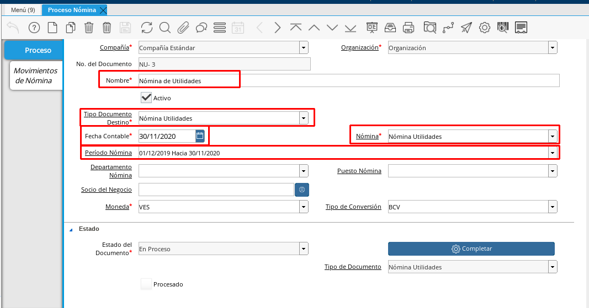
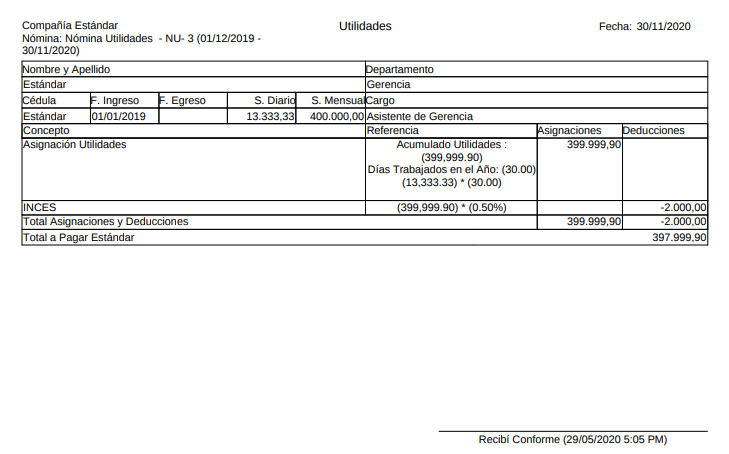
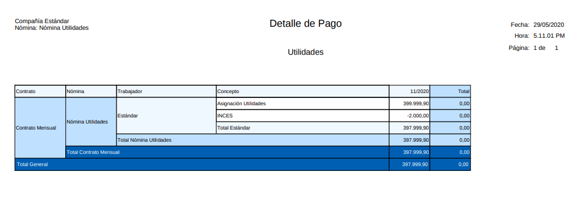
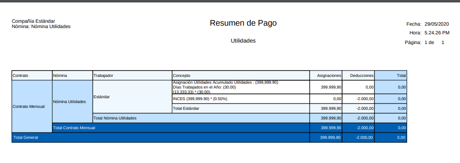
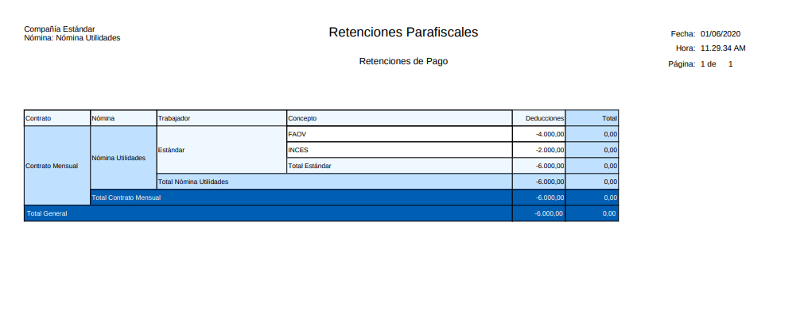

.. _ERPyA: http://erpya.com

.. |Aportes Nómina  Utilidades| image:: resources/aportesutilidades.png
.. |Incidencia Nómina  Utilidades| image:: resources/incidenciautilidades.png

.. _documento/nomina-utilidades:

=======================
 **Nómina Utilidades**
=======================

Para procesar una “**Nómina de Utilidades**” debemos realizar el proceso de nómina estándar mencionado en el documento :ref:`documento/procedimiento-para-procesar-nómina` elaborado por `ERPyA`_. En esta ventana se registran los datos principales que ADempiere requiere para crear una nómina de vacaciones, cada uno de los campos detallados a continuación son relevantes para obtener un registro exitoso:

#. Estatus del Documento:

    #. Seleccione “**Nómina Utilidades**” en el campo “**Tipo de Documento**”

 	  El tipo de documento le permitirá definir la acción del documento que esté registrando en ADempiere.

    #. Seleccione “**Nómina Utilidades**” en el campo “**Nómina**”

	   La nómina de utilidades define el comportamiento de la nómina, para este caso se cuenta con las siguientes características:

            #. Regla de Pago: Débito Directo
            #. Contrato de Nómina: Contrato Mensual
            #. Cargo: Sueldos y Salarios por Pagar

#. Seleccione el período anual correspondiente a la nómina que se está ejecutando en el campo "**Período Nómina**"

        El período de nómina define el período laborado que le está siendo cancelado al empleado, disponiendo de los períodos creados en la definición de nómina anual.

    #. Seleccione la fecha “Hasta” o el último día del período que seleccionó anteriormente en el campo "**Fecha Contable**"

        A través de la fecha contable se determina contablemente la fecha de pago de la nómina semanal en ejecución, por tal motivo se recomienda colocar la fecha “**Hasta**” o el último día del período que seleccionó anteriormente.

    |Nómina Utilidades|

    Imagen 1. Nómina de Utilidades

#. Incidencias:

	Para esta nómina no dispone no se dispone de incidencias

#. Resultados:

    - "**Reportes**"

        Para visualizar los reportes de nóminas  puede seguir los pasos que se encuentran en el documento :ref:`documento/reporte-de-nómina` con los datos adicionales que se indican a continuación para cada reporte

        - “**Recibo de Pago**”

            - **Nómina**: Nómina de Utilidades

         	- **Proceso de Nómina**: Ubique el número de documento del proceso de nómina que está ejecutando.

         	- **Configuración de Reporte de Nómina**: Utilidades

        |Recibo de Pago Nómina Utilidades|

        Imagen 3. Recibo de Pago Nómina Utilidades

        - “**Detalle de Pago**”

            - **Nómina**: Nómina de Utilidades

            - **Proceso de Nómina**: Ubique el número de documento del proceso de nómina que está ejecutando.

            - **Configuración de Reporte de Nómina**:  Utilidades

            - **Plantilla de Reporte de Nómina**: Detalle de Pago

        |Detalle de Pago Nómina  Utilidades|

        Imagen 4. Detalle de Pago Nómina de  Utilidades

        - “**Resumen de Pago**”

            - **Nómina**: Nómina de  Utilidades

            - **Proceso de Nómina**: Ubique el número de documento del proceso de nómina que está ejecutando.

            - **Configuración de Reporte de Nómina**:  Utilidades

            - **Plantilla de Reporte de Nómina**: Resumen de Pago

        |Resumen de Pago Nómina  Utilidades|

        Imagen 5. Resumen de Pago Nómina de Nómina de  Utilidades

        - “**Retenciones**”

            - **Nómina**: Nómina de  Utilidades

            - **Proceso de Nómina**: Ubique el número de documento del proceso de nómina que está ejecutando.

            - **Configuración de Reporte de Nómina**: Retenciones Parafiscales

        |Retenciones Nómina Utilidades|

        Imagen 6. Retenciones de Nómina de Utilidades

        - “**Aportes**”

            - **Nómina**: Nómina de Utilidades

            - **Proceso de Nómina**: Ubique el número de documento del proceso de nómina que está ejecutando.

            - **Configuración de Reporte de Nómina**: Aportes Parafiscales

        |Aportes Nómina Utilidades|

        Imagen 7. Aportes Nómina de Utilidades

        .. note::

            Cabe destacar que los reportes de Aportes y Retenciones se deben pasar al Departamento de Contabilidad
