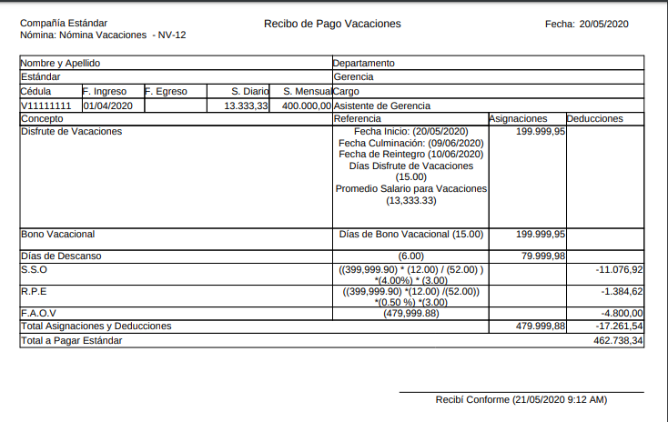
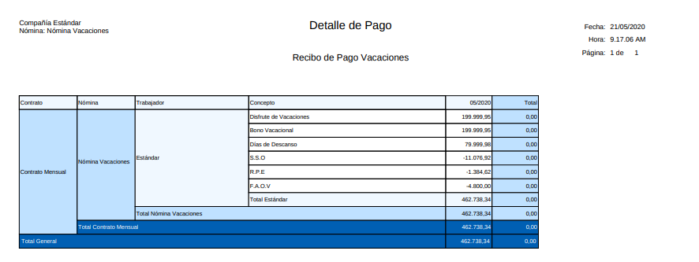
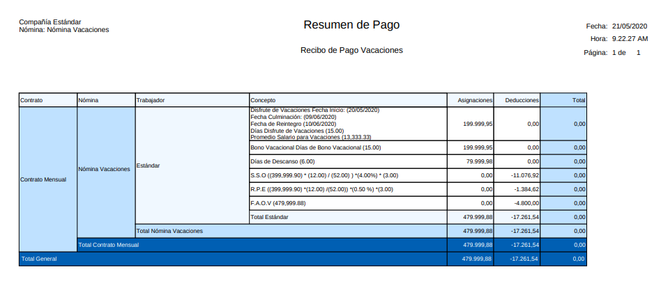
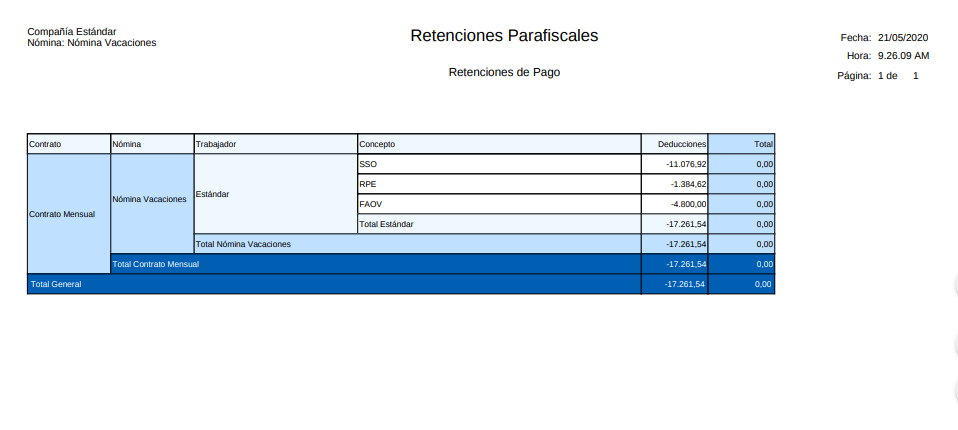

.. _ERPyA: http://erpya.com

.. |Aportes Nómina Vacaciones| image:: resources/aportesvacaciones.png

.. _documento/nomina-vacaciones:
.. _documento/novedades-de-nómina:
.. _documento/reporte-de-nómina:

============================
 **Nómina Vacaciones**
============================

Para procesar una “**Nómina de Vacaciones**” debemos realizar el proceso de nómina estándar mencionado en el documento :ref:`documento/procedimiento-para-procesar-nómina` elaborado por `ERPyA`_. En esta ventana se registran los datos principales que ADempiere requiere para crear una nómina de vacaciones, cada uno de los campos detallados a continuación son relevantes para obtener un registro exitoso:

#. Estatus del Documento:

    #. Seleccione “**Nómina Vacaciones**” en el campo “**Tipo de Documento**”

 	  El tipo de documento le permitirá definir la acción del documento que esté registrando en ADempiere.

    #. Seleccione “**Nómina Vacaciones**” en el campo “**Nómina**”

	   La nómina de vacaciones define el comportamiento de la nómina, para este caso por ser una nómina especial cuenta con las siguientes características:

            #. Regla de Pago: Débito Directo
            #. Contrato de Nómina: Contrato Mensual
            #. Cargo: Vacaciones por Pagar

    #. Seleccione la fecha en la qué esté ejecutando la nómina en el campo "**Fecha Contable**"

    #. Seleccione el “**Socio de Negocio Empleado**” a quién se le procesa la nómina de vacaciones en el campo "**Socio de Negocio**"

        .. note::

            Si son vacaciones colectivas a todo el personal no debe seleccionar ningún socio de negocio, deje este campo en blanco para que le procese la nómina de vacaciones a todo el personal.

    |Nómina Vacaciones|

    Imagen 1. Nómina de Vacaciones

    .. warning::

        Está nómina  por ser una nómina especial no debe registrarse con período

#. Incidencias:

    Para está nómina es obligatorio registrar la incidencia llamada "**Fecha de Inicio de Vacaciones**" para conocer el día a partir del cúal saldrá de vacaciones el empleado y el sistema pueda calcular su fecha de regreso, cabe destacar que esta incidencia debe registrarse al socio de negocio empleado al cual se le procesará la nómina de vacaciones

      +-------------------------------------------------------+----------------------+----------------+
      |           **INCIDENCIA**                              |     **CÓDIGO**       |    **TIPO**    |
      +=======================================================+======================+================+
      | Fecha de Inicio de Vacaciones                         |     ("IN_FIV")        |    Fecha    |
      +-------------------------------------------------------+----------------------+----------------+

    Para conocer cómo registrar una incidencia puede utilizar el siguiente enlace :ref:`documento/novedades-de-nómina:`

#. Resultados:

    - "**Reportes**"

        Para visualizar los reportes de nóminas  puede seguir los pasos que se encuentran en el documento :ref:`documento/reporte-de-nómina:` con los datos adicionales que se indican a continuación para cada reporte

        - “**Recibo de Pago**”

            - **Nómina**: Nómina de Vacaciones

         	- **Proceso de Nómina**: Ubique el número de documento del proceso de nómina que está ejecutando.

         	- **Configuración de Reporte de Nómina**: Vacaciones

        |Recibo de Pago Nómina Vacaciones|

        Imagen 2. Recibo de Pago Nómina Vacaciones

        - “**Detalle de Pago**”

            - **Nómina**: Nómina de Vacaciones

            - **Proceso de Nómina**: Ubique el número de documento del proceso de nómina que está ejecutando.

            - **Configuración de Reporte de Nómina**: Vacaciones

            - **Plantilla de Reporte de Nómina**: Detalle de Pago

        |Detalle de Pago Nómina Vacaciones|

        Imagen 3. Detalle de Pago Nómina de Vacaciones

        - “**Resumen de Pago**”

            - **Nómina**: Nómina de Vacaciones

            - **Proceso de Nómina**: Ubique el número de documento del proceso de nómina que está ejecutando.

            - **Configuración de Reporte de Nómina**: Vacaciones

            - **Plantilla de Reporte de Nómina**: Resumen de Pago

        |Resumen de Pago Nómina Vacaciones|

        Imagen 4. Resumen de Pago Nómina de Nómina de Vacaciones

        - “**Retenciones**”

            - **Nómina**: Nómina de Vacaciones

            - **Proceso de Nómina**: Ubique el número de documento del proceso de nómina que está ejecutando.

            - **Configuración de Reporte de Nómina**: Retenciones Parafiscales

        |Retenciones Nómina Vacaciones|

        Imagen 5. Retenciones de Nómina de Vacaciones

        - “**Aportes**”

            - **Nómina**: Nómina de Vacaciones

            - **Proceso de Nómina**: Ubique el número de documento del proceso de nómina que está ejecutando.

            - **Configuración de Reporte de Nómina**: Aportes Parafiscales

        |Aportes Nómina Vacaciones|

        Imagen 6. Aportes Nómina de Vacaciones

        .. note::

            Cabe destacar que los reportes de Aportes y Retenciones se deben pasar al Departamento de Contabilidad
