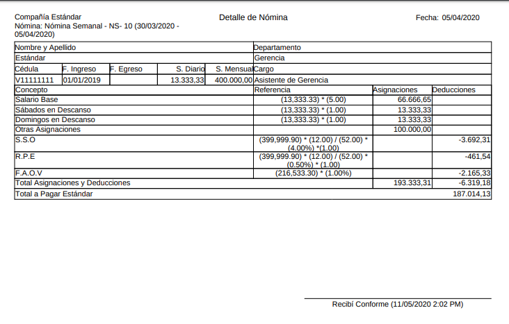
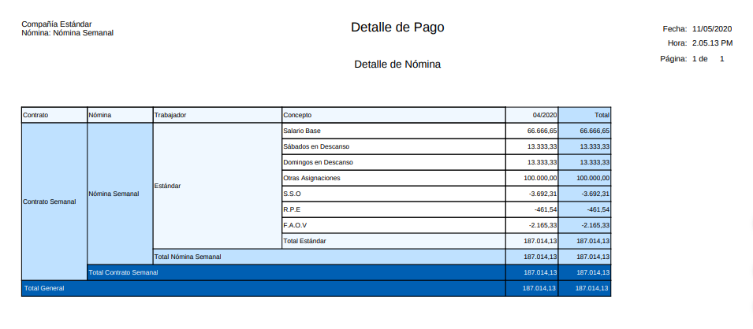
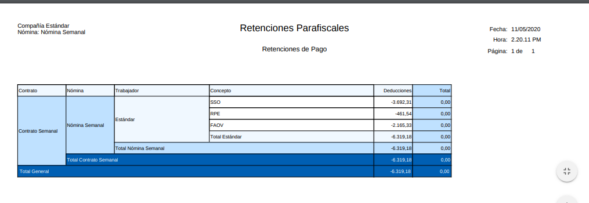
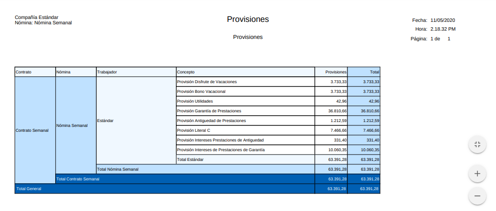

.. _documento/weekly-payroll:
.. _ERPyA: http://erpya.com

.. |Nómina Semanal| image:: resources/semanal.png

.. |Resumen de Pago Nómina Semanal| image:: resources/resumensemanal.png

.. |Aportes Nómina Semanal| image:: resources/aportessemanal.png

======================
 **NÓMINA SEMANAL**
======================

Para procesar una Nómina Semanal debemos realizar el Proceso de Nómina mecionado en el documento :ref:`documento/procedimiento-para-procesar-nómina` elaborado por `ERPyA`_. con los siguientes datos:

#. Estatus del Documento:

      _ **Tipo de Documento**: Nómina Semanal

      _ **Nómina**: Nómina Semanal

      _ **Periodo**: Escoga el Periodo Semanal correspondiente a la nómina que 	desee ejecutar

      _ **Fecha Contable**: Será la fecha “Hasta” o el último día del periodo que seleccióno anteriormente

      |Nómina Semanal|

      Imagen 1. Nómina Semanal

#. Incidencias:

      Para esta nómina no son obligatorias las incidencias, pero en Adempiere se cuentan con las siguientes incidencias disponibles para la Nómina Semanal:

      * Sábado Trabajado
      * Domingo Trabajado
      * Feriado Trabajado
      * Horas Extras Diurnas
      * Horas Nocturnas
      * Fecha de Inicio de Reposo Prenatal y Postnatal
      * Días de Reposo PreNatal y PostNatal
      * Fecha de Inicio de Reposo Convalidado por el IVSS
      * Días de Reposo Convalidado
      * Otras Asignaciones
      * Ausencias Injustificadas
      * Faltas Injustificadas
      * Retardos
      * Otras Deducciones

      Para conocer cómo Registrar una Incidencia puede utilizar el siguiente enlace :ref:`documento/novedades-de-nómina:`

#. Resultados:

    _** Reportes**

    Para visualizar los Reportes de Nóminas  puede seguir los pasos que se encuentran en el Documento :ref:`documento/reporte-de-nómina:` con los datos adicionales que se indican a continuación para cada Reporte

        _** Recibo de Pago**

        _ "**Configuración de Reporte de Nómina**": Nómina Regular

        |Recibo de Pago de Nómina Semanal|

        Imagen 2. Recibo de Pago Nómina Semanal

        _** Detalle de Pago**

        _ "**Configuración de Reporte de Nómina**": Nómina Regular

        _ "**Plantilla de Reporte de Nómina**": Detalle de Pago

        |Detalle de Pago de Nómina Semanal|

        Imagen 3. Recibo de Pago Nómina Semanal

        _** Resumen de Pago**

        _ "**Configuración de Reporte de Nómina**": Nómina Regular

        _ "**Plantilla de Reporte de Nómina**": Resumen de Pago

        |Resumen de Pago de Nómina Semanal|

        Imagen 4. Resumen de Pago Nómina Semanal

        _** Retenciones**

        _ "**Configuración de Reporte de Nómina**": Retenciones Parafiscales

        |Retenciones de Nómina Semanal|

        Imagen 5. Retenciones de Nómina Semanal

          _** Aportes**

          _ "**Configuración de Reporte de Nómina**": Aportes Parafiscales

          |Aportes de Nómina Semanal|

          Imagen 6. Aportes de Nómina Semanal

        _** Provisiones**

        _ "**Configuración de Reporte de Nómina**": Provisiones

        |Provisiones de Nómina Semanal|

        Imagen 7. Provisiones de Nómina Semanal

      Cabe destacar que los Reportes de Aportes, Retenciones, Provisiones se deben pasar al Departamento de Contabilidad
