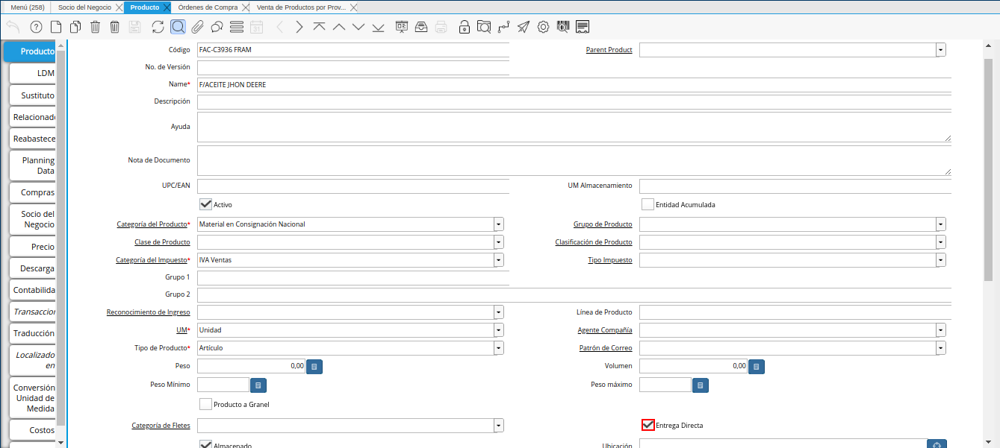

.. _ERPyA: http://erpya.com
.. |socio del negocio proveedor| image:: resources/supplier-business-partner.png

.. |orden de compra| image:: resources/purchase-order.png

.. _documento/configuración-de-ventas-en-consignación:

**Configuración de Ventas en Consignación**
===========================================

Para relacionar en ADempiere las ventas de productos en consignación, es necesario tener una configuración previa en cuanto a las órdenes de compra, los productos y los socios del negocio proveedores de dichas órdenes.

#. El registro del socio del negocio proveedor al cual se requiere generar la pre-factura o factura pro-forma, debe tener tildado obligatoriamente el check "**Entrega Directa**". De esta manera, 

.. note::

    El registro del socio del negocio proveedor se encuentra explicado de manera detallada en el material :ref:`documento/socio-proveedor`, elaborado por `ERPyA`_.

|socio del megocio proveedor|

Imagen 1. Socio del Negocio Proveedor

#. El producto de la orden de compra, debe tener tildado el check "**Entrega Directa**". 

.. note::

    El registro del producto se encuentra explicado de manera detallada en el material :ref:`documento/producto`, elaborado por `ERPyA`_.

|producto|

Imagen 2. Producto

#. La orden de compra debe tener tildado el check "**Entrega Directa**".

.. note::

    El registro de la orden de compra se encuentra explicado de manera detallada en el material :ref:`documento/producto`, elaborado por `ERPyA`_.

|orden de compra|

Imagen 3. Orden de Compra