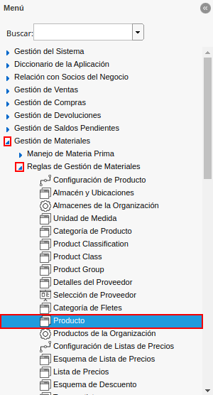
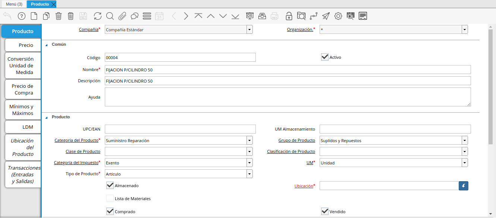
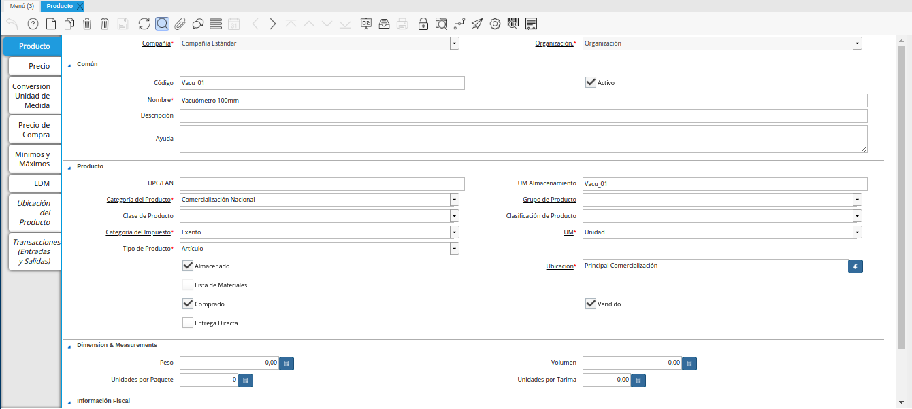

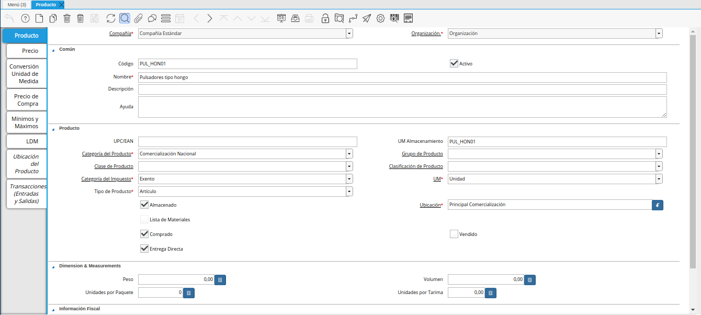
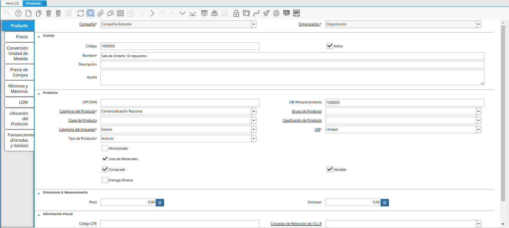
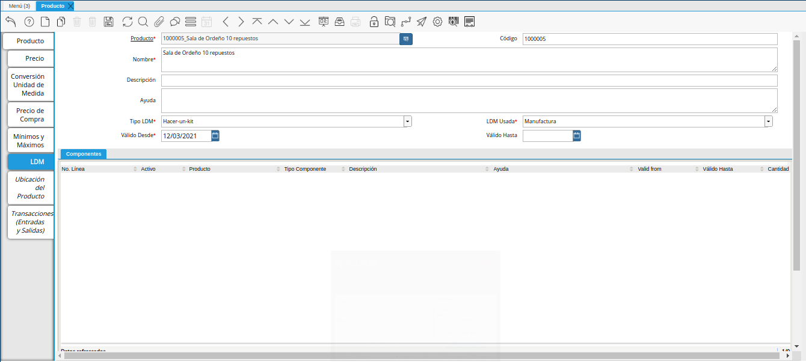
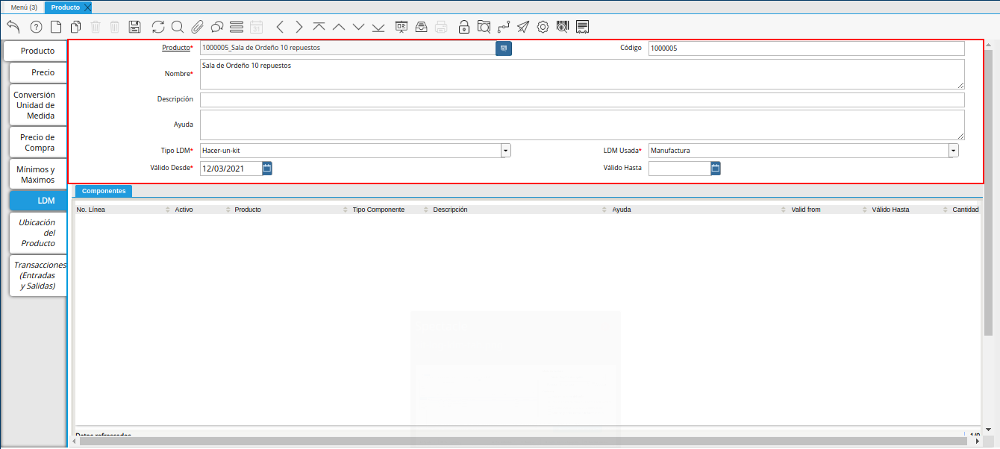
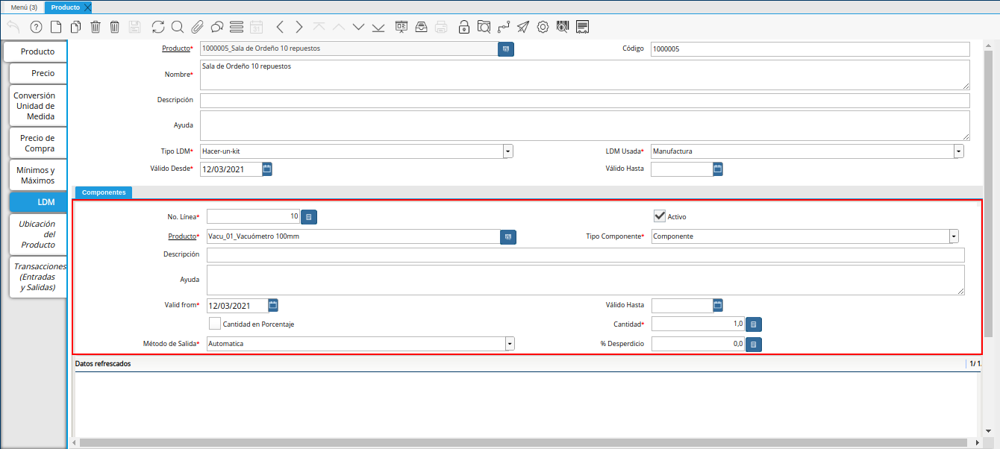
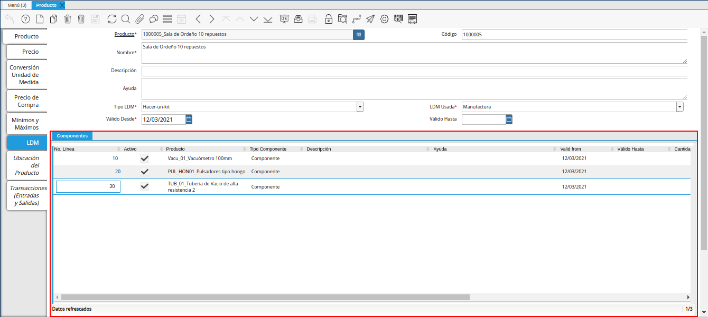
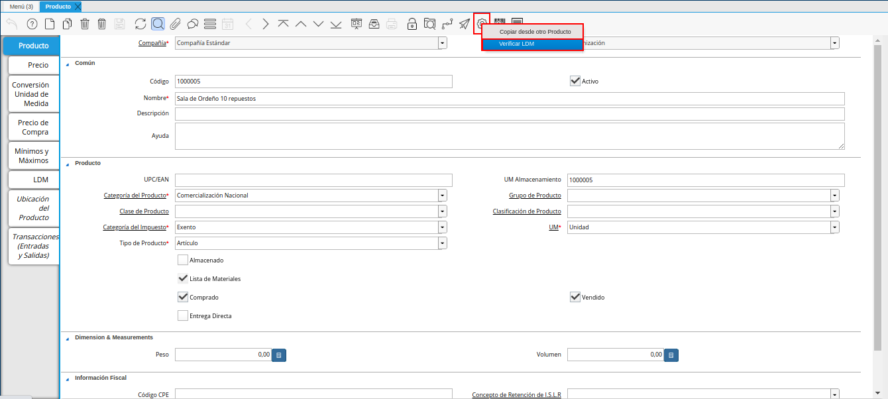
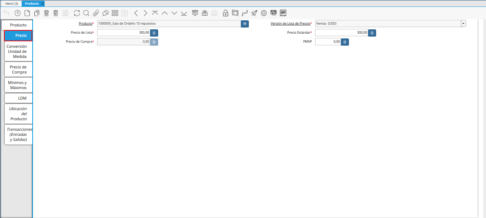
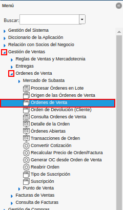
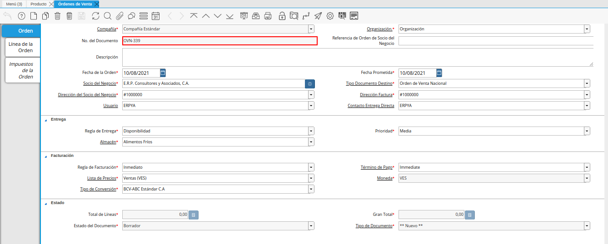
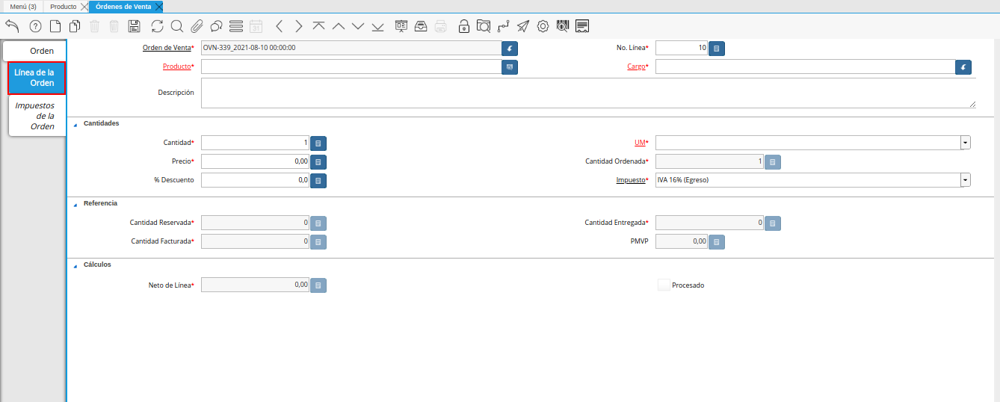
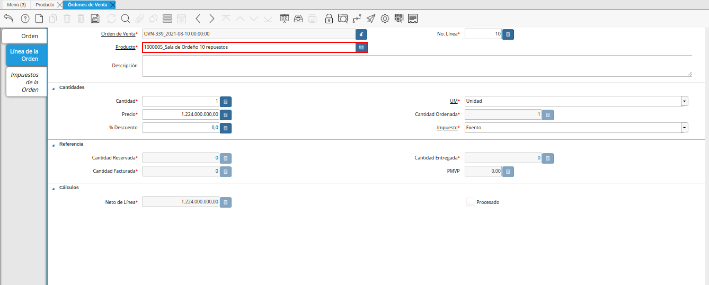
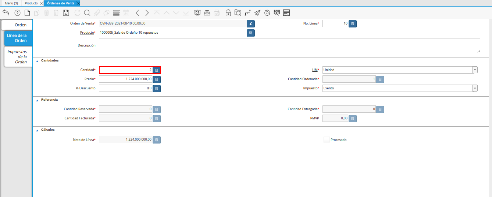
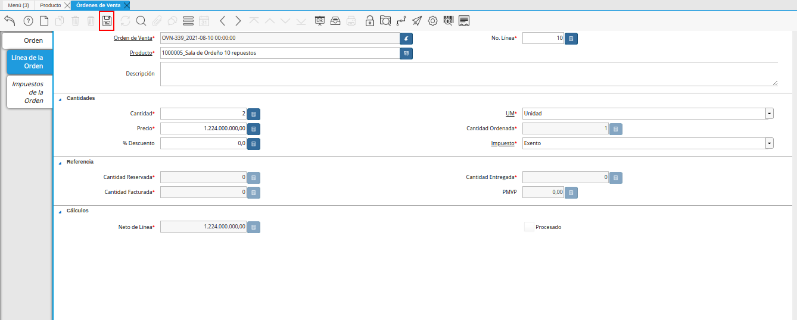
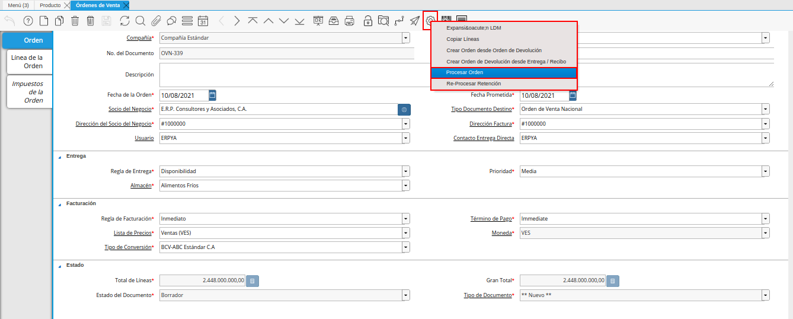
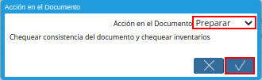
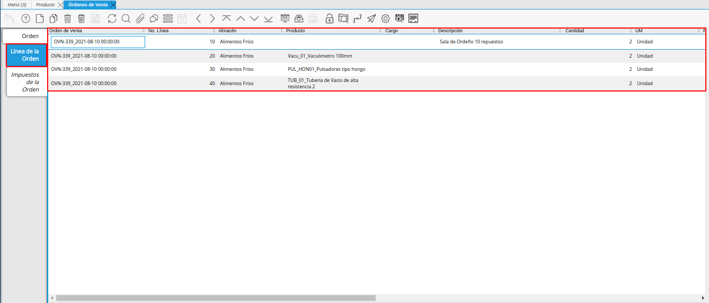
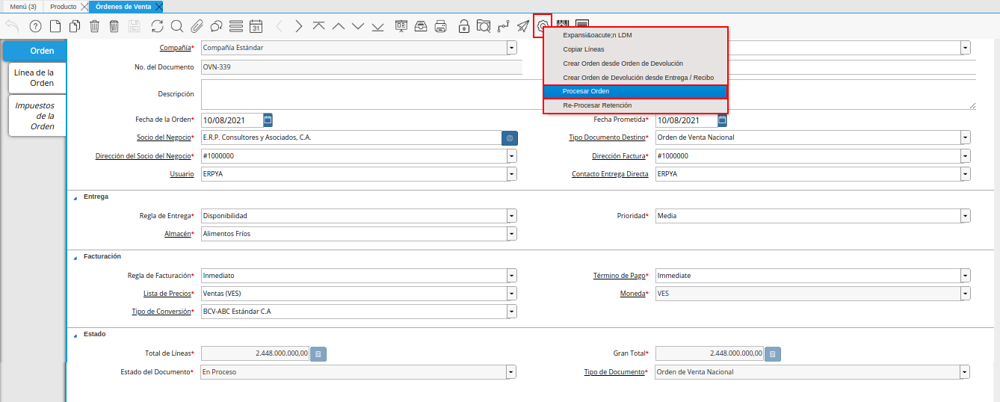
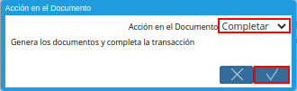

.. _documento/kit-de-productos-de-ventas:

**Kit de Productos de Ventas**
==============================

Un kit de productos de ventas permite agrupar ciertos productos destinados para la venta, son utilizados como estrategias de marketing con la finalidad de mejorar y agilizar el proceso de las ventas en las empresas. En el presente documento se detalla el procedimiento que se debe realizar en ADempiere para crear los kit de productos de ventas. De esta manera, al momento de realizar una venta, se hace referencia al kit de productos que contiene asociados los diferentes productos requeridos por el cliente.

.. _documento/proceso-de-configuración-del-kit:

**Configuración del Kit de Productos**
--------------------------------------

Una vez definido el kit que requiere configurar en ADempiere, se debe realizar el registro del producto padre que en este caso es el "**Kit de Productos de Ventas**". Para explicar de manera detallada el procedimiento de kit de productos de ventas, se presenta el siguiente ejemplo:

    Se requiere registrar en ADempiere el kit de ventas "**Kit Sala de Ordeño 10 Repuestos**".

    .. warning::

        Al momento de registrar el kit de productos de ventas se debe verificar que el check "**Almacenado**", se encuentre desactivado ya que ningún kit se almacena. Recuerde que el registro padre agrupa todos los productos que componen el mismo y que dichos productos si deben estar almacenados.

Los registros de los productos se realizan en la ventana "**Producto**", para acceder a la misma se debe realizar lo siguiente:

Ubique y seleccione en el menú de ADempiere, la carpeta "**Gestión de Materiales**", luego seleccione la carpeta "**Reglas de Gestión de Materiales**", por último seleccione la ventana "**Producto**".

    |menú de la ventana producto|

    Imagen 1. Menú de ADempiere

Podrá visualizar la ventana "**Producto**", en la cual se encuentran todos los registros de productos de ADempiere.

    |ventana producto|

    Imagen 2. Ventana Producto

    .. note::

        Recuerde que para crear un nuevo registro de producto se debe seleccionar el icono "**Registro Nuevo**", ubicado en la barra de herramientas de ADempiere.

Si desconoce el procedimiento que se debe realizar para registrar los productos en ADempiere, consulte el material :ref:`documento/producto`. Sin embargo, a continuación se explican las restricciones que se deben considerar en dicho proceso.

Al momento de registrar el kit, se deben tener registrados y configurados los productos que componen dicho kit. Es decir, si el kit a registrar es "**Kit Sala de Ordeño 10 Repuestos**" y el mismo se compone de los siguientes productos:

    ==========      =======================================
    **Código**      **Producto**
    ==========      =======================================
    Vacu-01         Vacuómetro 100mm
    TUB-01          Tubería de Vacio de alta resistencia 2
    PUL-HON01       Pulsadores tipo hongo
    ==========      =======================================

    Debe existir en ADempiere de manera obligatoria, el registro de los mismos como se muestra a continuación:

    - Vacuómetro 100mm

        |producto vacuómetro|

        Imagen 3. Registro del Producto Vacuómetro

    - Tubería de Vacio de alta resistencia 2

        |producto tubería de vacio de alta resistencia 2|

        Imagen 4. Producto Tubería de Vacio de Alta Resistencia 2

    - Pulsadores tipo hongo

        |producto pulsadores tipo hongo|

        Imagen 5. Producto Pulsadores Tipo Hongo

Finalmente, se debe crear el registro del kit haciendo referencia al nombre de dicho kit de ventas y con el check "**Almacenado**" desactivado. Continuando con el ejemplo presentado anteriormente, se registra el kit "**Kit Sala de Ordeño 10 Repuestos**".

    |registro del kit de productos de ventas|

    Imagen 6. Kit de Productos de Ventas

Luego se deben asociar los productos que componen el kit de productos de ventas. Para ello, se debe seleccionar la pestaña "**LDM**".

    |pestaña ldm del registro del kit|

    Imagen 7. Pestaña LDM de la Ventana Producto.

El registro del encabezado de la pestaña "**LDM**" debe contemplar los siguientes campos:

    - "**Tipo LDM**": Se debe seleccionar la opción "**Hacer-un-kit**", para indicar que el registro que se esta realizando corresponde a un kit de productos.
    - "**LDM Usada**": Se debe seleccionar la opción "**Manufactura**", para indicar que la lista de materiales corresponde a la manufactura.
    - "**Válido Desde**": Se debe seleccionar la fecha de inicio del periodo de validez del kit de productos.
    - "**Válido Hasta**": Se debe seleccionar la fecha de culminación del periodo de validez del kit de productos. De no tener un fecha final se puede dejar en blanco.

    |encabezado de la pestaña ldm|

    Imagen 8. Encabezado de la Pestaña LDM

.. note::

    Para ubicarse en el grupo de campos "**Componentes**", se debe hacer clic en cualquier parte de la misma.

El registro de los componentes de la pestaña "**LDM**", se realiza en el grupo de campos "**Componentes**", en el cual se deben contemplar los siguientes campos:

    - "**Producto**": Se debe seleccionar el producto que se requiere asociar al kit de productos.
    - "**Tipo Componente**": Se debe seleccionar la opción "**Componente**" para indicar que el producto seleccionado es un componente del kit de productos.
    - "**Cantidad**": Se debe ingresar la cantidad solicitada del producto seleccionado para el kit de productos.
    - "**Método de Salida**": Se debe seleccionar la opción "**Automático**" para indicar que los componentes serán despachados de manera automática.

    |registro de componentes de la pestaña ldm|

    Imagen 9. Registro de Componentes de la Pestaña LDM

    .. note::

        Para registrar otro componente, correspondiente al mismo encabezado, se debe encontrar posicionado en el grupo de campos "**Componentes**" y seleccionar el icono "**Registro Nuevo**", ubicado en la barra de herramientas de ADempiere y proceder a registrar el siguiente componente considerando los campos indicados anteriormente.

    |registro de todos los componentes de la pestaña ldm|

    Imagen 10. Registro de los Componentes de la Pestaña LDM

Una vez asociados los productos a la pestaña "**LDM**", se debe validar la misma. Para ello, se debe seleccionar la pestaña principal "**Producto**", luego se debe seleccionar el icono "**Proceso**" y finalmente la opción "**Validar LDM**" que se desplega al selecccionar dicho icono.

    |opción validar ldm del icono proceso|

    Imagen 11. Opción Validar LDM del Icono Proceso

Tanto el kit como los productos que componen el kit deben estar asociados a una lista de precios de ventas, ya sea "**VES**" o "**USD**".

    |pestaña precios del kit de productos de ventas|

    Imagen 12. Pestaña Precios del Kit de Productos de Ventas

.. _documento/proceso-de-venta-del-kit:

**Venta del Kit de Productos**
------------------------------

Al momento de realizar la venta del kit de productos se tiene como requerimiento principal que el mismo se encuentre configurado como se indica en el proceso :ref:`documento/proceso-de-configuración-del-kit`. Una vez configurado el mismo, se procede a realizar la venta desde la ventana "**Orden de Venta**". Para ello, se debe realizar lo siguiente.

Ubique y seleccione en el menú de ADempiere, la carpeta "**Gestión de Ventas**", luego seleccione la carpeta "**Órdenes de Venta**", por último seleccione la ventana "**Órdenes de Venta**".

    |menú de la ventana órdenes de venta|

    Imagen 13. Menú de ADempiere

Podrá visualizar la ventana "**Órdenes de Venta**", donde se encuentran los diferentes registros de órdenes de venta que se encuentran en ADempiere. En dicha ventana se debe proceder a realizar el registro de la orden de venta del kit de productos. Para ello, se debe seleccionar el icono "**Registro Nuevo**" ubicado en la barra de herramientas de ADempiere y proceder al llenado de los campos correspondientes.

    |registro de pestaña orden de la ventana órdenes de venta|

    Imagen 14. Registro de Pestaña Orden

    .. note::

        Si desconoce el procedimiento para realizar un nuevo registro de orden de venta en la ventana "**Órdenes de Venta**", puede consultar el material :ref:`src/adempiere/quote-to-invoice/sales-order`.

Una vez lleno el registro de la pestaña principal "**Órdenes de Venta**", seleccione la pestaña "**Línea de la Orden**" y proceda al llenado de los campos correspondientes.

    |pestaña línea de la orden de la ventana órdenes de venta|

    Imagen 15. Pestaña Línea de la Orden

En el campo "**Producto**", se debe seleccionar el registro del kit de productos que requiere vender. Continuando con el escenario planteado anteriormente en el presente documento, el producto a asociar en este campo sería "**Kit Sala de Ordeño 10 Repuestos**".

    |campo producto de la pestaña línea de la orden|

    Imagen 16. Campo Producto

En el campo "**Cantidad**", se debe ingresar la cantidad del kit de productos que se encuentra vendiendo. 

    |campo cantidad de la pestaña línea de la orden|

    Imagen 17. Campo Cantidad

El registro debe ser guardado con ayuda del icono "**Guardar Cambios**", ubicado en la barra de herramientas de ADempiere.

    |icono guardar cambios de la pestaña línea de la orden|

    Imagen 18. Icono Guardar Cambios

Luego se debe seleccionar la pestaña principal "**Orden**" y la opción "**Procesar Orden**" desplegada por la selección del icono "**Proceso**", ubicado en la barra de herramientas de ADempiere.

    |pestaña principal orden y opción procesar orden del icono proceso|

    Imagen 19. Pestaña Orden y Opción Procesar Orden del Icono Proceso

En la ventana emergente se debe seleccionar la acción "**Preparar**" y la opción "**OK**".

    |acción preparar y opción ok|

    Imagen 20. Acción Preparar y Opción Ok

Al cambiar el estado del documento "**Borrador**" a estado "**En Proceso**" o "**Completo**", ADempiere agrega de manera automática, una línea por cada producto asociado al kit de productos seleccionado y a su vez, agrega en el campo "**Cantidad**", la cantidad establecida en cada uno de los productos asociados al kit. Este resultado se puede verificar seleccionando la pestaña "**Línea de la Orden**" y navegando entre los registros creados en dicha pestaña.

    |pestaña línea de la orden despues de procesar la misma|

    Imagen 21. Pestaña Línea de la Orden

Finalmente, se debe seleccionar nuevamente la pestaña principal "**Orden**" y la opción "**Procesar Orden**" desplegada por la selección del icono "**Proceso**", ubicado en la barra de herramientas de ADempiere.

    |pestaña principal orden y opción procesar orden del icono proceso completar|

    Imagen 22. Pestaña Orden y Opción Procesar Orden del Icono Proceso

En la ventana emergente se debe seleccionar la acción "**Completar**" y la opción "**OK**", para completar el registro de la orden de venta.

    |acción completar y opción ok|

    Imagen 23. Acción Completar y Opción Ok
