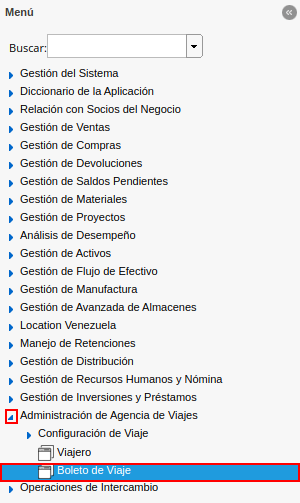
.. |ventana boleto de viaje| image:: resources/window-travel-ticket.png
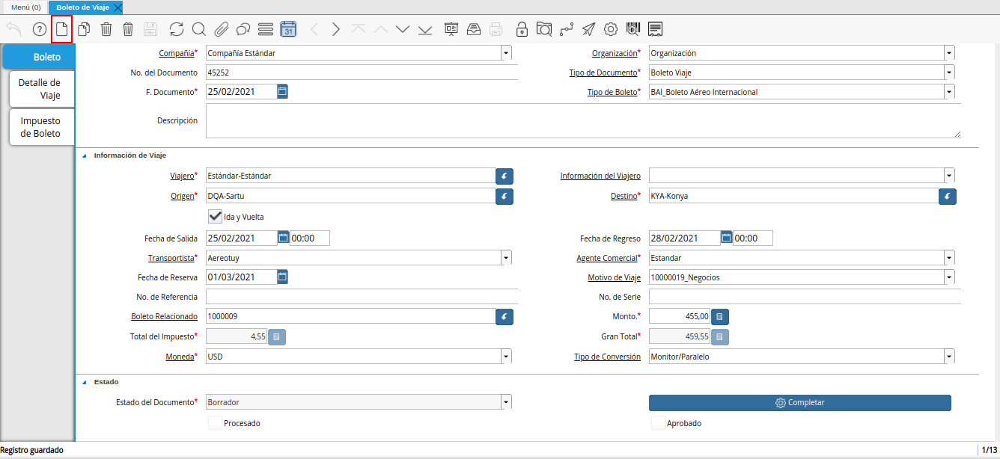
.. |campo organización de la ventana boleto de viaje| image:: resources/travel-ticket-window-organization-field.png
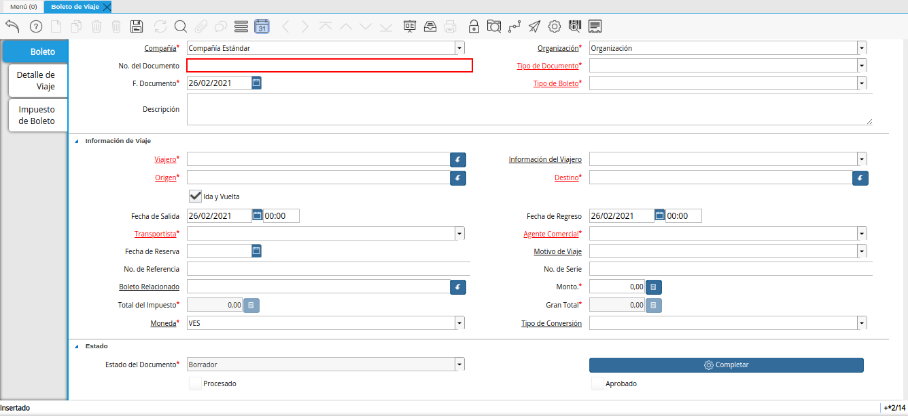
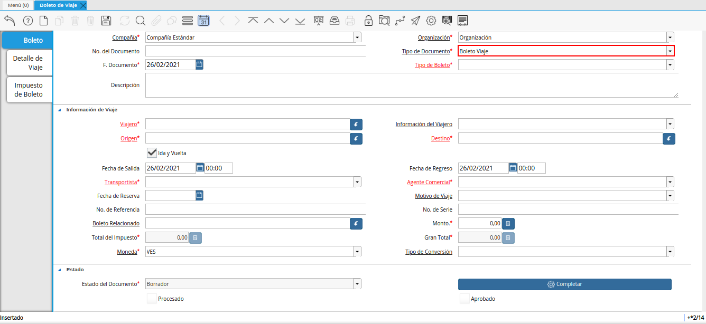
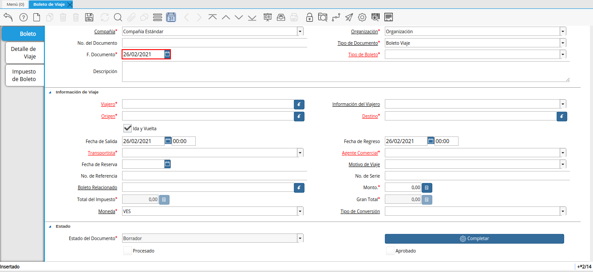
.. |campo tipo de boleto de la ventana boleto de viaje| image:: resources/field-window-ticket-type-travel-ticket.png
.. |campo descripción de la ventana boleto de viaje| image:: resources/field-travel-ticket-window-description.png
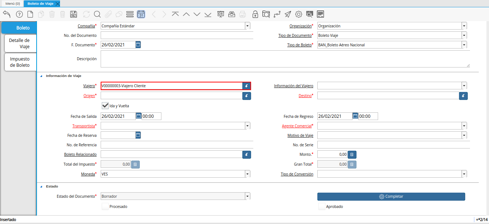
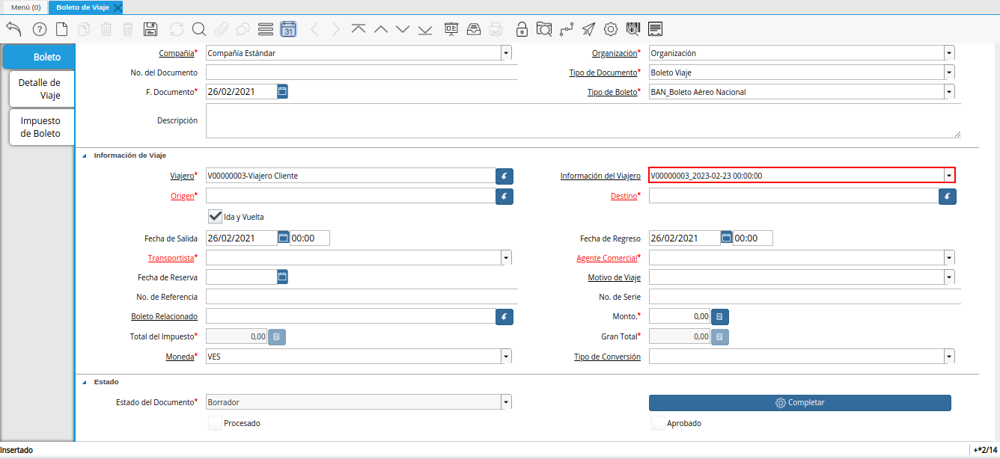
.. |campo origen de la ventana boleto de viaje| image:: resources/window-origin-field-travel-ticket.png
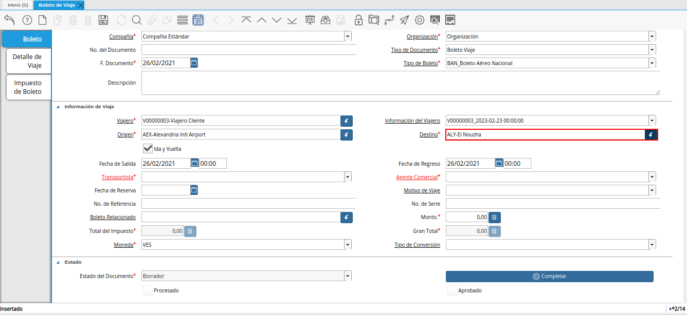
.. |check ida y vuelta de la ventana boleto de viaje| image:: resources/check-round-trip-from-the-window-travel-ticket.png
.. |campo fecha de salida de la ventana boleto de viaje| image:: resources/field-departure-date-of-the-travel-ticket-window.png
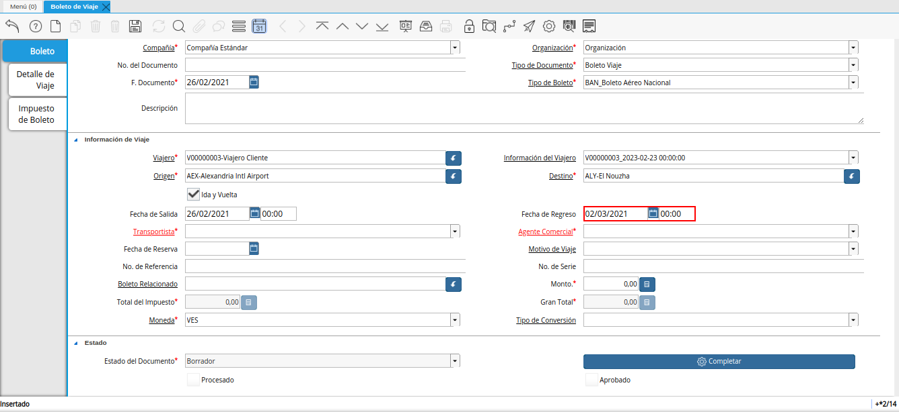
.. |campo transportista de la ventana boleto de viaje| image:: resources/field-carrier-window-travel-ticket.png
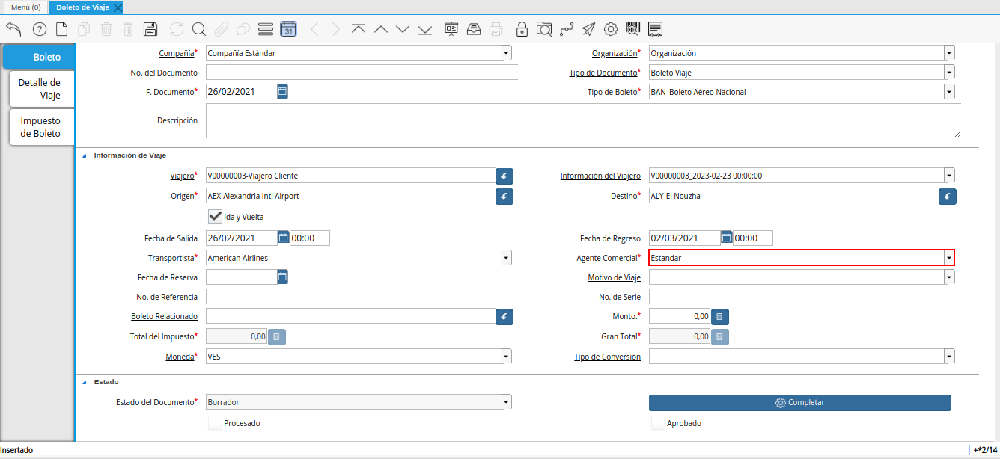
.. |campo fecha reservada de la ventana boleto de viaje| image:: resources/reserved-date-field-of-travel-ticket-window.png
.. |campo motivo de viaje de la ventana boleto de viaje| image:: resources/field-travel-reason-window-travel-ticket.png
.. |campo número de referencia de la ventana boleto de viaje| image:: resources/travel-ticket-window-reference-number-field.png
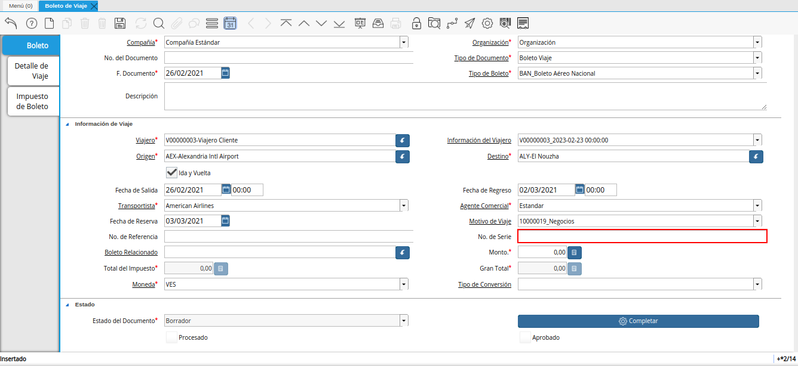
.. |campo boleto relacionado de la ventana boleto de viaje| image:: resources/field-related-ticket-window-travel-ticket.png
.. |campo monto de la ventana boleto de viaje| image:: resources/field-window-amount-travel-ticket.png
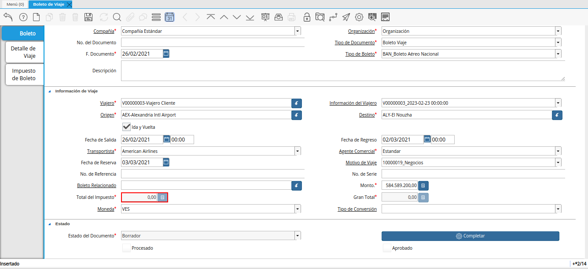
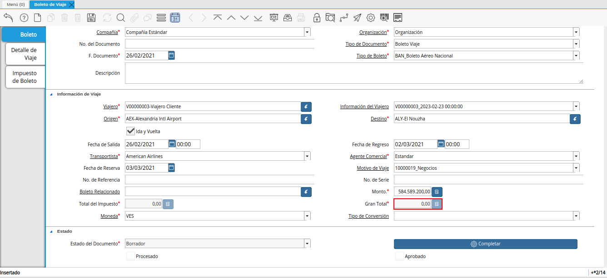
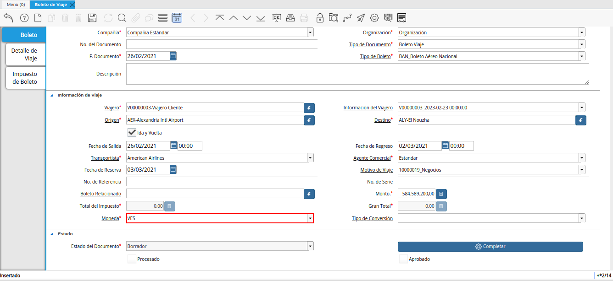
.. |campo tipo de conversión de la ventana boleto de viaje| image:: resources/conversion-type-field-of-the-travel-ticket-window.png
.. |icono guardar cambios de la ventana boleto de viaje| image:: resources/icon-save-changes-of-travel-ticket-window.png
.. |pestaña detalle de viaje de la ventana boleto de viaje| image:: resources/window-trip-detail-tab-trip-ticket.png
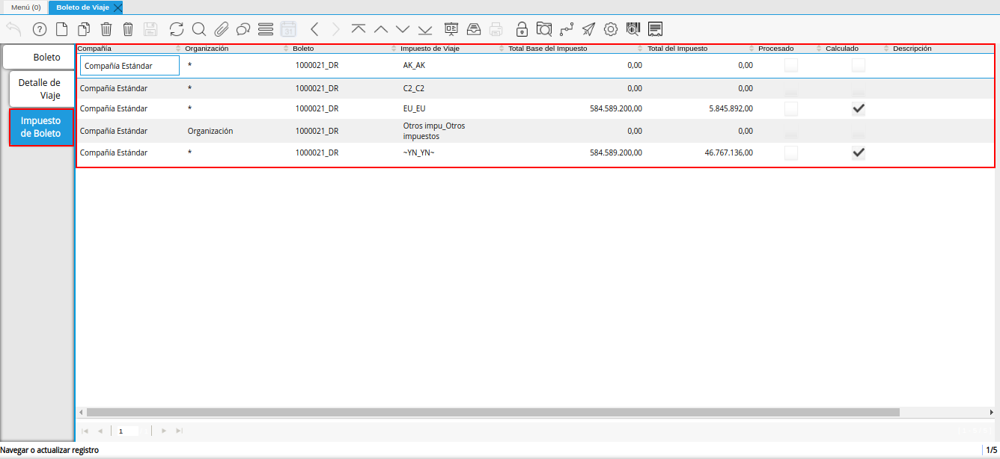
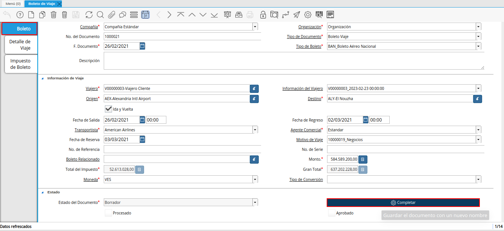
.. |acción completar y opción ok de la ventana boleto de viaje| image:: resources/action-complete-and-option-ok-from-the-travel-ticket-window.png
.. |menú documentos por cobrar| image:: resources/documents-receivable-menu.png
.. |pestaña factura de la ventana documentos por cobrar| image:: resources/invoice-tab-of-the-documents-receivable-window.png
.. |icono proceso de la ventana documentos por cobrar| image:: resources/window-process-icon-receivable-documents.png
.. |opción crear factura desde boleto| image:: resources/option-create-invoice-from-ticket.png
.. |ventana del proceso crear factura desde boleto| image:: resources/process-window-create-invoice-from-ticket.png
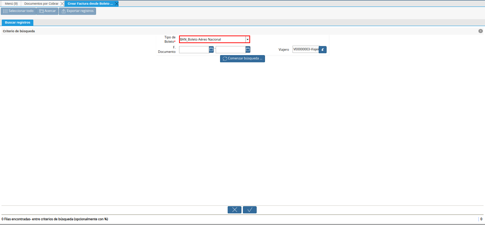
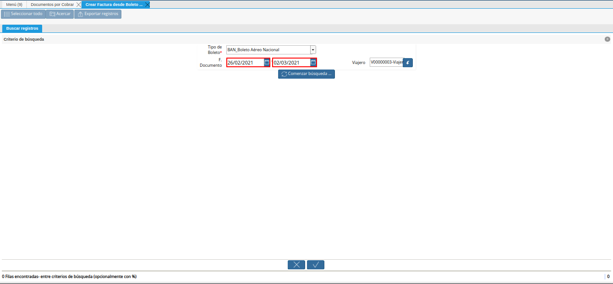
.. |campo viajero del proceso crear factura desde boleto| image:: resources/traveler-field-of-the-create-invoice-from-ticket-process.png
.. |opción comenzar búsqueda del proceso crear factura desde boleto| image:: resources/option-start-process-search-create-invoice-from-ticket.png
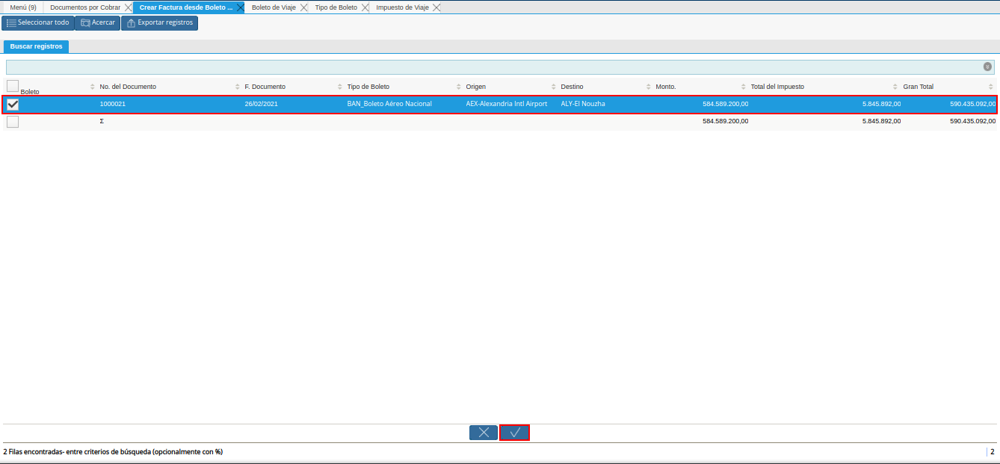
.. |icono refrescar de la ventana documentos por cobrar| image:: resources/icon-refresh-of-the-window-documents-receivable.png
.. |documento por cobrar en estado completo| image:: resources/document-receivable-in-complete-state.png
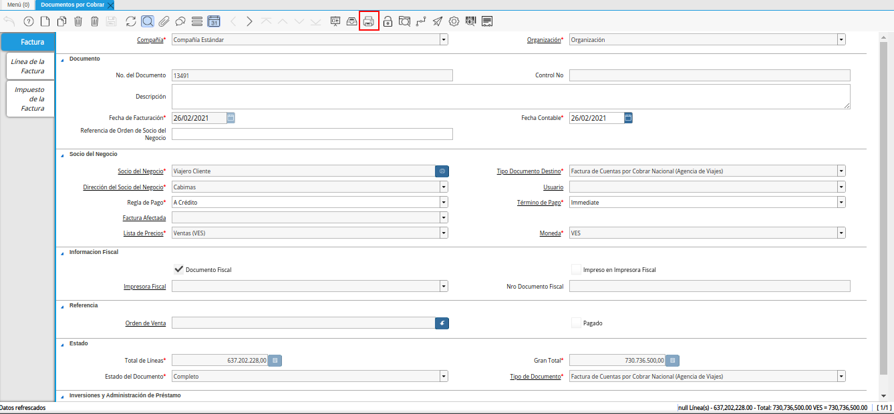
.. |ventana informe con reporte de factura| image:: resources/report-window-with-invoice-report.png

.. _documento/boletería:

**Boletería**
=============

El procedimiento de boletería parte de una previa configuración en la cual se debe contar con los siguientes puntos:

    - :ref:`src/adempiere/master/traveler` Debe estar registrado el socio del negocio cliente (viajero). De no cumplir con ello, se debe realizar el procedimiento explicado en el material :ref:`documento/paso-registro-de-viajero`.

    - :ref:`src/adempiere/master/terminal` Deben estar definidos los diferentes terminales de origen y destino de los viajes. De no cumplir con ello, se debe realizar el procedimiento explicado en el material :ref:`documento/terminal`. 

    - :ref:`src/adempiere/master/carrier` Deben estar definidas las diferentes empresas responsables de realizar el viaje. De no cumplir con ello, se debe realizar el procedimiento explicado en el material :ref:`documento/transportista`. 

    - :ref:`src/adempiere/master/travel-tax` Deben estar definidos los diferentes impuestos de viaje con los que trabaja la organización. De no cumplir con ello, se debe realizar el procedimiento explicado en el material :ref:`documento/impuesto-de-viaje`. Cada impuesto de viaje varia según el tipo de boleto.

        .. warning::

            Es importante resaltar que cada impuesto de viaje es configurado por su parte, indicando cual será calculado de manera automática y cual no. Si indica que será calculado de manera automática, se asigna el porcentaje a aplicar para el mismo. 

    - :ref:`src/adempiere/master/ticket-type` Deben estar definidos los diferentes tipos de boletos con los que trabaja la organización. En la configuración del mismo, se indica el producto, cargo e impuestos a aplicar por cada tipo de boleto. De no cumplir con ello, se debe realizar el procedimiento explicado en el material :ref:`documento/tipo-de-boleto`. 

    - :ref:`src/adempiere/master/reason-for-trip` Deben estar definidos los diferentes motivos de viaje de los socios viajeros. De no cumplir con ello, se debe realizar el procedimiento explicado en el material :ref:`documento/motivo-de-viaje`. 

Como ejemplo se presenta el tipo de boleto "**Boleto Aéreo Nacional**", en el cual se tiene configurado el producto "**Servicio de Vuelo**", el cargo "**Impuestos Incluidos**" y los impuestos de viaje "**AK**", "**C2**", "**EU**", "**YN**" y "**Otros impuestos**". 

A continuación se explica el procedimiento a seguir para realizar correctamente el proceso de boletería.

.. _documento/paso-registro-de-boleto:

**Registro de Boleto**
----------------------

#. Ubique y seleccione en el menú de ADempiere, la carpeta "**Administración de Agencia de Viajes**", luego seleccione la ventana "**Boleto de Viaje**".

    |menú de ventana boleto de viaje|

    Imagen 61. Menú de ADempiere

#. Podrá visualizar la ventana "**Boleto de Viaje**", con los diferentes registros de boletos.

    |ventana boleto de viaje|

    Imagen 62. Ventana Boleto de Viaje

#. Seleccione el icono "**Registro Nuevo**", ubicado en la barra de herramientas de ADempiere y proceda al llenado de los campos correspondientes.

    |icono registro nuevo de la ventana boleto de viaje|

    Imagen 63. Icono Registro Nuevo

#. Seleccione en el campo "**Organización**", la organización para la cual se encuentra realizando el registro.

    |campo organización de la ventana boleto de viaje|

    Imagen 64. Campo Organización

#. Introduzca en el campo "**No. del Documento**", el número de documento correspondiente al registro que se encuentra realizando.

    .. note::

        Si no es ingresado ningún valor en este campo, al guardar el registro ADempiere asigna de manera automática un número de documento según la secuencia de registros que se tenga en el momento.

    |campo número del documento de la ventana boleto de viaje|

    Imagen 65. Campo No. del Documento

#. Seleccione el tipo de documento a generar en el campo "**Tipo de Documento**", la selección de este define el comportamiento del documento que se esta elaborando, dicho comportamiento se encuentra explicado en el documento "**Tipo de Documento**" elaborado por `ERPyA`_.

    |campo tipo de documento de la ventana boleto de viaje|

    Imagen 66. Campo Tipo de Documento

#. Seleccione en el campo "**F. Documento**", la fecha en la cual se encuentra realizando el documento.

    |campo fecha del documento de la ventana boleto de viaje|

    Imagen 67. Campo F. Documento

#. Seleccione en el campo "**Tipo de Boleto**", el tipo de boleto que se encuentra realizando.

    .. note::

        Recuerde que puede consultar del material :ref:`documento/tipo-de-boleto`, para conocer dicho procedimiento.

    |campo tipo de boleto de la ventana boleto de viaje|

    Imagen 68. Campo Tipo de Boleto

#. Introduzca en el campo "**Descripción**", una breve descripción referente al registro que se encuentra realizando.

    |campo descripción de la ventana boleto de viaje|

    Imagen 69. Campo Descripción

#. Seleccione en el campo "**Viajero**", el socio del negocio cliente viajero correspondiente al registro que se encuentra realizando.

    .. note::

        Recuerde que puede consultar del material :ref:`documento/paso-registro-de-viajero`, para conocer dicho procedimiento.

    |campo viajero de la ventana boleto de viaje|

    Imagen 70. Campo Viajero

#. Seleccione en el campo "**Información del Viajero**", la información del viajero correspondiente al registro que se encuentra realizando.

    |campo información del viajero de la ventana boleto de viaje|

    Imagen 71. Campo Información del Viajero

#. Seleccione en el campo "**Origen**", el origen del boleto.

    |campo origen de la ventana boleto de viaje|

    Imagen 72. Campo Origen

#. Seleccione en el campo "**Destino**", el destino del boleto.

    |campo destino de la ventana boleto de viaje|

    Imagen 73. Campo Destino

#. El check "**Ida y Vuelta**", se encuentra tildado por defecto para indicar que el boleto es de ida y vuelta.

    |check ida y vuelta de la ventana boleto de viaje|

    Imagen 74. Check Ida y Vuelta

#. Seleccione en el campo "**Fecha de Salida**", la fecha de salida para el boleto.

    |campo fecha de salida de la ventana boleto de viaje|

    Imagen 75. Campo Fecha de Salida

#. Seleccione en el campo "**Fecha de Regreso**", la fecha de regreso del viaje.

    ..note::

        Este campo se debe llenar cuando el boleto sea de ida y vuelta.

    |campo fecha de regreso de la ventana boleto de viaje|

    Imagen 76. Campo Fecha de Regreso 

#. Seleccione en el campo "**Transportista**", el transportista responsable de la entrega del producto

    .. note::

        Recuerde que puede consultar del material :ref:`documento/transportista`, para conocer dicho procedimiento.

    |campo transportista de la ventana boleto de viaje|

    Imagen 77. Campo Transportista

#. Seleccione en el campo "**Agente Comercial**", el agente comercial para la región de ventas.

    |campo agente comercial de la ventana boleto de viaje|

    Imagen 78. Campo Agente Comercial

#. Seleccione en el campo "**Fecha Reservada**", la fecha reservada para el boleto.

    |campo fecha reservada de la ventana boleto de viaje|

    Imagen 79. Campo Fecha Reservada

#. Seleccione en el campo "**Motivo de Viaje**", el motivo del viaje.

    .. note::

        Recuerde que puede consultar del material :ref:`documento/motivo-de-viaje`, para conocer dicho procedimiento.

    |campo motivo de viaje de la ventana boleto de viaje|

    Imagen 80. Campo Motivo de Viaje

#. Introduzca en el campo "**No. de Referencia**", el número de referencia del socio del negocio cliente viajero.

    |campo número de referencia de la ventana boleto de viaje|

    Imagen 81. Campo No. de Referencia

#. Introduzca en el campo "**No. de Serie**", el número de serie del producto.

    |campo número de serie de la ventana boleto de viaje|

    Imagen 82. Campo No. de Serie

#. Seleccione en el campo "**Boleto Relacionado**", el boleto relacionado al registro que se encuentra realizando.

    |campo boleto relacionado de la ventana boleto de viaje|

    Imagen 83. Campo Boleto Relacionado

#. Introduzca en el campo "**Monto**", el monto del boleto.

    |campo monto de la ventana boleto de viaje|

    Imagen 84. Campo Monto 

#. En el campo "**Total de Impuesto**", podrá visualizar el total del impuesto del boleto.

    |campo total de impuesto de la ventana boleto de viaje|

    Imagen 85. Campo Total de Impuesto

#. Podrá visualizar en el campo "**Gran Total**", el gran total del boleto.

    |campo gran total de la ventana boleto de viaje|

    Imagen 86. Campo Gran Total

#. Seleccione en el campo "**Moneda**", la moneda correspondiente al boleto.

    |campo moneda de la ventana boleto de viaje|

    Imagen 87. Campo Moneda

#. Seleccione en el campo "**Tipo de Conversión**", el tipo de conversión correspondiente al boleto.

    |campo tipo de conversión de la ventana boleto de viaje|

    Imagen 88. Campo Tipo de Conversión

#. Seleccione el icono "**Guardar Cambios**", ubicado en la barra de herramientas de ADempiere.

    |icono guardar cambios de la ventana boleto de viaje|

    Imagen 89. Icono Guardar Cambios 

#. Al guardar el registro se crean de manera automática los registros de los detalles del viaje de ida y vuelta en la pestaña "**Detalle de Viaje**".

    |pestaña detalle de viaje de la ventana boleto de viaje|

    Imagen 90. Pestaña Detalle de Viaje

#. De igual manera, se crean de manera automática en la pestaña "**Impuesto de Boleto**", los registros de los impuestos con los que podrían trabajar los boletos. Dichos impuestos pueden variar dependiendo del tipo de documento utilizado al momento de crear el boleto.

    .. note::

        Recuerde que puede consultar del material :ref:`documento/impuesto-de-viaje`, para conocer dicho procedimiento.

    |pestaña Impuesto de Boleto de la ventana boleto de viaje|

    Imagen 91. Pestaña Impuesto de Boleto

#. Regrese a la pestaña principal "**Boleto**" y seleccione la opción "**Completar**".

    |pestaña principal boleto y opción completar de la ventana boleto de viaje|

    Imagen 92. Pestaña Principal Boleto y Opción Completar

#. Seleccione la acción "**Completar**" y la opción "**OK**". 

    |acción completar y opción ok de la ventana boleto de viaje|

    Imagen 93. Acción Completar y Opción OK

.. _documento/paso-generar-factura-desde-boleto:

**Generar Factura desde Boleto**
--------------------------------

#. Ubique y seleccione en el menú de ADempiere, la carpeta "**Gestión de Ventas**", luego seleccione la carpeta "**Facturas de Ventas**", por último seleccione la ventana "**Documentos por Cobrar**".

    |menú documentos por cobrar|

    Imagen 94. Menú de ADempiere

#. Realice el procedimiento regular para crear una factura de cuentas por cobrar en la ventana "**Documentos por Cobrar**", llenando solamente la información de la pestaña "**Factura**" y seleccionando en el campo "**Tipo de Documeto Destino**", la opción "**Factura de Cuentas por Cobrar Nacional (Agencia de Viajes)**". Dicho proceso se encuentra explicado de manera detallada en el material :ref:`documento/documento-por-cobrar`.

    |pestaña factura de la ventana documentos por cobrar|

    Imagen 95. Pestaña Factura

    .. warning::

        El socio del negocio seleccionado en el documento por cobrar debe ser el mismo socio del negocio seleccionado en el boleto.

#. Luego de guardar el registro de los campos, seleccione el icono "**Proceso**" ubicado en la barra de herramientas de ADempiere.

    |icono proceso de la ventana documentos por cobrar|

    Imagen 96. Icono Proceso

#. Despues, seleccione la opción "**Crear Factura Desde Boleto**".

    |opción crear factura desde boleto|

    Imagen 97. Opción Crear Factura desde Boleto 

#. Podrá visualizar la ventana del proceso con diferentes campos que le permiten al usuario filtrar la información en base a lo requerido.

    |ventana del proceso crear factura desde boleto|

    Imagen 98. Ventana del Proceso Crear Factura desde Boleto

#. Seleccione en el campo "**Tipo de Boleto**", el tipo de boleto desde el cual se requiere generar la factura.

    |campo tipo de boleto el proceso crear factura desde boleto|

    Imagen 99. Campo Tipo de Boleto

#. Seleccione en el campo "**F. Documento**", el rango de fecha para buscar los registros de boletos.

    |campo fecha del documento del proceso crear factura desde boleto|

    Imagen 100. Campo F. Documento

#. Seleccione en el campo "**Viajero**", el socio del negocio por el cual requiere buscar los registros de boletos.

    Este campo contiene cargada de manera predeterminada la información del socio del negocio seleccionado en la pestaña "**Factura**" del documento por cobrar. Si requiere generar la factura a un tercero, debe dejar el campo "**Viajero**" en blanco, para filtrar la búsqueda por todos los socios del negocio que se encuentren asociados a boletos.

    |campo viajero del proceso crear factura desde boleto|

    Imagen 101. Campo Viajero

#. Seleccione la opción "**Comenzar Búsqueda**", para realizar la búsqueda filtrando la información en base a lo seleccionado.

    |opción comenzar búsqueda del proceso crear factura desde boleto|

    Imagen 102. Opción Comenzar Búsqueda

#. Seleccione el registro del boleto al cual le requiere generar la factura y luego seleccione la opción "**OK**".

    |selección del boleto y opción ok|

    Imagen 103. Selección del Boleto y Opción OK

#. Seleccione el icono "**Refrescar**", ubicado en la barra de herramientas de ADempiere para actualizar la ventana "**Documentos por Cobrar**" y sea cargada a la misma, la información seleccionada en el proceso "**Crear Factura desde Boleto**".

    |icono refrescar de la ventana documentos por cobrar|

    Imagen 104. Icono Refrescar

#. Proceda a completar el documento por cobrar. Si desconoce dicho procedimiento, puede consultar el material :ref:`documento/documento-por-cobrar`.

    |documento por cobrar en estado completo|

    Imagen 105. Documento por Cobrar Completo

#. Seleccione el icono "**Imprimir**", ubicado en la barra de herramientas de ADempiere para imprimir la factura generada.

    |icono imprimir de la ventana documentos por cobrar|

    Imagen 106. Icono Imprimir

#. Podrá visualizar la ventana "**Factura de Ventas**" con el reporte de la factura a ser impresa, donde debe seleccionar el icono "**Imprimir**" dicha ventana.

    |ventana informe con reporte de factura|

    Imagen 107. Ventana Informe y Icono Imprimir