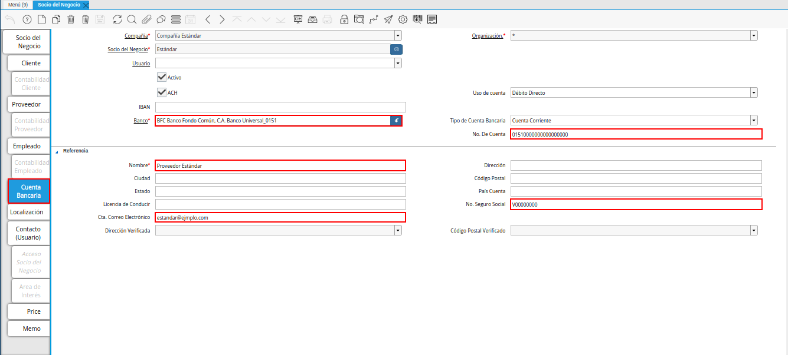
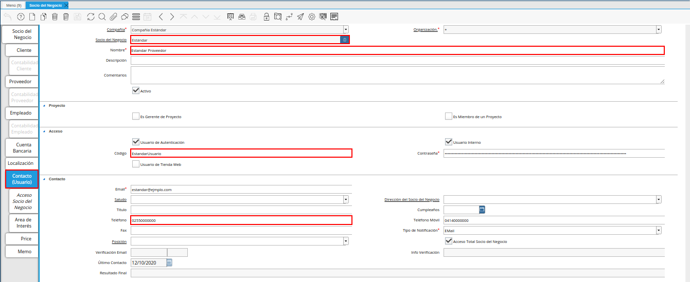
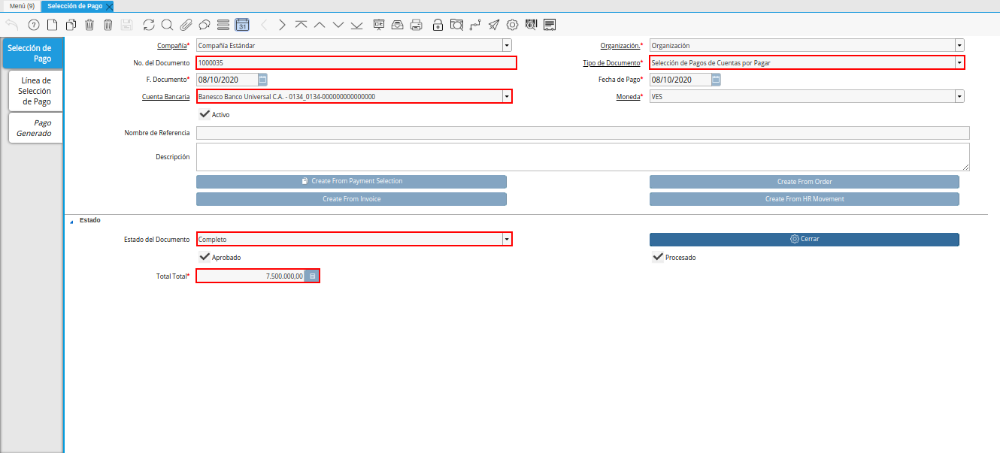
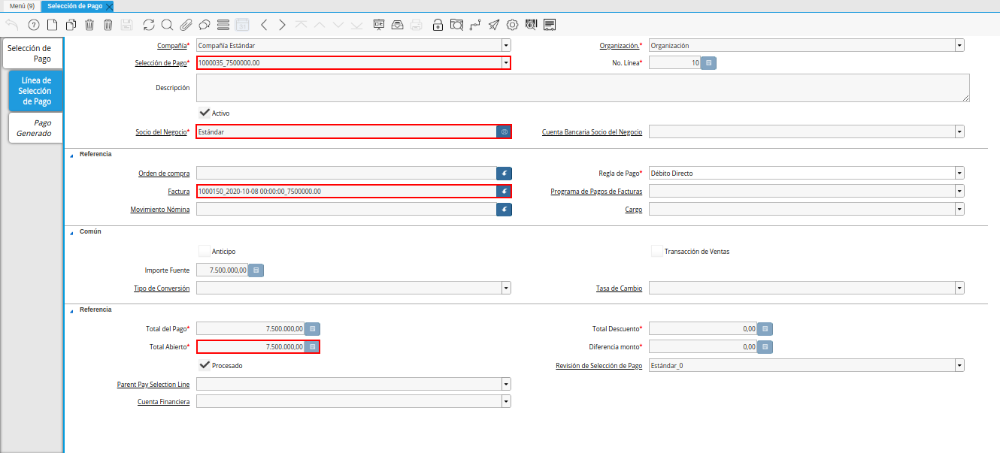

.. _ERPyA: http://erpya.com

.. |ventana imprimir exportar pagos| image:: resources/print-window-export-payments.png

.. _documento/txt-con-pagos-en-lotes:

**Extracto Bancario con Pagos en Lotes**
========================================

ADempiere permite procesar pagos en lotes y generar su respectivo archivo "**.txt**" para ser cargado al banco requerido por el usuario. Para ello, es necesario contar con ciertos requerimientos y que se cumpla con los flujos de trabajo correctos. 

Este proceso permite que se realice una gran cantidad de pagos a diferentes socios del negocio, en el cual la empresa u organización debe clasificar o agrupar mediante una selección de pago, todos los procesos de nómina o en su defecto, todas las facturas de cuentas por pagar a proveedores que requiere cancelar.

**Configuración Esencial**
**************************

Principalmente, el servicio de ADempiere debe contar con la siguiente configuración por socio del negocio, en la pestaña "**Cuenta Bancaria**" del registro del mismo. Esta configuración se debe cumplir de manera "**Obligatoria**" para los socios que cumplen los roles de proveedor y empleado.

Suponiendo que se tiene un socio del negocio llamado "**Estándar**". Se debe realizar el registro del mismo como lo indica el procedimiento explicado en los documentos :ref:`documento/socio-proveedor` y :ref:`documento/socio-empleado`, según sea el caso del socio. 

Es necesario que todos los socios del negocio cuenten con el registro de los siguientes campos que contiene la pestaña "**Cuenta Bancaria**", ya que con dicha información es creado el archivo "**.txt**" de cada banco soportado por ADempiere:

- "**Usuario**": El usuario de acceso en ADempiere definido para el socio del negocio que se encuentra configurando. La selección de este campo permite que ADempiere tome el número de teléfono ingresado en el campo "**Teléfono**", el usuario definido en el campo "**Código**" y el nombre ingresado en el campo "**Nombre**", del registro de la pestaña "**Contacto (Usuario)**" del socio del negocio, cuando sea requerido en el construcción del archivo "**.txt**". Un ejemplo de este campo puede ser "**02550000000**", "**EstandarUsuario**" y "**Estandar Proveedor**".

    |pestaña contacto usuario|

    Imagen 1. Configuración de Contacto Usuario de la Ventana Socio del Negocio

- "**Banco**": Banco donde el socio del negocio posee una cuenta bancaria. Este puede ser "**BFC Banco Fondo Común, C.A. Banco Universal**".
- "**No. De Cuenta**": Número de cuenta bancaria del socio del negocio en el banco indicado anteriormente. Un ejemplo de este campo puede ser "**01510000000000000000**".
- "**Nombre**": Nombre del socio del negocio titular de la cuenta bancaria indicada anteriormente. Para este ejemplo se tiene como nombre "**Proveedor Estándar**".
- "**No. Seguro Social**": Número de cédula de identidad o registro de información fiscal (RIF), del socio del negocio titular de la cuenta bancaria. Un ejemplo de este campo puede ser "**V00000000**".
- "**Cta. Correo Electrónico**": La dirección de correo electrónico del titular de la cuenta bancaria indicada anteriormente.

|pestaña cuenta bancaria de la ventana socio del negocio|

Imagen 2. Configuración Bancaria de la Ventana Socio del Negocio

.. note::

    Si desconoce el procedimiento para cargar en ADempiere la información bancaria del socio del negocio, puede consultar los documentos :ref:`documento/socio-proveedor` y :ref:`documento/socio-empleado`.

**Generación de Archivo**
*************************

Para obtener un extracto bancario o archivo en formato "**.txt**", debe existir un documento de "**Selección de Pago**" indicando la cuenta desde la cual se requiere ejecutar las transferencias bancarias. Para la elaboración de este documento se puede realizar el procedimiento explicado en el material :ref:`documento/selección-de-pago`, en el cual se incluyen todas las facturas de cuentas por pagar a proveedores que se van a cancelar desde la cuenta bancaria seleccionada. Adicional a ello, se puede realizar el procedimiento explicado en el material :ref:`documento/seleccion-pago-de-nómina`, en el cual se incluyen todos procesos de nómina que se van a cancelar desde la cuenta bancaria seleccionada.

Continuando con el ejemplo expuesto anteriormente, se crea el documento de selección de pago número "**1000035**".

    |ventana selección de pagos|

    Imagen 3. Ventana Selección de Pagos

Documento en el cual se tiene asociada la factura por pagar número "**1000150**", con monto de "**7.500.000,00**". Factura en la cual se encuentra involucrado el socio del negocio "**Estándar**" como socio proveedor.

    |pestaña línea selección de pagos|

    Imagen 4. Pestaña Línea Selección de Pagos

Al momento de generar el archivo en formato "**.txt**", ADempiere toma de la pestaña "**Cuenta Bancaria**" los datos de los socios del negocio involucrados en el documento seleccionado en el campo "**Selección de Pago**" de la ventana "**Imprimir/Exportar Pagos**".

    |ventana imprimir exportar pagos|

    Imagen 5. Ventana Imprimir/Exportar Pagos

    .. note::

        Si desconoce los procedimientos para registrar en ADempiere los pagos de nómina y los pagos a proveedores, puede consultar el documento :ref:`documento/pago-de-nómina`, para cancelar la nómina de los empleados. Adicional a ello, puede consultar los documentos :ref:`documento/orden-de-pago-desde-orden`, :ref:`documento/orden-de-pago`, :ref:`documento/selección-de-pago` y :ref:`documento/Imprimir-Exportar`, para cancelar las cuentas por pagar a proveedores.

**Resultado Obtenido**
**********************

Finalmente, se puede visualizar el archivo descargado automáticamente desde ADempiere para corroborar la información.

Un ejemplo del archivo generado en formato "**.txt**", sin seleccionar el usuario en la pestaña "**Cuenta Bancaria**", puede ser el siguiente:

::

    HDRBANESCO        ED  95BPAYMULP
    01SCV                                9  1000035                            20201008000000
    021000035                       J000000000       Compaa Estndar                     000000750000000VES 0134000000000000000               BANESCO    20201008
    0300000000                      000000750000000VES01510000000000000000          0151          V00000000        Proveedor Estndar                                                     estandar@ejmplo.com                                                                                                                                                                                      425
    06000000000000001000000000000001000000750000000

Un ejemplo del archivo generado en formato "**.txt**", seleccionando el usuario en la pestaña "**Cuenta Bancaria**", puede ser el siguiente:

::

    HDRBANESCO        ED  95BPAYMULP
    01SCV                                9  1000039                            20201012000000
    021000039                       J000000000       Compaa Estndar                     000000464000000VES 01340000000000000000              BANESCO    20201012
    0300000000                      000000464000000VES01510000000000000000          0151          V00000000        Proveedor Estndar                                                     estandar@ejmplo.com                                                   02550000000              EstandarUsuario  Estandar Proveedor                                                                       425
    06000000000000001000000000000001000000464000000

El archivo en formato "**.txt**" generado por ADempiere, debe ser cargado al banco desde el cual requiere que sean ejecutadas las transferencias bancarias.

`ERPyA`_ pretende ofrecer una explicación eficiente a nuestros clientes del estándar de extracto bancario a través de una guía fácil y sencilla para así obtener resultados exitosos en la versión 3.9.2 de ADempiere en la localización Venezuela. A continuación se explica el estándar que se debe tener por banco para generar un extracto bancario desde ADempiere y poder cargar el mismo al banco requerido por el usuario.

.. toctree::
    :maxdepth: 2

    bancaribe
    banesco
    banplus
    bfc
    bod
    exterior