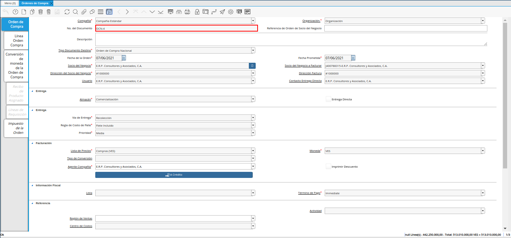
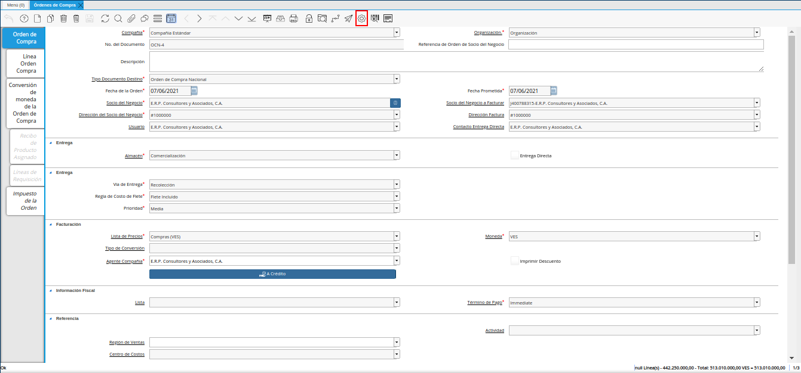
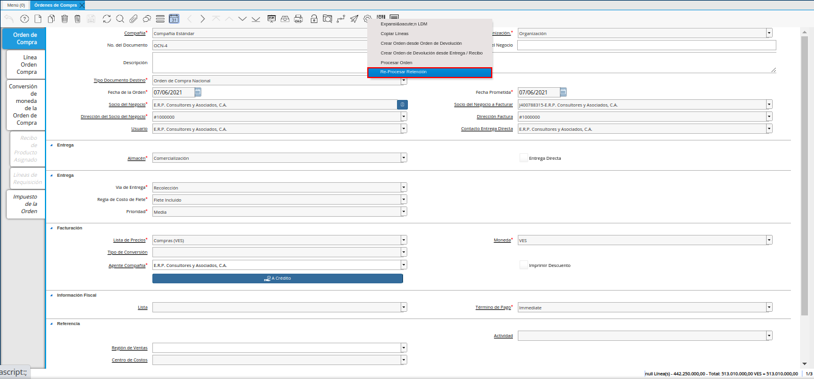
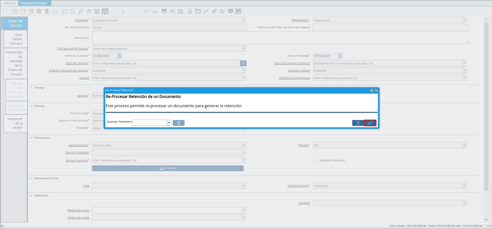
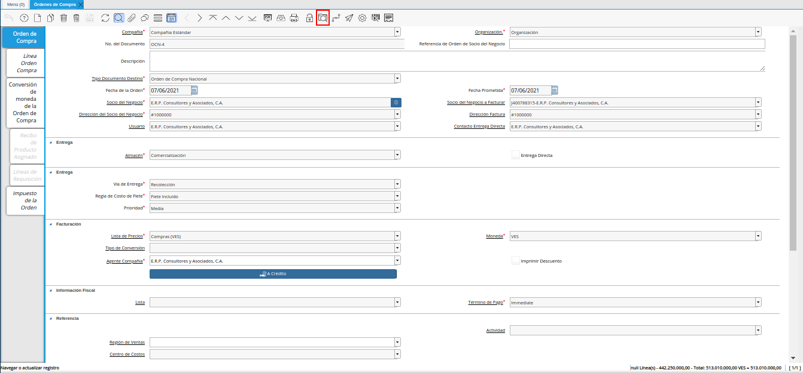
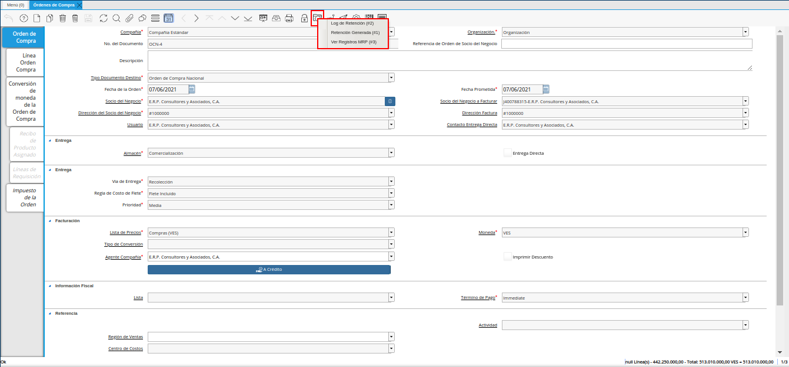
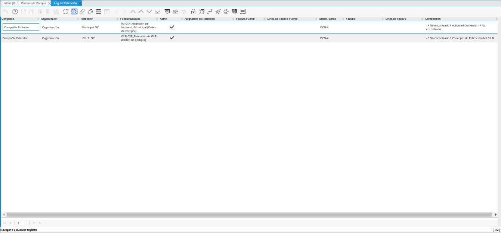
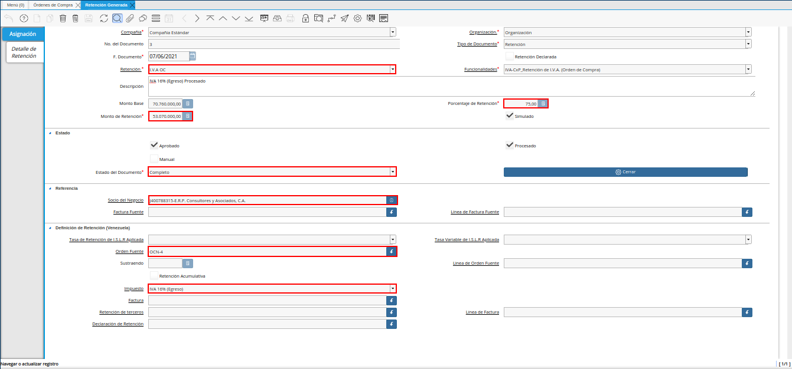

.. _documento/retenciones-estimadas-de-orden-de-compra:

**Retenciones Estimadas de Orden de Compra**
============================================

Realice el procedimiento regular para registrar una orden de compra en ADempiere.

    |registro de orden de compra|

    Imagen 1. Registro de Orden de Compra

    .. note::

        Si desconoce el procedimiento regular para generar en ADempiere un documento de orden de compra, puede consultar el material :ref:`src/adempiere/requisition-to-invoice/purchase-order`.

Luego de completar el registro de la orden de compra, seleccione el icono "**Proceso**" ubicado en la barra de herramientas de ADempiere.

    |icono proceso de la orden de compra|

    Imagen 2. Icono Proceso

Seleccione la opción "**Re-procesar Retención**", en el menú desplegado por el icono "**Proceso**".

    |opción reprocesar retención de la orden de compra|

    Imagen 3. Opción Re-procesar Retención

Podrá visualizar la ventana "**Re-procesar Retención**", donde debe seleccionar la opción "**OK**" para ejecutar el proceso.

    |ventana reprocesar retención de la orden de compra|

    Imagen 4. Ventana Re-procesar Retención

En la barra de herramientas seleccione el icono "**Visualiza Detalle**" para apreciar donde es usado el documento, en este caso la orden de compra.

    |icono visualiza detalle de la orden de compra| 

    Imagen 5. Icono Visualiza Detalle

Podrá apreciar el menú desplegado por el icono "**Visualiza Detalle**", el mismo muestra los documentos donde es utilizada la orden de compra.

    |menú del icono visualiza detalle de la orden de compra| 

    Imagen 6. Menú del Icono Visualiza Detalle

    La opción "**Log de Retención**" muestra el log de la retención no aplicada a la orden de compra número "**OCN-4**" seleccionada para el ejemplo.

        |opción log de retención de la orden de compra|

        Imagen 7. Opción Log de Retención

    La opción "**Retención Generada**" muestra el documento de estimación de retención aplicado a la orden de compra número "**OCN-4**" seleccionada para el ejemplo.

        |opción retención generada de la orden de compra|  

        Imagen 8. Opción Retención Generada

.. warning:: 

    ADempiere le genera al usuario por medio del icono "**Visualiza Detalle**", las alertas donde indica cuales fueron las retenciones aplicadas (**Retención Generada**) y cuales retenciones no fueron aplicadas (**Log**) según la configuración que tiene un socio del negocio determinado.
