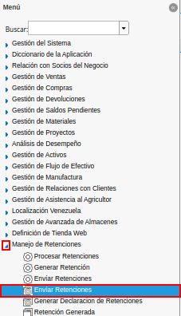
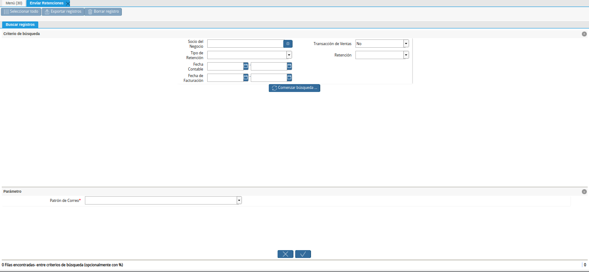
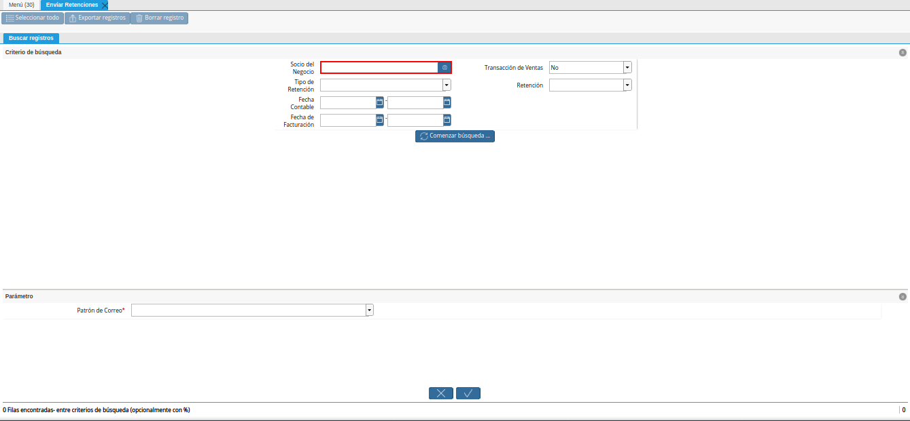
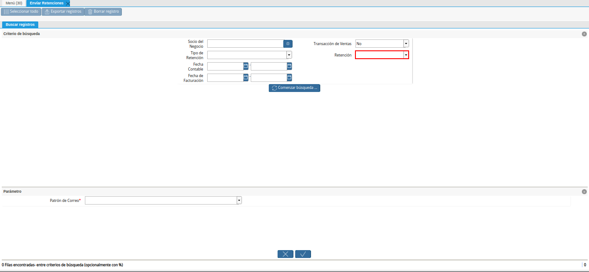
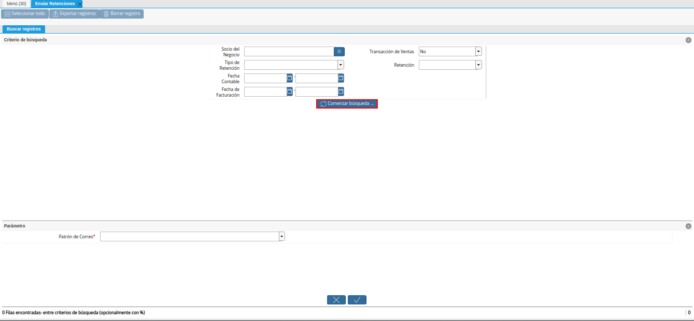
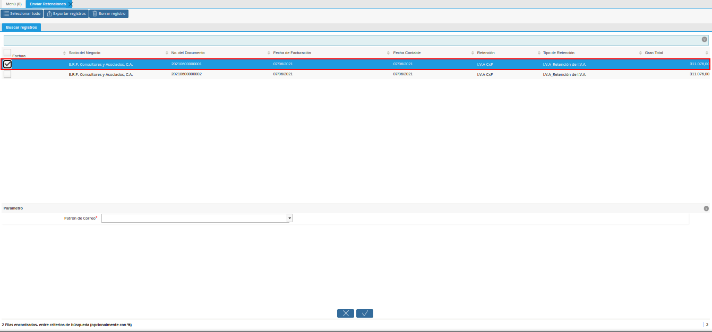
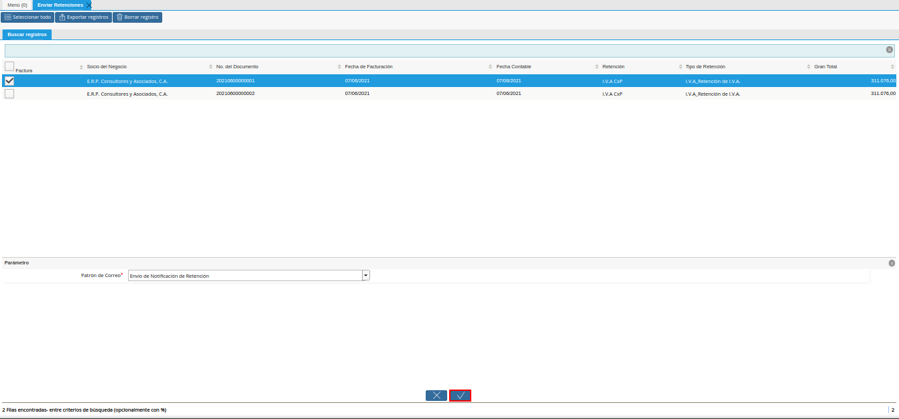
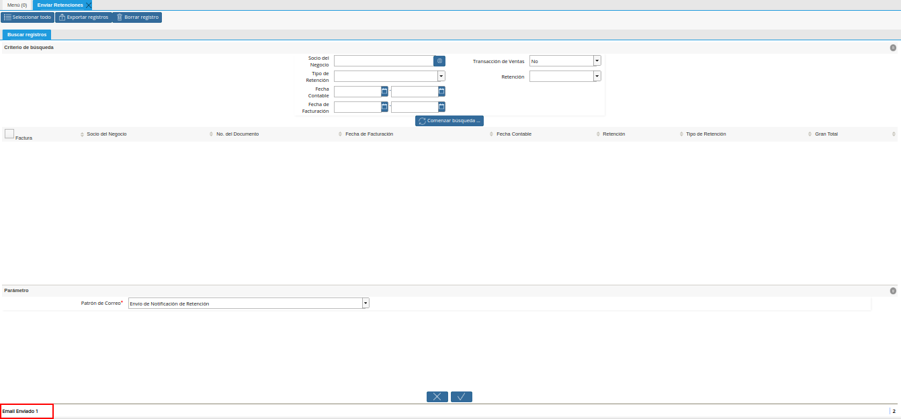

.. |campo transacciones de ventas de la ventana enviar retenciones| image:: resources/sales-transactions-field-of-the-send-withholdings-window.png

.. |campo fecha contable de la ventana enviar retenciones| image:: resources/accounting-date-field-of-the-window-send-withholdings.png
.. |campo fecha de facturación de la ventana enviar retenciones| image:: resources/billing-date-field-of-the-send-withholdings-window.png

.. |campo patrón de correo de la ventana enviar retenciones| image:: resources/mail-pattern-field-of-the-send-holds-window.png

.. |correo enviado| image:: resources/email-sent.png

.. _documento/enviar-retenciones:

**Enviar Retenciones**
======================

Ubique y seleccione en el menú de ADempiere, la carpeta "**Manejo de Retenciones**", luego seleccione la ventana de búsqueda inteligente "**Enviar Retenciones**".

    |menú de envío de retenciones|

    Imagen 1. Menú de ADempiere

Podrá visualizar la ventana de búsqueda inteligente "**Enviar Retenciones**", con diferentes campos que le permiten al usuario, filtrar la información para ejecutar el proceso en base a lo requerido por el mismo.

    |ventana de búsqueda inteligente enviar retenciones|

    Imagen 2. Ventana de Búsqueda Inteligente Enviar Retenciones

Seleccione en el campo "**Socio del Negocio**", el socio del negocio requerido para filtrar la información.

    |campo socio del negocio de la ventana enviar retenciones|

    Imagen 3. Campo Socio del Negocio

Indique en el campo "**Transacciones de Ventas**", si requiere filtrar la información por transacciones de ventas.

    |campo transacciones de ventas de la ventana enviar retenciones|

    Imagen 4. Campo Transacciones de Ventas

Seleccione en el campo "**Tipo de Retención**", el tipo de retención requerido para filtrar la información.

    |campo tipo de retención de la ventana enviar retenciones|

    Imagen 5. Campo Tipo de Retención

Seleccione en el campo "**Retención**", la retención requerida para filtrar la información.

    |campo retención de la ventana enviar retenciones|

    Imagen 6. Campo Retención

Seleccione en el campo "**Fecha Contable**", el rango de fecha contable por el cual requiere filtrar la información.

    |campo fecha contable de la ventana enviar retenciones|

    Imagen 7. Campo Fecha Contable

Seleccione en el campo "**Fecha de Facturación**", el rango de fecha de facturación por el cual requiere filtrar la información.

    |campo fecha de facturación de la ventana enviar retenciones|

    Imagen 8. Campo Fecha de Facturación

Seleccione la opción "**Comenzar Búsqueda**", para filtrar la información en base a los campos indicados anteriormente.

    |opción comenzar búsqueda de la ventana enviar retenciones|

    Imagen 9. Opción Comenzar Búsqueda

Seleccione el registro del documento de retención que requiere enviar por correo electrónico.

    |selección de retención de la ventana enviar retenciones|

    Imagen 10. Selección de Retención

Indique en el campo "**Patrón de Correo**", la plantilla de correo para enviar la retención.

    |campo patrón de correo de la ventana enviar retenciones|

    Imagen 11. Campo Patrón de Correo

Seleccione la opción "**OK**", para ejecutar el proceso y enviar la retención previamente seleccionada.

    |opción ok para enviar retención|

    Imagen 12. Opción OK para Enviar Retención

Podrá visualizar en la parte inferior izquierda de la ventana de búsqueda inteligente, el resultado del proceso.

    |resultado del proceso|

    Imagen 13. Resultado del Proceso

Finalmente, al acceder al correo electrónico y ubicar los mensajes enviados, podrá visualizar el correo enviado desde ADempiere.

    |correo enviado|

    Imagen 14. Correo Enviado