.. _ERPyA: http://erpya.com
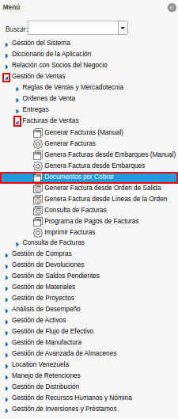
.. |Factura de Cuentas por Cobrar| image:: resources/accounts-receivable-invoice.png
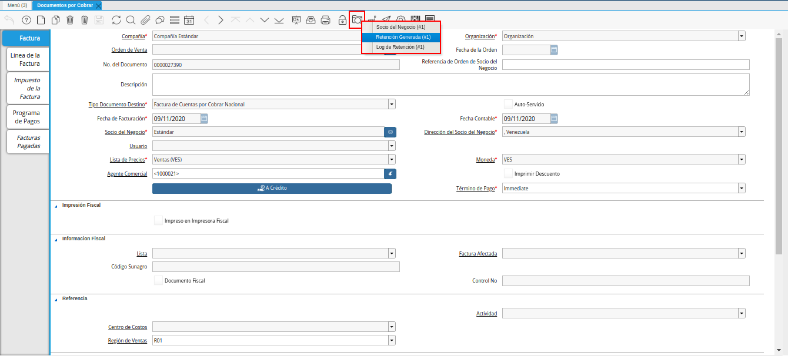
.. |Estimación de Retención de Cuentas por Cobrar| image:: resources/accounts-receivable-retention-estimate.png
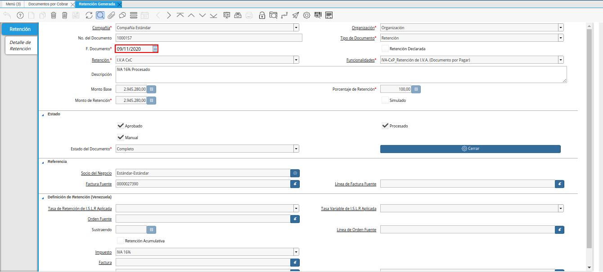
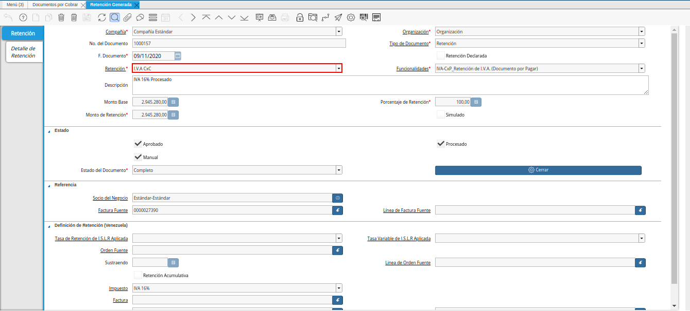
.. |Campo Monto de Retención de Estimación de Retención| image:: resources/withholding-estimate-withholding-amount-field.png
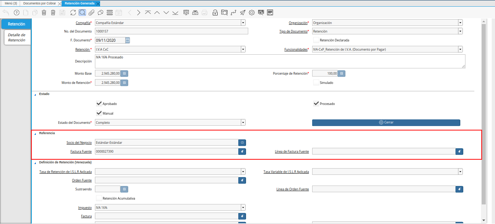
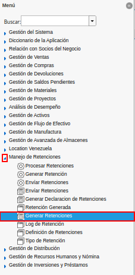
.. |ventana de búsqueda inteligente generar retenciones| image:: resources/smart-search-window-generate-holds.png
.. |campo socio del negocio de la retención| image:: resources/retention-business-partner-field.png
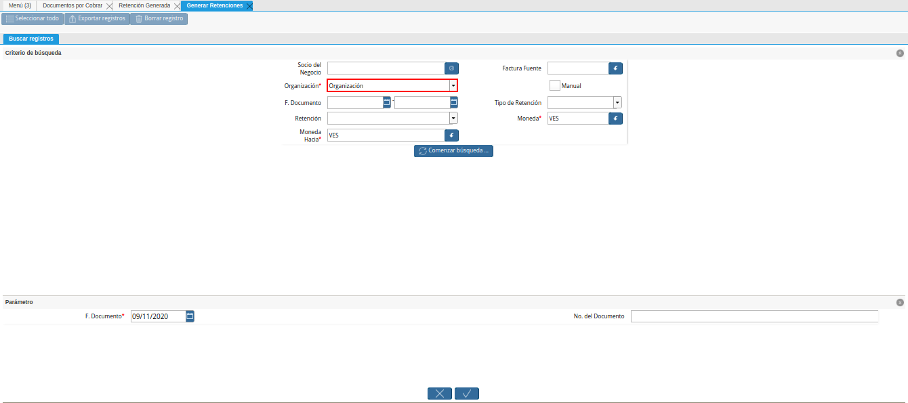
.. |campo fecha de documento de la retención| image:: resources/withholding-document-date-field.png
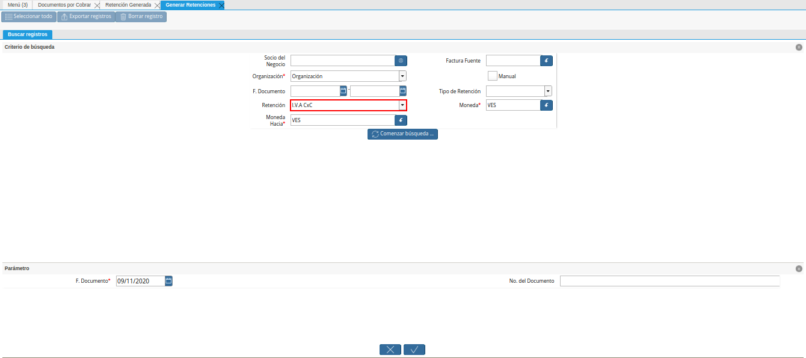
.. |campo moneda hacia para la retención| image:: resources/currency-to-field-for-withholding.png
.. |Campo Factura Fuente de la retención| image:: resources/withholding-source-invoice-field.png
.. |check manual de la retención| image:: resources/retention-manual-check.png
.. |campo tipo de retención| image:: resources/withholding-type-field.png
.. |campo moneda de la retención| image:: resources/withholding-currency-field.png
.. |opción comenzar búsqueda| image:: resources/option-start-search.png
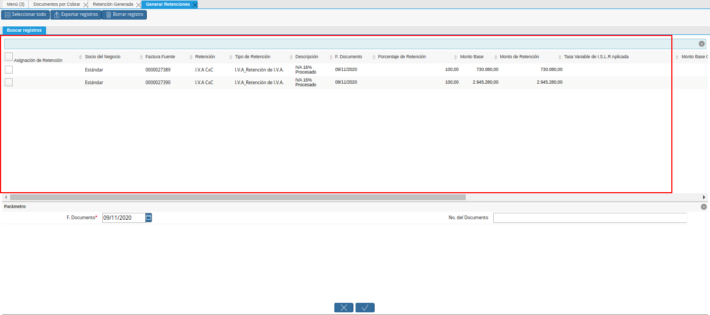
.. |selección de registros para retención| image:: resources/select-records-for-retention.png
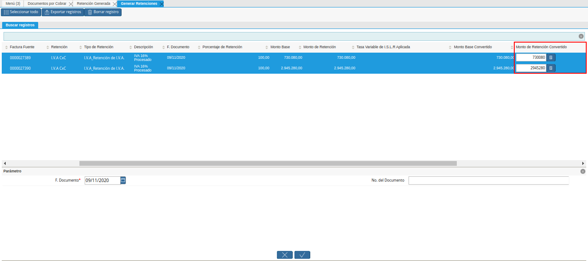
.. |campo fecha de documento a generar| image:: resources/date-field-of-document-to-generate.png
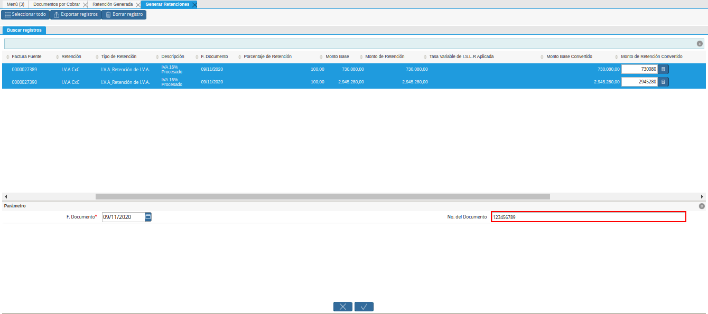
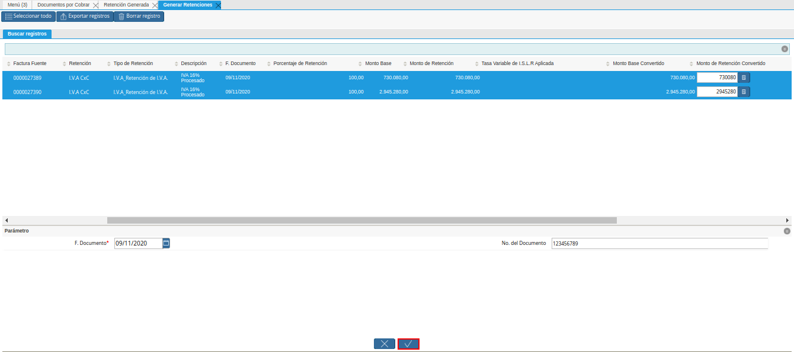
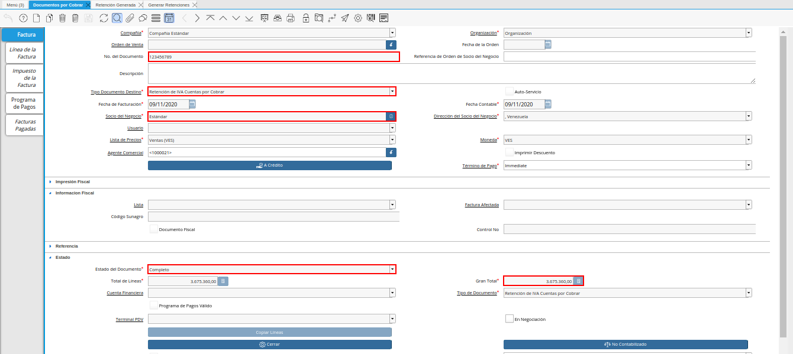
.. |líneas de la retención| image:: resources/retention-lines.png
.. |Icono Imprimir| image:: resources/print-icon.png
.. |PDF Retención de IVA CxC| image:: resources/pdf-withholding-iva-cxc.png

.. _documento/retenciones-cxc:

**Ejecución de la Estimación de Retenciones**
---------------------------------------------

Realice el procedimiento regular para generar una factura de cuentas por cobrar, explicado en el documento :ref:`documento/documento-por-cobrar`, elaborado por `ERPyA`_.

Luego seleccione en el menú de ADempiere, la carpeta "**Gestión de Ventas**", luego seleccione la carpeta "**Facturas de Ventas**", por último seleccione la ventana "**Documento por Cobrar**".

    |Menú de Factura por Cobrar|

    Imagen 1. Menú de ADempiere

Ubique el documento por cobrar al cual se le aplicará la retención de IVA, correspondiente a la factura de la venta realizada.

    |Factura de Cuentas por Cobrar|

    Imagen 2. Factura de Cuentas por Cobrar

    Seleccione el icono "**Visualiza Detalle**", en la barra de herramientas de ADempiere para desplegar los diferentes registros donde es utilizado el documento, luego seleccione la opción "**Retención Generada**".

        |Icono Visualiza Detalle|

        Imagen 3. Icono Visualiza Detalle

        .. note::

            La estimación de la retención se puede visualizar cuando el documento por cobrar se encuentre en estado "**Completo**".

    Podrá visualizar la ventana "**Retención Generada**" con la estimación de la retención generada de manera automática por ADempiere.

        |Estimación de Retención de Cuentas por Cobrar|

        Imagen 4. Estimación de Retención de Cuentas por Cobrar

    Podrá visualizar en el campo "**F. Documento**", la fecha en la que fue generada la estimación de la retención.

        |Campo Fecha de Documento de Estimación de Retención|

        Imagen 5. Campo Fecha de Documento de la Estimación de Retención

    Adicional a ello, el tipo de retención al cual le fue aplicada la estimación de retención, se encuentra en el campo "**Retención**".

        |Campo Retención de Estimación de Retención|

        Imagen 6. Campo Retención de la Estimación de Retención

    El monto estimado de la retención, se encuentra en el campo "**Monto de Retención**".

        |Campo Monto de Retención de Estimación de Retención|

        Imagen 7. Campo Monto de Retención de la Estimación de Retención

    Finalmente, la información del socio del negocio y la factura a la cual le fue aplicada la retención, se encuentra en el grupo de campos "**Referencia**".

        |Grupo de Campos Referencia de la Estimación de Retención|

        Imagen 8. Grupo de Campos Referencia de la Estimación de Retención

    .. note::

        Hasta este punto, solo se ve un precálculo o una estimación de la retención a aplicar a este documento por cobrar.

**Generar Retención**
---------------------

Ubique y seleccione en el menú de ADempiere, la carpeta "**Manejo de Retenciones**", luego seleccione la ventana de búsqueda inteligente "**Generar Retenciones**".

    |menú generar retenciones de cuentas por cobrar|

    Imagen 9. Menú de ADempiere

Podrá visualizar la ventana "**Generar Retenciones**", con diferentes campos que permiten filtrar la búsqueda de los registros para generar las retenciones.

    |ventana de búsqueda inteligente generar retenciones|

    Imagen 10. Ventana de Búsqueda Inteligente Generar Retenciones

Seleccione en el campo "**Socio del Negocio**", el socio del negocio relacionado a la retención que requiere generar.

    |campo socio del negocio de la retención|

    Imagen 11. Campo Socio del Negocio de la Retención

En el campo "**Organización**", la organización relacionada a la retención que requiere generar.

    |campo organización de la retención|

    Imagen 12. Campo Organización de la Retención

Seleccione en el campo "**F. Documento**", el rango de fecha en la cual fue generado el documento por cobrar relacionado a la retención que requiere generar.

    |campo fecha de documento de la retención|

    Imagen 13. Campo Fecha del Documento de la Retención

Seleccione en el campo "**Retención**", el tipo de retención por el cual requiere filtrar la información.

    |campo retención a buscar|

    Imagen 14. Campo Retención

Seleccione en el campo "**Moneda Hacia**", la moneda a la cual requiere convertir el monto de la retención.

    |campo moneda hacia para la retención|

    Imagen 15. Campo Moneda Hacia

Seleccione en el campo "**Factura Fuente**", la factura por la cual requiere filtrar la información para generar la retención.

    |Campo Factura Fuente de la retención|

    Imagen 16. Campo Factura Fuente

Seleccione el check "**Manual**", para filtrar la búsqueda por documentos por cobrar.

    |check manual de la retención|

    Imagen 17. Check Manual

Seleccione en el campo "**Tipo de Retención**", el tipo de retención por el cual requiere filtrar la búsqueda.

    |campo tipo de retención|

    Imagen 18. Campo Tipo de Retención

    .. note::

        El campo cuenta con tres opciones que son "**IM_Retencion de Impuesto Municipal**, "**ISLR_Retención de I.S.L.R.**" y "**I.V.A_Retención de I.V.A.**". Recuerde que la selección de este campo va a depender de la retención que se va a aplicar a la factura de cuentas por cobrar.

Seleccione en el campo "**Moneda**", la moneda del documento y desde la cual se requiere convertir el monto de la retención.

    |campo moneda de la retención|

    Imagen 19. Campo Moneda

Seleccione la opción "**Comenzar Búsqueda**", para filtrar la información en base a lo seleccionado en los campos indicados anteriormente.

    |opción comenzar búsqueda|

    Imagen 20. Opción Comenzar Búsqueda

Podrá visualizar los diferentes registros de estimaciones de retenciones generadas en ADempiere.

    |estimaciones de retenciones|

    Imagen 21. Estiimaciones de Retenciones

    Seleccione los diferentes registros a los cuales requiere generar la retención.

        |selección de registros para retención|

        Imagen 22. Selección de Registros para Retención

        .. note::

            El proceso permite seleccionar diferentes registros y generar una retención para todos.

    Al seleccionar el registro, ADempiere permite modificar el monto de retención, en el campo "**Monto de Retención Convertido**".

        |campo monto de retención convertido|

        Imagen 23. Campo Monto de Retención Convertido

    .. warning::

        El monto estimado de la retención debe ser verificado antes de generar el documento de retención, ya que el este monto puede variar por céntimos o decimales, según el comprobante facilitado por el socio cliente que aplico la retención. 

Seleccione en el campo "**F. Documento**", la fecha del comprobante de retención facilitado por el socio del negocio cliente que aplico la retención. 

    |campo fecha de documento a generar|

    Imagen 24. Campo Fecha de Documento a Generar

Introduzca en el campo "**No. del Documento**", el número del documento del comprobante de retención facilitado por el socio del negocio cliente que aplico la retención.

    |campo número del documento a generar|

    Imagen 25. Campo Número del Documento

Seleccione la opción "**OK**", para procesar la retención y generar en la ventana "**Documento por Cobrar**", el documento de retención con las indicaciones ingresadas en la ventana del proceso "**Generar Retenciones**", con el número de documento ingresado en el campo "**No. del Documento**".

    |opción ok de la ventana generar retenciones|

    Imagen 26. Opción OK de la Ventana Generar Retenciones

.. note::

    En este punto, si fueron generadas las retenciones, el cual rebaja parte de la cuenta por cobrar. Para mayor información puede consultar el reporte "**Saldos Abiertos**".

**Consultar el Documento por Cobrar Generado**
----------------------------------------------

El documento generado desde la ventana del proceso "**Generar Retenciones**", se puede visualizar de la siguiente manera al buscarlo en la ventana "**Documento por Cobrar**", con el número de documento ingresado en el campo "**No. del Documento**" del proceso. Para ejemplificar el registro es utilizado el número de documento "**123456789**".

    |Retención de IVA Cuentas por Cobrar|

    Imagen 27. Documento de Retención de IVA Cuentas por Cobrar Generado.

    .. note::

        El documento es generado en estado "**Completo**" y con las especificaciones ingresadas en la ventana del proceso "**Generar Retenciones**". Adicional a ello, toma el socio del negocio que se encuentra en la factura por cobrar desde donde se realizó el proceso. 

En la pestaña "**Línea de la Factura**", podrá visualizar un registro por cada estimación de retención seleccionada en el proceso "**Generar Retenciones**".

    |líneas de la retención|

    Imagen 28. Líneas de la Retención

Regrese a la pestaña principal "**Factura**" y seleccione en el icono "**Imprimir**" ubicado en la barra de herramientas de ADempiere, para visualizar el documento en PDF y poder imprimir el mismo.

    |Icono Imprimir|

    Imagen 29. Icono Imprimir

El PDF del documento "**Retención de IVA CxC**" quedaría de la siguiente manera.

    |PDF Retención de IVA CxC|

    Imagen 30. PDF del Documento Retención de IVA CxC

.. note::

    El procedimiento para generar en ADempiere las retenciones de ISLR y municipales de cuentas por cobrar es el mismo explicado en el presente documento, tomando en cuenta las notas con relación a ellas en la descripción de los campos "**Tipo de Retención**" y "**Retención**".