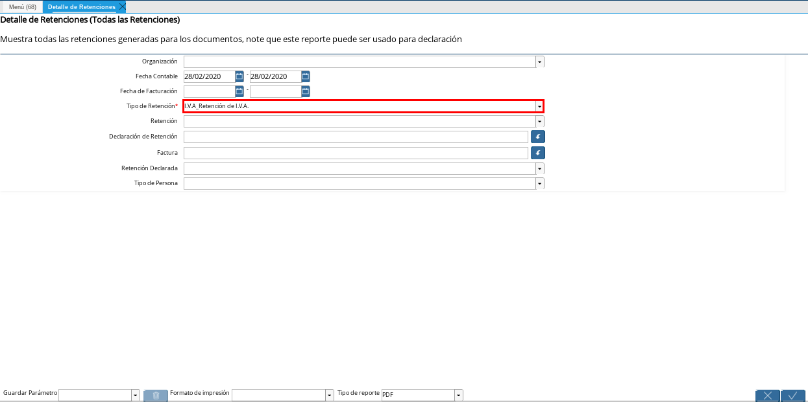

.. _ERPyA: http://erpya.com
.. |Menú de ADempiere 1| image:: resources/menu-gen-dec-ret-iva.png
.. |Ventana Generar Declaración de Retenciones| image:: resources/vent-gen-dec-ret-iva.png
.. |Campo Tipo de Retención 1| image:: resources/campo-tipo-ret1.png

.. |Opción Comenzar Búsqueda| image:: resources/comenz-bus-gen-dec1.png

.. |Número de Declaración Generada| image:: resources/num-dec-gen1.png
.. |Menú de ADempiere 2| image:: resources/menu-doc-pagar.png
.. |Documento por Pagar 1| image:: resources/doc-dec-ret1.png

.. |Campo Fecha Contable 1| image:: resources/fec-cont-det-ret.png

.. |Opción OK 1| image:: resources/op-ok-det-ret.png

.. |Icono Exportar Registro 1| image:: resources/ico-exp-reg.png

.. |Archivo o Documento Exportado 1| image:: resources/doc-generado.png

.. _documento/declaración-retención-cxp:

.. _paso/generar-declaración-retenciones:

**Generar Declaraciones de Retenciones**
========================================

#. Ubique y seleccione en el menú de ADempiere, la carpeta "**Manejo de Retenciones**", luego seleccione la ventana "**Generar Declaración de Retenciones**".

    |Menú de ADempiere 1|

    Imagen 1. Menú de ADempiere

#. Podrá visualizar la ventana de búsqueda inteligente "**Generar Declaración de Retenciones**", con los campos "**Tipo de Retención**" en el cual se selecciona el tipo de retención a declarar y "**Fecha Contable**" con el cual se establece el rango de fecha para filtrar la búsqueda.

    |Ventana Generar Declaración de Retenciones|

    Imagen 2. Ventana de Búsqueda Inteligente Generar Declaración de Retenciones

    #. Seleccione en el campo "**Tipo de Retención**", el tipo de retención por la cual desea filtrar la búsqueda para realizar la declaración del mismo. Para ejemplificar el registro es utilizada la opción "**I.V.A_Retención de I.V.A.**".

        |Campo Tipo de Retención 1|

        Imagen 3. Campo Tipo de Retención

        .. note::

            Recuerde que en el campo "**Tipo de Retención**", puede seleccionar cualquiera de las opciones "**IM_Retencion de Impuesto Municipal**", "**ISLR_Retención de I.S.L.R.**" o "**I.V.A_Retención de I.V.A.**", para realizar la búsqueda de las retenciones aplicadas de acuerdo a la opción seleccionada.

    #. Seleccione en el campo "**Fecha Contable**", el rango de fecha para filtrar la búsqueda de las retenciones aplicadas, según el tipo de retención seleccionado.

        |Campo Fecha Contable|

        Imagen 4. Campo Fecha Contable

    #. Seleccione la opción "**Comenzar Búsqueda**", para búscar los registros que tengan coincidencias con la información ingresada en los campos o filtros de búsqueda.

        |Opción Comenzar Búsqueda|

        Imagen 5. Opción Comenzar Búsqueda

        .. note::

            El campo "**F. Documento**" es la fecha contable que tomará el documento de declaración de retenciones al culminar el proceso "**Generar Declaración de Retenciones**". `ERPyA`_ recomienda ingresar la fecha en la que se declara la retención.

    #. Seleccione las diferentes retenciones a declarar y posteriormente seleccione la opción "**OK**" para culminar el proceso "**Generar Declaración de Retenciones**".

        |Selección de Retención y Opción OK|

        Imagen 6. Selección de Retenciones y Opción OK

        .. note::

            En la ventana del proceso se muestran todas las retenciones aplicadas a los diferentes socios del negocio que tengan coincidencias con la información ingresada en los campos o filtros de búsqueda.

#. Podrá visualizar en la parte inferior izquierda de la ventana, el número del documento generado.

    |Número de Declaración Generada|

    Imagen 7. Número de Declaración Generada

.. note::

    El proceso genera un documento por pagar de tipo "**Declaración Municipal de Cuentas por Pagar**", "**Declaración de ISLR de Cuentas por Pagar**" o "**Declaración de IVA de Cuentas por Pagar**", según la opción seleccionada en el campo "**Tipo de Retención**". El mismo es generado en estado "**Completo**" y con la sumatoria del monto total de todas las retenciones seleccionadas.

.. _paso/consultar-declaración-retenciones:

**Consultar Declaración de Retenciones**
========================================

#. Ubique y seleccione en el menú de ADempiere, la carpeta "**Gestión de Compras**", luego seleccione la ventana "**Documento por Pagar**".

    |Menú de ADempiere 2|

    Imagen 8. Menú de ADempiere

#. Al buscar el documento de declaración de retenciones, con el número de documento generado en la ventana del proceso "**Generar Declaración de Retenciones**", podrá visualizar el mismo de la siguiente manera.

    |Documento por Pagar 1|

    Imagen 9. Documento por pagar generado de tipo "**Declaración de IVA de Cuentas por Pagar**"

**Detalle de Declaraciones de Retenciones**
===========================================

#. Ubique y seleccione en el menú de ADempiere, la carpeta "**Localización Venezuela**", luego seleccione la ventana "**Detalle de Retenciones**".

    |Menú de ADempiere 3|

    Imagen 10. Menú de ADempiere

#. Podrá visualizar la ventana del reporte "**Detalle de Retenciones**", con diferentes campos o filtros para realizar la búsqueda de la información según lo requerido por el usuario y generar el reporte de acuerdo a lo seleccionado en los mismos.

    |Ventana Detalle de Retenciones 1|

    Imagen 11. Ventana del Reporte Detalle de Retenciones

    #. Seleccione en el campo "**Fecha Contable**", el rango de fecha para filtrar la búsqueda de las declaraciones realizadas. 

        |Campo Fecha Contable 1|

        Imagen 12. Campo Fecha Contable

    #. Seleccione en el campo "**Tipo de Retención**", el tipo de retención por la cual desea filtrar la búsqueda de las declaraciones realizadas. Para ejemplificar el registro es utilizada la opción "**I.V.A_Retención de I.V.A.**".

        |Campo Tipo de Retención 2|

        Imagen 13. Campo Tipo de Retención

        .. note::

            Recuerde que en el campo "**Tipo de Retención**", puede seleccionar cualquiera de las opciones "**IM_Retencion de Impuesto Municipal**", "**ISLR_Retención de I.S.L.R.**" o "**I.V.A_Retención de I.V.A.**", para realizar la búsqueda de las declaraciones generadas de acuerdo a la opción seleccionada.

    #. Seleccione la opción "**OK**" para generar el reporte "**Detalle de Retenciones**"

        |Opción OK 1|

        Imagen 14. Opción OK

    #. Podrá visualizar el reporte con todas las retenciones aplicadas a los diferentes socios del negocio que tengan coincidencias con la información ingresada en los campos o filtros de búsqueda.

        |Reporte de Detalle de Retenciones 1|

        Imagen 15. Reporte de Detalle de Retenciones

    #. Para visualizar el reporte de las diferentes declaraciones de retenciones generadas a los diferentes socios del negocio que tengan coincidencias con la información ingresada en los campos o filtros de búsqueda, seleccione en el campo o filtro "**Formato de Impresión**", la opción "**Declaración_TXT_IVA**". 

        |Reporte de Detalle de Declaraciones 1|

        Imagen 16. Reporte de Detalle de Declaraciones

        .. note:: 

            La opción en el campo "**Formato de Impresión**", para visualizar el reporte de las declaraciones de ISLR es "**RelaciónRetencionesISLR**".

    #. Seleccione el icono "**Exportar Registros**", para exportar el archivo o documento que debe ser importado a al portal del SENIAT.

        |Icono Exportar Registro 1|

        Imagen 17. Icono Exportar Registros 

        #. Podrá visualizar la siguiente ventana donde debe seleccionar en el campo "**Archivo de Tipo**", la opción "**Declaración de I.V.A (txt) Archivo de exportación de  Declaración de I.V.A**" y posteriormente la opción "**OK**" para generar el archivo o documento de declaración de retenciones de IVA.

            |Archivo de Tipo 1|

            Imagen 18. Campo Archivo de Tipo y Opción OK

            .. note::

                La opción para generar el archivo o documento de declaración de retenciones de ISLR es "**Declaración de I.S.L.R (xml) Export file format for Withholding Rental Tax applied to documents**".

    #. Podrá visualizar el archivo exportado en la parte inferior izquierda de la ventana del reporte "**Detalle de Retenciones**".

        |Archivo o Documento Exportado 1|

        Imagen 18. Archivo o Documento Exportado 

    #. Al abrir el archivo podrá visualizarlo de la siguiente manera

        ::

            J000000006	202101	2020-06-15	C	01	J000000779	10739	00-012468	12713872.59	10960234.99	1753637.60	0	20210110058697	0.00	16.00	0
            J000000006	202101	2020-08-27	C	01	J000000779	11048	00-012798	10086543.36	8695296.00	1391247.36	0	20210110058701	0.00	16.00	0
            J000000006	202101	2020-10-13	C	01	J000000779	11236	00-012997	171375555.12	147737547.49	23638007.63	0	20210110058700	0.00	16.00	0
            J000000006	202101	2020-12-22	C	01	J000000605	00007014	00-008546	22554057.84	19443153.31	2333178.40	0	20210110058704	0.00	16.00	0

    #. Dicho archivo contiene la siguiente descripción, explicada de manera detallada en el documento :download:`Formato_TXT_IVA.pdf`

        - **RIF del Agente de Retención**, en el archivo el rif del agente de retención es "**J000000006**"
        - **Periodo Impositivo**, en el archivo el periodo de facturación es "**202101**"
        - **Fecha de Factura**, en el archivo las fechas de las facturas son "**2020-06-15**", "**2020-08-27**", "**2020-10-13**", "**2020-12-22**"
        - **Tipo de Operación**, este puede ser "**C = compre; V = ventas**", en el archivo el tipo de operación es "**C**"
        - **Tipo de Documento**, este puede ser "**01 = Factura; 02 = Nota de Debito; 03 = Notas de Créditos**", en el archivo el tipo de documento es "**01**"
        - **Rif del Proveedor**, en el archivo los rif de los proveedores son "**J000000779**", "**J000000605**"
        - **Número de Factura**, en el archivo los números de facturas son "**10739**", "**11048**", "**11236**", "**00007014**"
        - **Número de Control**, en el archivo los números de control de las facturas son "**00-012468**", "**00-012798**", "**00-012997**", "**00-008546**"
        - **Monto Total de la Factura**, en el archivo los montos totales de las facturas son "**12713872.59**", "**10086543.36**", "**171375555.12**", "**22554057.84**"
        - **Total Base del Impuesto**, en el archivo los totales base de los impuestos son "**10960234.99**", "**8695296.00**", "**147737547.49**", "**19443153.31**"
        - **Monto del IVA Retenido**, en el archivo los montos del IVA retenidos son "**1753637.60**", "**1391247.36**", "**23638007.63**", "**2333178.40**"
        - **Número de Documento Afectado**, esta es la factura que dio origen a la nota de crédito o nota de débito. En el archivo el número de documento afectado es "**0**"
        - **Números de Comprobante de Retención**, en el archivo los números de comprobantes de retenciones son "**20210110058697**", "**20210110058701**", "**20210110058700**", "**20210110058704**"
        - **Monto Exento del IVA**, en el archivo el monto exento del IVA es "**0.00**"
        - **Alícuota**", en el archivo la alícuota es "**16.00**"
        - **Numero de Expediente**, en el archivo el número de expediente es "**0**"

.. note::

    La declaración de las retenciones municipales de cuentas por pagar, varia según el municipio donde se encuentre el socio del negocio al cual se le brinda el servicio ya que en cada municipio varía la retención del mismo. En ADempiere, dicha declaración es generada realizando los procesos :ref:`paso/generar-declaración-retenciones` y :ref:`paso/consultar-declaración-retenciones`, anteriormente explicados en el presente material.