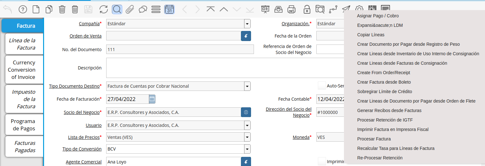
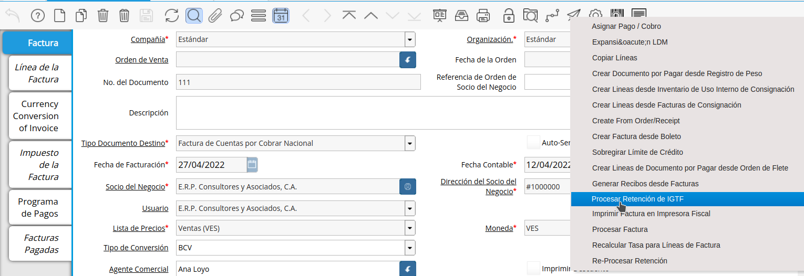

.. |Factura| image:: resources/invoice.png
.. |Proceso| image:: resources/proceso.png

.. |VentanaProcesoIGTF| image:: resources/ventanaprocesoigtf.png
.. |TipoRetencion| image:: resources/tipoderetencion.png
.. |Funcionalidades| image:: resources/funcionalidades.png
.. |Retención| image:: resources/retencion.png
.. |Moneda| image:: resources/moneda.png
.. |MontoBase| image:: resources/montobase.png
.. |OpcionOKP| image:: resources/opcionokproceso.png
.. |DescripcionIGTF| image:: resources/descripcionigtf.png
.. |VisualizaDetalle| image:: resources/visualizadetalle.png

.. |MenuGRetenciones| image:: resources/generarretenciones.png
.. |VentanaGRetenciones| image:: resources/vgenerarretenciones.png
.. |SeleccionSociodeNegocio| image:: resources/seleccionsociodenegocio.png

.. |SeleccionManual| image:: resources/seleccionmanual.png

.. |SeleccionMoneda| image:: resources/seleccionmoneda.png

.. |BotonComenzarBusqueda| image:: resources/botoncomenzarbusqueda.png

.. |AcercadorIGTFdeb| image:: resources/acercadordebigtf.png
.. |DocAsignadosIGTF| image:: resources/docasignadosigtf.png

     

.. _documento/retención-igtf:

=========================================================
**Retención IGTF de Cuenta por Cobrar**
=========================================================

En la providencia Nº Snat/2022/000013 del Servicio Nacional Integrado de Administración Aduanera y Tributaria (Seniat), que entró en vigencia el 28 de marzo de este año, se designa a los contribuyentes especiales como agentes de percepción del IGTF.

En este sentido, para el caso de la cuenta por cobrar el tributo es percibido en la factura, tomando como monto base el total de la cobranza en divisas o criptoactivos diferente al petro.

De esta manera se estará generando un débito fiscal de IGTF, que debe ser  declarado quincenalmente acorde al :download:`instructivo emitido por el SENIAT. <IGTF_QUINCENAL.pdf>`
  

**Ejecución de la Estimación de Retenciones**
---------------------------------------------

Ubique la factura de cuenta por cobrar ya realizada al cliente, la misma debe estar en estado "**Completo**", para este ejemplo se utiliza la factura número "**111**".

      |Factura|

      Imagen 1. Factura Aplicada al Socio del Negocio

Seleccione el icono "**Proceso**" en la barra de herramientas para ejecutar la retención de IGTF.

      |Proceso| 

      Imagen 2. Icono Proceso

Podrá apreciar el menú desplegado por el icono "**Proceso**", el mismo muestra los Procesos disponibles en su rol para la ejecución.

      |DetalleProceso|

      Imagen 3. Menú de Procesos

Seleccione la opción "**Procesar Retención de IGTF**".
      
      |ProcesoIGTF|

      Imagen 4. Proceso IGTF
    
A continuación se desplegará la siguiente ventana.

      |VentanaProcesoIGTF|

      Imagen 5. Ventana de Proceso Generar IGTF

Proceda a vaciar la información necesaria.

      Seleccione "**Impuesto IGTF**" para el campo "**Tipo de Retención**".  

            |TipoRetencion|

            Imagen 6. Tipo de Retención

      Seleccione "**Impuesto IGTF**" en el campo  "**Funcionalidades**".  

            |Funcionalidades|

            Imagen 7. Funcionalidades

      Seleccione "**Impuesto IGTF (CxC)**" en el campo "**Retención**".  

            |Retención|

            Imagen 8. Retención

      Seleccione "**Moneda**", para este caso indique la moneda del acuerdo del cobro, para el ejemplo utilizaremos USD ($).  

            |Moneda|

            Imagen 9. Moneda de Acuerdo de cobro

      Indique el "**Monto Base**", para este caso indique el monto del acuerdo del cobro, para el ejemplo indicaremos 70.  

            |MontoBase|

            Imagen 10. Monto del Cobro
      
      Seleccione la opción "**OK**" Ubicada en el proceso para generar la retención.
            
            |OpcionOKP|

            Imagen 11. Opción OK
      
      Al ejecutar el proceso, luego de unos segundos se visualiza en el campo descripción de la factura, el siguiente mensaje que será impreso en su documento en caso de trabajar con formato proforma.
            
            |DescripcionIGTF|

            Imagen 12. Mensaje Impreso en la Factura
.. warning::

      Repita el procedimiento desde el punto dos, para registrar un nuevo pago con una moneda o criptoactivo diferente a la anterior, de esta manera ADempiere generará tantas retenciones como cobros con diferentes monedas existan.

.. note::

      Si por algún motivo el monto del cobro debiera sufrir algún cambio, repita el procedimiento desde el punto dos, para registrar un nuevo cobro con la misma moneda anterior, de esta manera ADempiere anulará la retención anterior y generará la nueva retención.
      
Seleccione el icono "**Visualiza Detalle**" en la barra de herramientas para apreciar donde es usado el documento, en este caso la factura.

      |VisualizaDetalle| 

      Imagen 13. Icono Visualiza Detalle

Podrá apreciar el menú desplegado por el icono "**Visualiza Detalle**", el mismo muestra los documentos donde es utilizada la factura.

      |DetalleDocumento|

      Imagen 14. Menú del Icono Visualiza Detalle

      Seleccione La opción "**Retención Generada**" muestra el documento de retención aplicado a la factura número "**111**" seleccionada para el ejemplo.

.. warning::

      ADempiere le genera al usuario por medio del icono "**Visualiza Detalle**", las alertas donde indica cuales fueron las retenciones aplicadas (**Retención Generada**) y cuales retenciones no fueron aplicadas (**Log**) según la configuración que tiene un socio del negocio determinado.

**Re-Generar IGTF desde Caja/Cobro**
------------------------------------

Realice el procedimiento regular para generar un cobro, explicado en el documento :ref:`documento/cobro`, elaborado por `ERPyA`_. 

.. note::

      Este procedimiento solo aplica bajo las siguientes condiciones: 
      "**Tipo de Pago Efectivo**"
      "**Moneda: Diferente a la moneda de curso legal**"

Al completar la caja se reversa de manera automática la estimación de retenciones anterior, para dar paso a la retención definitiva con la base del cobro definitivo, en este sentido, al consultar la factura podrá observar la estimación de retención anterior anulada, y una nueva en estado completo proveniente del cobro.

      Vaya a la factura origen y ubique las "**Retenciones Generadas**" para validar los cálculos, si todo está correcto vaya al siguiente capitulo para generar el comprobante del cobro del "**IGTF**".

**Generar Débito de IGTF para Factura**
---------------------------------------------
Seleccione en el menú la opción "**Generar Retenciones**"

      |MenuGRetenciones|

      Imagen 15. Menú Generar Retenciones

Se visualiza la siguiente ventana  "**Generar Retenciones**"

      |VentanaGRetenciones|

      Imagen 15. Menú Generar Retenciones

Indique el cliente al cual le generará el comprobante de retención en el campo "**Socio de Negocio**"
      
      |SeleccionSociodeNegocio|

      Imagen 16. Selección del Cliente

Indique la Factura, en caso querer emitir el comprobante a una factura en especifico en el campo "**Factura Fuente**", caso contrario, omita el campo y podrá filtrar todas las facturas pendientes por emisión de retención.

      |SeleccionFactura|

      Imagen 17. Selección de Factura

Indique la organización en la que desea generar el comprobante en el campo "**Organización**"
      
      |SeleccionOrganizacion|

      Imagen 18. Selección de Organización

Para este caso, se omite el campo "**Manual**" siendo de esta manera falso, puesto que, para el caso de esta retención es calculada desde ADempiere.

      |SeleccionManual|

      Imagen 19. Selección de Manual

Indique el valor "**Impuesto IGTF (CxC)**" en el campo "**Retención**"

      |SeleccionRetención|

      Imagen 20. Selección de Retención

Indique la moneda del pago en el campo "**Moneda**"

      |SeleccionMoneda|

      Imagen 21. Selección de Moneda de Cobro

Indique la Moneda a Convertir para el comprobante y monto a declarar, en el campo "**Moneda Hacia**", por defecto encontrará la moneda "**VES**" por ser la moneda oficial en Venezuela.

      |SeleccionMonedaHacia|

      Imagen 22. Selección de Moneda para Comprobante

Indique el tipo de conversión con el cúal será convertido la retención del IGTF, en el campo "**Tipo de Conversión**", por defecto encontrará el tipo de conversión "**BCV**" por ser la tasa oficial en Venezuela.

      |SeleccionTipoConversion|

      Imagen 23. Selección de Tipo de Conversión

Seleccione la opción "**Comenzar Búsqueda**", para comenzar a ver los registros a generar como comprobantes.

      |BotonComenzarBusqueda|

      Imagen 24. Comenzar Búsqueda

Visualizará los siguientes resultados
      
      |ResultadoComprobante|

      Imagen 25. Resultados de Búsqueda

Seleccione el registro al cúal generará el comprobante

      |SeleccionComprobante|

      Imagen 26. Selección de Búsqueda

Seleccione la opción "**OK**" que indica que se emitirá el comprobante del IGTF, ó débito por concepto de retención de IGTF.

      |SeleccionOKComprobante|

      Imagen 26. Selección Botón OK

**Impresión de Comprobante de IGTF**
------------------------------------
Ubique la factura producto de "**Retención IGTF la opción**", seleccione el acercador.

      |AcercadorIGTFdeb|

Seleccione la opción "**Documentos por Cobrar (Asignados)"

      |DocAsignadosIGTF|

Seleccione la opción imprimir de manera regular y acontinuación verá el siguiente formato.

      |comprobanteIGTF|

