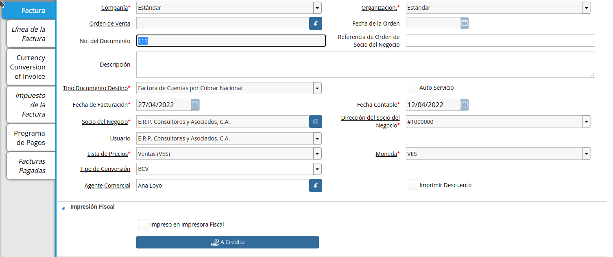
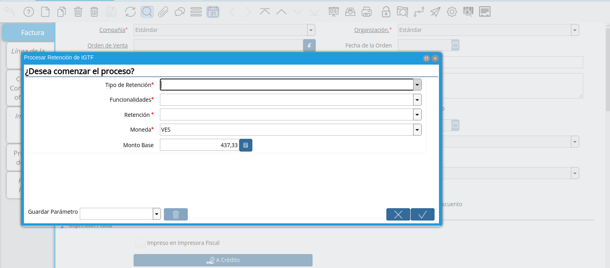
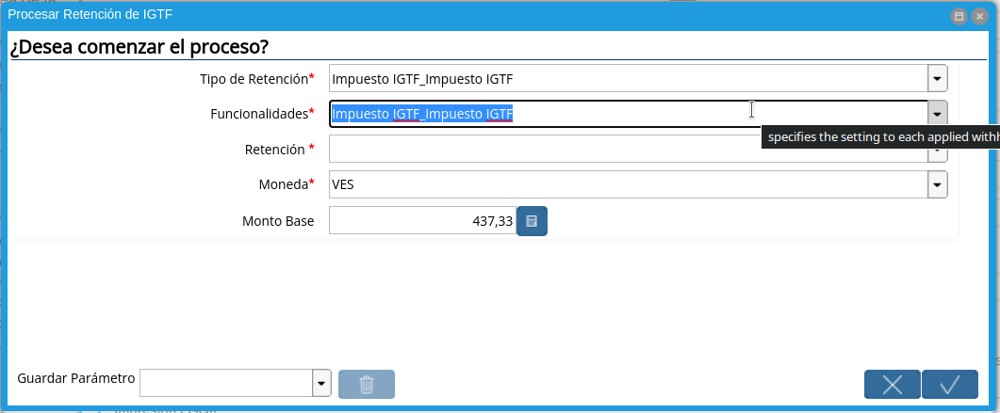
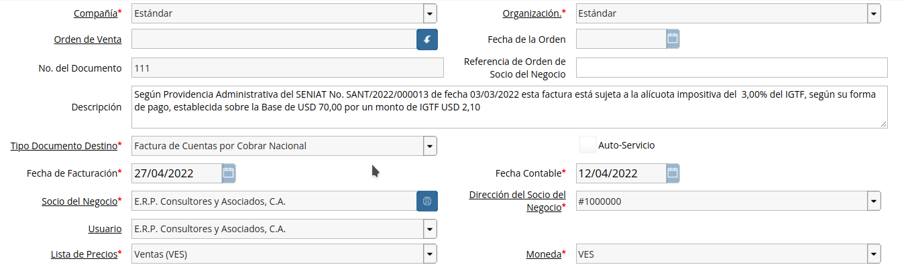

.. |Proceso| image:: resources/proceso.png
.. |DetalleProceso| image:: resources/detalleprocesos.png
.. |ProcesoIGTF| image:: resources/procesoigtf.png

.. |TipoRetencion| image:: resources/tipoderetencion.png

.. |Retención| image:: resources/retencion.png
.. |Moneda| image:: resources/moneda.png
.. |MontoBase| image:: resources/montobase.png
.. |OpcionOKP| image:: resources/opcionokproceso.png

.. _documento/retención-igtf:

**Ejecución de la Estimación de Retenciones IGTF**
===================================================

Ubique la factura de cuenta por cobrar ya realizada al cliente, la misma debe estar en estado "**Completo**", para este ejemplo se utiliza la factura número "**111**".

      |Factura|

      Imagen 1. Factura Aplicada al Socio del Negocio

Seleccione el icono "**Proceso**" en la barra de herramientas para ejecutar la retención de IGTF.

      |Proceso| 

      Imagen 2. Icono Proceso

Podrá apreciar el menú desplegado por el icono "**Proceso**", el mismo muestra los Procesos disponibles en su rol para la ejecución.

      |DetalleProceso|

      Imagen 3. Menú de Procesos

Seleccione la opción "**Procesar Retención de IGTF**".
      
      |ProcesoIGTF|

      Imagen 4. Proceso IGTF
    
A continuación se desplegará la siguiente ventana.

      |VentanaProcesoIGTF|

      Imagen 5. Ventana de Proceso Generar IGTF

Proceda a vaciar la información necesaria.

      Seleccione "**Tipo de Retención: Impuesto IGTF**".  

            |TipoRetencion|

            Imagen 6. Tipo de Retención

      Seleccione "**Funcionalidades: Impuesto IGTF**".  

            |Funcionalidades|

            Imagen 7. Funcionalidades

      Seleccione "**Retención: Impuesto IGTF (CxC)**".  

            |Retención|

            Imagen 8. Retención

      Seleccione "**Moneda**", para este caso indique la moneda del acuerdo del cobro, para el ejemplo utilizaremos USD ($).  

            |Moneda|

            Imagen 9. Moneda de Acuerdo de cobro

      Indique el "**Monto Base**", para este caso indique el monto del acuerdo del cobro, para el ejemplo indicaremos 70.  

            |MontoBase|

            Imagen 10. Monto del Cobro
      
      Seleccione la opción "**OK**" Ubicada en el proceso para generar la retención.
            
            |OpcionOKP|

            Imagen 11. Opción OK
      
      Al ejecutar el proceso, luego de unos segundos se visualiza en el campo descripción de la factura, el siguiente mensaje que será impreso en su documento en caso de trabajar con formato proforma.
            
            |DescripcionIGTF|

            Imagen 12. Mensaje Impreso en la Factura

.. warning::

      ADempiere le genera al usuario por medio del icono "**Visualiza Detalle**", las alertas donde indica cuales fueron las retenciones aplicadas (**Retención Generada**) y cuales retenciones no fueron aplicadas (**Log**) según la configuración que tiene un socio del negocio determinado.

**Generar Retención Municipal Fiscal**
======================================

Ubique en el menú de ADempiere la carpeta "**Manejo de Retenciones**" y seleccione la ventana de busqueda inteligente "**Generar Retenciones**".

      |Menú de ADempiere 2| 
    
      Imagen 15. Menú de ADempiere

Podrá apreciar la ventana de busqueda inteligente con diferentes campos para filtrar la busqueda.

      |Ventana de Busqueda Inteligente| 
    
      Imagen 16. Ventana de Busqueda Inteligente

Seleccione el socio del negocio en el campo "**Socio del Negocio**", para este ejemplo el socio del negocio es "**Standard Standard**".

      |Filtrar por Socio del Negocio| 

      Imagen 17. Filtrar por Socio del Negocio

Seleccione la opción "**Comenzar Busqueda**" para buscar por los campos introducidos.

      |Opción Comenzar Busqueda| 

      Imagen 18. Opción Comenzar Busqueda

Podrá apreciar las retenciones que el socio del negocio tiene seleccionado en los diferentes documentos.

      |Retenciones del Socio del Negocio| 

      Imagen 19. Retenciones del Socio del Negocio

Seleccione la retención a generar y la opción "**OK**" para generar la retención al socio del negocio seleccionado.

      |Selección de Retención y Opción OK| 

      Imagen 20. Selección de Retención y Opción OK

Podrá apreciar que el proceso se realizó correctamente con el mensaje "OK" mostrado por ADempiere al final de la ventana de busqueda inteligente.

      |Mensaje OK|

      Imagen 21. Mensaje OK

**Imprimir Documento de la Retención Aplicada al Socio del Negocio**
====================================================================

Ubique en el menú de ADempiere la carpeta "**Gestión de Compras**" y seleccione la ventana "**Documentos por Pagar**".

      |Menú de ADempiere 3| 

      Imagen 22. Menú de ADempiere

Podrá apreciar la ventana "**Documentos por Pagar**" donde se encuentran todos los registros que posee la misma.

      |Ventana Documentos por Pagar|

      Imagen 23. Ventana Documentos por Pagar

Seleccione el icono "**Encontrar Registro**" en la barra de herramientas de ADempiere, para realizar una busqueda avanzada del documento de retención generado.

      |Icono Encontrar Registro| 

      Imagen 24. Icono Encontrar Registro

Seleccione la pestaña "**Avanzado**" para filtrar la busqueda por "**Socio del Negocio**", "**Tipo de Documento de Retención de Cuentas por Pagar**" y "**Fecha de la Retención**".

      |Buscador Avanzado|

      Imagen 25. Buscador Avanzado

Seleccione el icono "**Nuevo**" para generar el número de filas de busqueda que se necesitan, para este ejemplo se necesitan tres (3) filas.

      |Icono Nuevo|

      Imagen 26. Icono Nuevo

      Seleccione en la primera fila la opción "**Socio del Negocio**" y introduzca el nombre del socio del negocio en la columna "**Valor Consulta**", para este ejemplo el socio del negocio es "**Standard Standard**".

            |Selección Socio del Negocio|
        
            Imagen 27. Selección Socio del Negocio

      Seleccione en la segunda fila la opción "**Tipo de Documento Destino**" y seleccione en la columna "**Valor Consulta**" el tipo de documento destino, para este ejemplo el tipo de documento destino es "**Retención de IVA para Factura de Cuentas por Pagar**".

            |Selección Tipo de Documento Destino| 
        
            Imagen 28. Selección Tipo de Documento Destino

      Seleccione en la tercera fila la opción "**Fecha Contable**" y seleccione en la columna "**Valor Consulta**" la fecha en la que se realizo la retención, para este ejemplo la fecha es "**25/09/2019**".
    
            |Selección Fecha Contable| 
        
            Imagen 29. Selección Fecha Contable

      Seleccione la opción "**OK**" para realizar la busqueda filtrada por los campos seleccionados.

            |Opción OK|
        
            Imagen 30. Opción OK

Seleccione en la barra de herramientas de ADempiere el icono "**Imprimir**", para imprimir el documento de retención buscado.

      |Opción Imprimir|
    
      Imagen 31. Opción Imprimir

Podrá apreciar el documento de retención de la siguiente manera.

      |Documento de Retención| 
      
      Imagen 32. Documento de Retención
