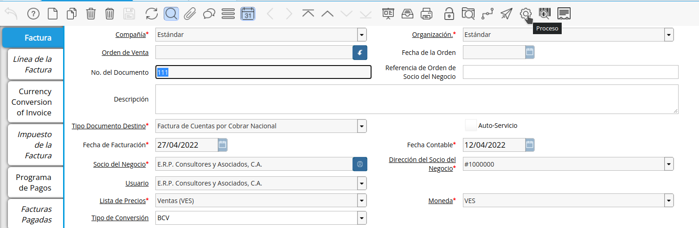
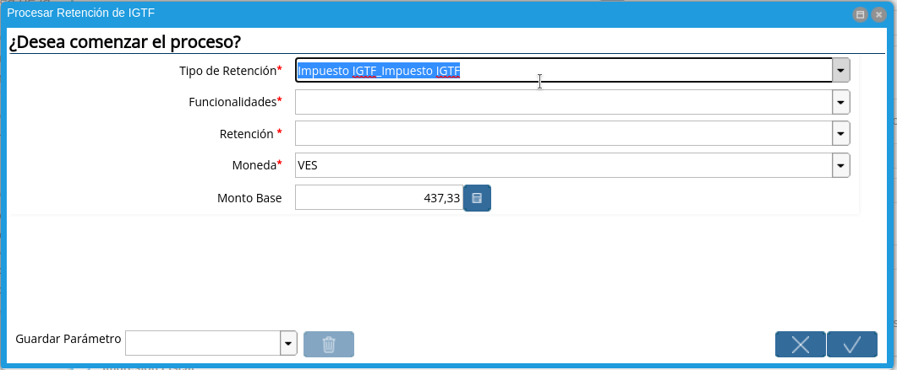
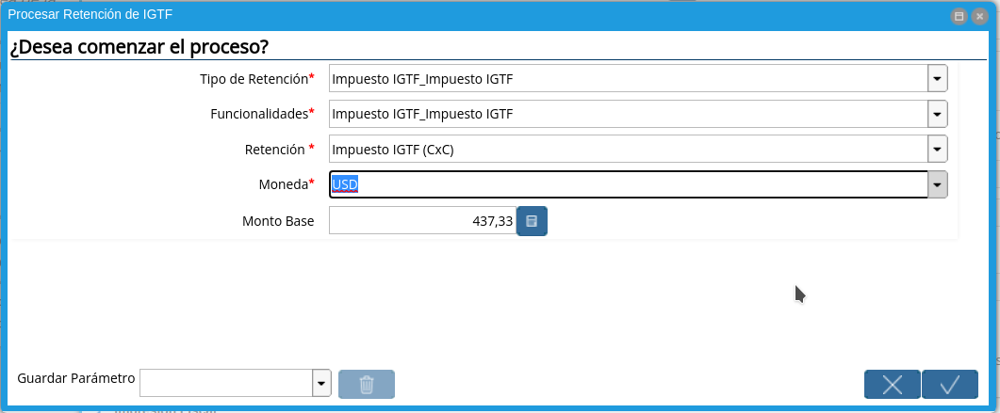
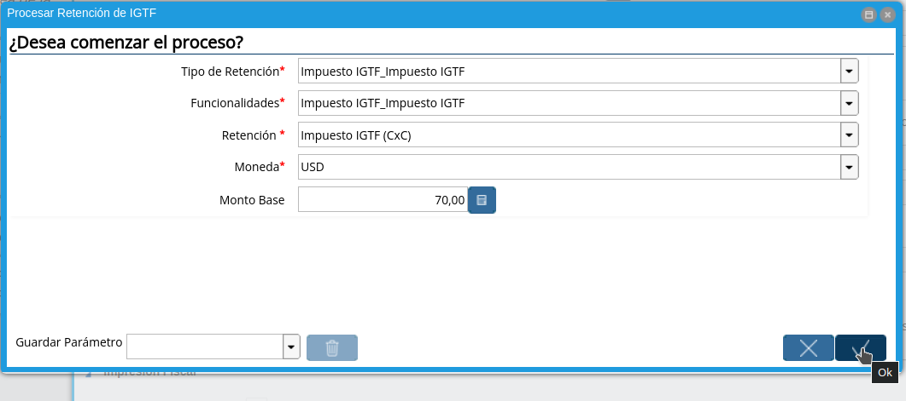

.. |Factura| image:: resources/invoice.png

.. |DetalleProceso| image:: resources/detalleprocesos.png
.. |ProcesoIGTF| image:: resources/procesoigtf.png
.. |VentanaProcesoIGTF| image:: resources/ventanaprocesoigtf.png

.. |Funcionalidades| image:: resources/funcionalidades.png
.. |Retención| image:: resources/retencion.png

.. |MontoBase| image:: resources/montobase.png

.. |DescripcionIGTF| image:: resources/descripcionigtf.png
.. |VisualizaDetalle| image:: resources/visualizadetalle.png
.. |DetalleDocumento| image:: resources/detalledocumento.png
.. |MenuGRetenciones| image:: resources/generarretenciones.png
.. |VentanaGRetenciones| image:: resources/vgenerarretenciones.png

.. _documento/retención-igtf:

**Ejecución de la Estimación de Retenciones IGTF**
===================================================

Ubique la factura de cuenta por cobrar ya realizada al cliente, la misma debe estar en estado "**Completo**", para este ejemplo se utiliza la factura número "**111**".

      |Factura|

      Imagen 1. Factura Aplicada al Socio del Negocio

Seleccione el icono "**Proceso**" en la barra de herramientas para ejecutar la retención de IGTF.

      |Proceso| 

      Imagen 2. Icono Proceso

Podrá apreciar el menú desplegado por el icono "**Proceso**", el mismo muestra los Procesos disponibles en su rol para la ejecución.

      |DetalleProceso|

      Imagen 3. Menú de Procesos

Seleccione la opción "**Procesar Retención de IGTF**".
      
      |ProcesoIGTF|

      Imagen 4. Proceso IGTF
    
A continuación se desplegará la siguiente ventana.

      |VentanaProcesoIGTF|

      Imagen 5. Ventana de Proceso Generar IGTF

Proceda a vaciar la información necesaria.

      Seleccione "**Tipo de Retención: Impuesto IGTF**".  

            |TipoRetencion|

            Imagen 6. Tipo de Retención

      Seleccione "**Funcionalidades: Impuesto IGTF**".  

            |Funcionalidades|

            Imagen 7. Funcionalidades

      Seleccione "**Retención: Impuesto IGTF (CxC)**".  

            |Retención|

            Imagen 8. Retención

      Seleccione "**Moneda**", para este caso indique la moneda del acuerdo del cobro, para el ejemplo utilizaremos USD ($).  

            |Moneda|

            Imagen 9. Moneda de Acuerdo de cobro

      Indique el "**Monto Base**", para este caso indique el monto del acuerdo del cobro, para el ejemplo indicaremos 70.  

            |MontoBase|

            Imagen 10. Monto del Cobro
      
      Seleccione la opción "**OK**" Ubicada en el proceso para generar la retención.
            
            |OpcionOKP|

            Imagen 11. Opción OK
      
      Al ejecutar el proceso, luego de unos segundos se visualiza en el campo descripción de la factura, el siguiente mensaje que será impreso en su documento en caso de trabajar con formato proforma.
            
            |DescripcionIGTF|

            Imagen 12. Mensaje Impreso en la Factura
.. warning::

      Repita este procedimiento de ser necesario, si existe más de un pago con diferente moneda contemplado en este decreto.

Seleccione el icono "**Visualiza Detalle**" en la barra de herramientas para apreciar donde es usado el documento, en este caso la factura.

      |VisualizaDetalle| 

      Imagen 13. Icono Visualiza Detalle

Podrá apreciar el menú desplegado por el icono "**Visualiza Detalle**", el mismo muestra los documentos donde es utilizada la factura.

      |DetalleDocumento|

      Imagen 14. Menú del Icono Visualiza Detalle

      Seleccione La opción "**Retención Generada**" muestra el documento de retención aplicado a la factura número "**111**" seleccionada para el ejemplo.

.. warning::

      ADempiere le genera al usuario por medio del icono "**Visualiza Detalle**", las alertas donde indica cuales fueron las retenciones aplicadas (**Retención Generada**) y cuales retenciones no fueron aplicadas (**Log**) según la configuración que tiene un socio del negocio determinado.

**Generar Débito de IGTF para Factura**
===================================================

Seleccione en el menú la opción "**Generar Retenciones**"

      |MenuGRetenciones|

      Imagen 15. Menú Generar Retenciones

Se visualiza la siguiente ventana  "**Generar Retenciones**"
      |VentanaGRetenciones|

      Imagen 15. Menú Generar Retenciones