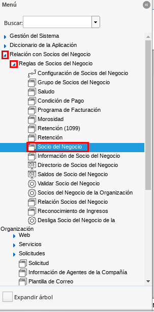
.. |Socio del Negocio| image:: resources/socio.png 
.. |Campo Tipo de Persona| image:: resources/tipoperso.png 
.. |Pestaña Proveedor| image:: resources/proveedor.png 
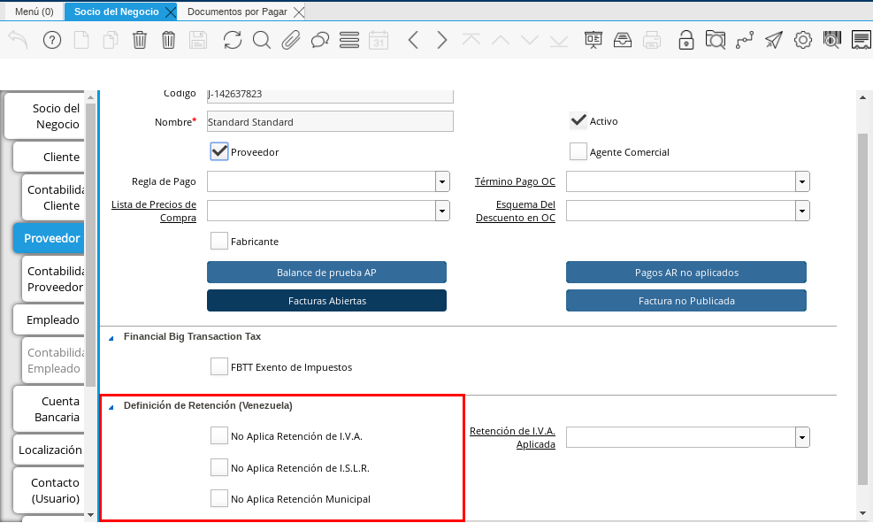

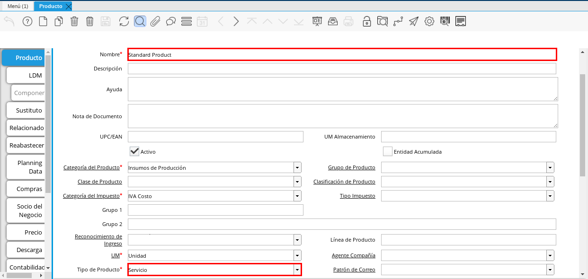

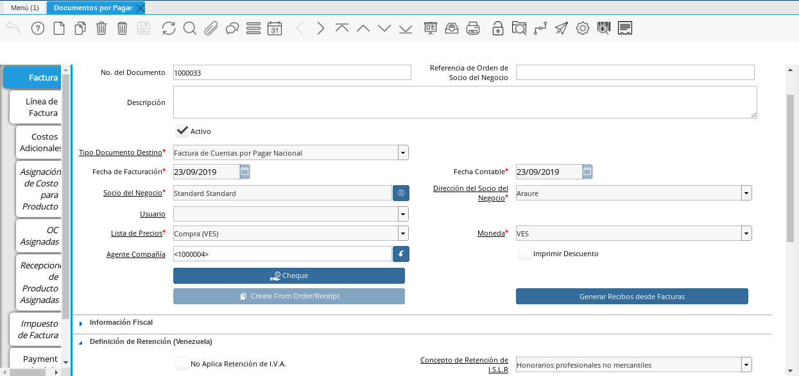
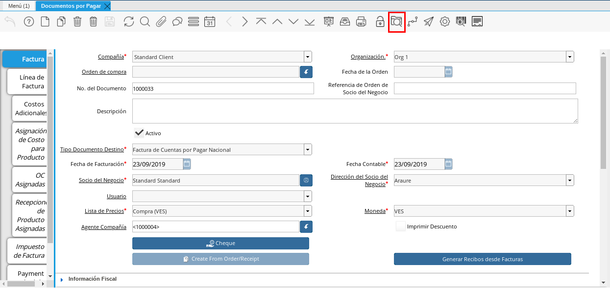

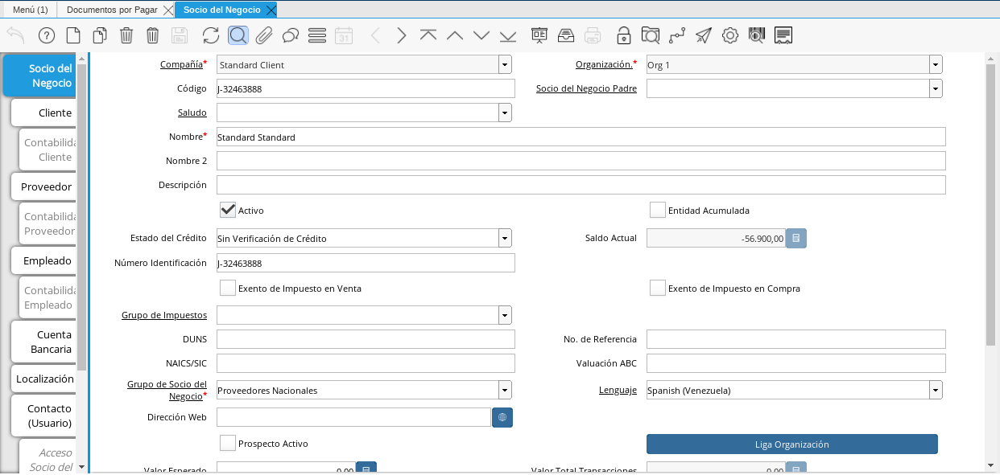
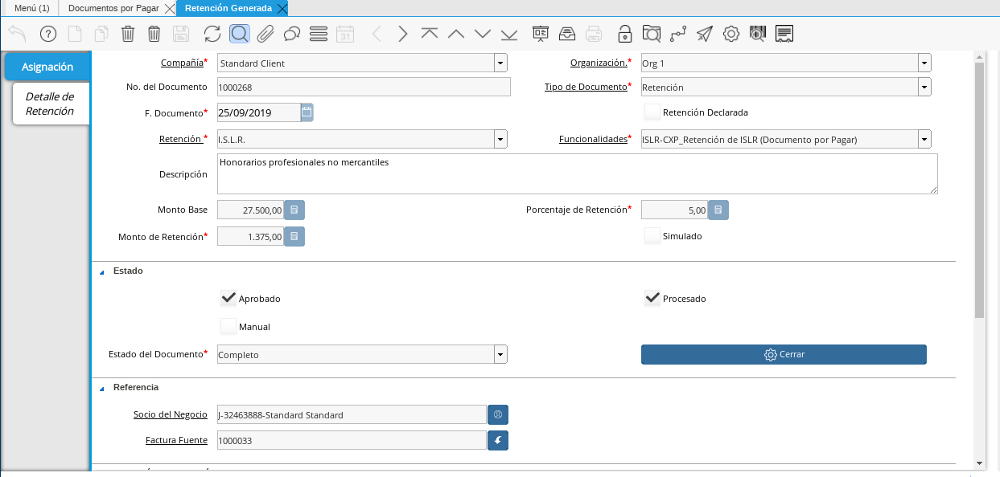

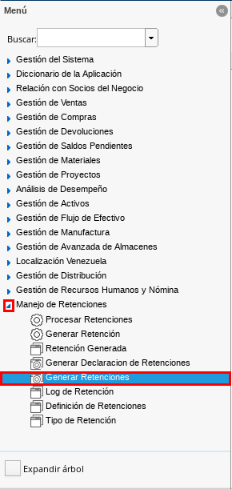
.. |Ventana de Busqueda Inteligente| image:: resources/ventana.png 
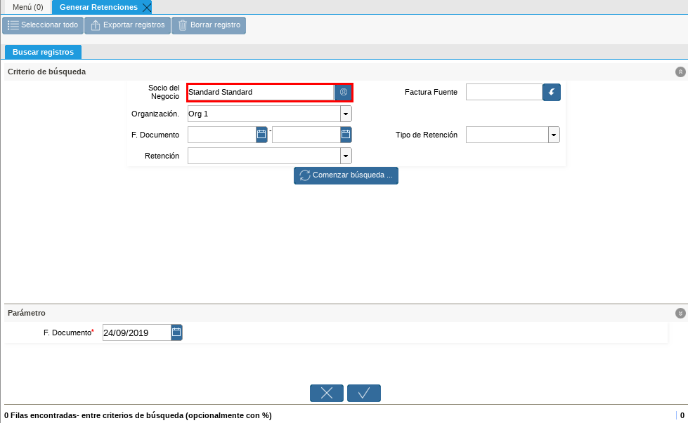
.. |filtrar por organización| image:: resources/filtrarorg.png
.. |filtrar por fecha del documento| image:: resources/filtrarfechadoc.png
.. |filtrar por retención| image:: resources/filtrarretencion.png
.. |campo moneda hacia| image:: resources/monedahacia.png
.. |filtrar por factura fuente| image:: resources/filtrarfactfuent.png
.. |filtrar por tipo de retención| image:: resources/filtrartiporetencion.png
.. |campo moneda| image:: resources/moneda.png
.. |Opción Comenzar Busqueda| image:: resources/opcioncomenzar.png 

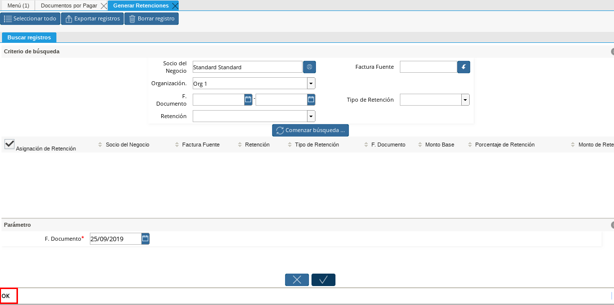
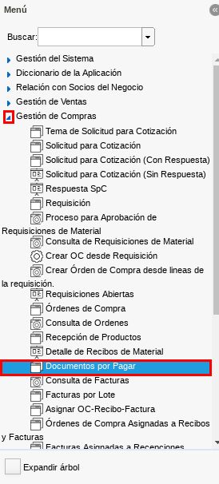
.. |Ventana Documentos por Pagar| image:: resources/ventanadoc.png 
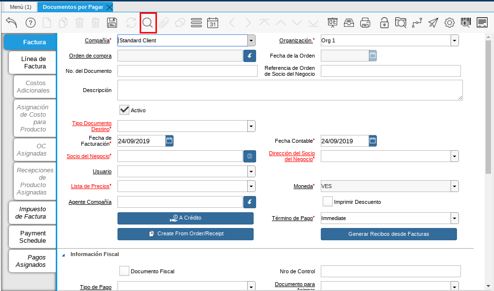

.. |Selección Socio del Negocio| image:: resources/nomsocio.png 
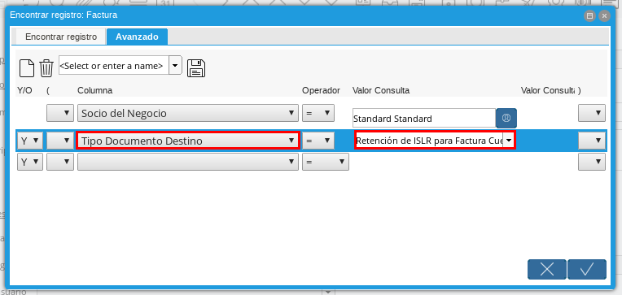

.. _documento/retención-islr:

**Configuración Esencial de la Retención de ISLR**
==================================================

ADempiere permite seleccionar por socio del negocio la retención de ISLR a aplicar en los documentos de compra/venta del mismo, a continuación se explica el procedimiento para seleccionar el ISLR en un socio del negocio determinado.

Ubique en el menú de ADempiere la carpeta "**Relación con Socios del Negocio**", luego seleccione la carpeta "**Reglas de Socios del Negocio**", por último seleccione la ventana "**Socio del Negocio**".

    |Menú de ADempiere 1|
    
    Imagen 4. Menú de ADempiere

Ubique el socio del negocio proveedor al cual se le va a configurar la retención de ISLR, para este ejemplo el socio del negocio proveedor es "**Standard Standard**".

    |Socio del Negocio|
    
    Imagen 5. Socio del Negocio Proveedor

En la ventana principal "**Socio del Negocio**" verifique que en el campo "**Tipo de Persona**" se encuentre seleccionado el tipo de socio del negocio al que se le aplicará la retención de ISLR, en este campo debe indicar si el socio es persona jurídica domiciliada, persona jurídica no constituída domiciliada, persona jurídica no domiciliada, persona natural no residente, persona natural residente. 

    |Campo Tipo de Persona|
    
    Imagen 6. Campo Tipo de Persona

Seleccione la pestaña "**Proveedor**" para configurar la retención de ISLR a aplicar al socio del negocio.

    |Pestaña Proveedor|
    
    Imagen 7. Pestaña Proveedor

Ubique en la parte inferior del documento los checklist para definir las retenciones a aplicar a un socio del negocio proveedor.

    |Retenciones|
    
    Imagen 8. Retenciones

    .. note::

        Al tildar el checklist en los campos de retenciones ubicados en la parte inferior del documento, significa para ADempiere que no se aplicará dicha retención seleccionada al socio del negocio.

Para realizar este ejemplo de la retención de ISLR y observar el comportamiento de los checklist en ADempiere, se tildan los checklist referentes a retención de IVA y municipal.

    |Checklist Retenciones|
    
    Imagen 9. Checklist Retenciones

.. warning::

    Recuerde que solo debe tildar la retención que no se aplicará al socio del negocio proveedor que esta configurando y guarde los cambios realizados en el socio del negocio con ayuda del icono "**Guardar Cambios**" de la barra de herramientas de ADempiere.

**Asociar Retención de ISLR**
=============================

ADempiere permite asociar de tres (3) formas la retención de ISLR a aplicar en los documentos de compra/venta, a continuación se explica el procedimiento para asociar el ISLR a un cargo tipo servicio, a una factura determinada y a un producto tipo servicio.

**Asociar ISLR a Cargos Tipo Servicio**
***************************************

Ubique en el menú de ADempiere la carpeta "**Análisis de Desempeño**", luego seleccione la carpeta "**Reglas Contables**" y por último seleccione la ventana "**Cargo**".

    |Menú de ADempiere 2|
    
    Imagen 10. Menú de ADempiere

En el campo "**Concepto de Retención de ISLR**" de cada cargo se puede asociar un concepto para generar el impuesto, para este ejemplo se utiliza el cargo "**Adiestramiento de Personal**" y el concepto "**Honorarios profesionales no mercantiles**".

    |Campo Concepto de Retención de ISLR en Ventana Cargo|
    
    Imagen 11. Campo Concepto de Retención de ISLR en Ventana Cargo

.. note::

    El tipo de concepto que se asocia al cargo le indica a ADempiere que al utilizarce dicho cargo en cualquier documento y con cualquier socio del negocio, siempre le va a aplicar la retención del concepto que tiene asociado el cargo, dicho concepto puede variar dependiendo de la actividad que este realizando el socio del negocio.

**Asociar ISLR Directo en la Factura**
**************************************

Ubique en el menú de ADempiere la carpeta "**Gestión de Compras**" y luego seleccione la ventana "**Documentos por Pagar**".

    |Menú de ADempiere 3|
    
    Imagen 12. Menú de ADempiere

En el campo "**Concepto de Retención de ISLR**" del documento se puede asociar un concepto para generar el impuesto, para este ejemplo se utiliza la factura "**1000033**" y el concepto "**Honorarios profesionales no mercantiles**".

    |Campo Concepto de Retención de ISLR en Factura|
    
    Imagen 13. Campo Concepto de Retención de ISLR en Factura

.. note::

    El concepto solo se puede asociar a una factura si la misma se encuentra en proceso de elaboración o en estado borrador, al estar en estado completo no se pueden modificar los campos de la misma; el concepto puede variar dependiendo de la actividad que este realizando el socio del negocio.

**Asociar ISLR al Producto Tipo Servicio**
******************************************

Ubique en el menú de ADempiere la carpeta "**Gestión de Materiales**", luego seleccione la carpeta "**Reglas de Gestión de Materiales**", por último seleccione la ventana "**Producto**".

    |Menú de ADempiere 4| 
    
    Imagen 14. Menú de ADempiere

Verifique que el producto tenga seleccionado "**Servicio**" en el campo "**Tipo de Producto**", para este ejemplo utilizaremos el producto "**Standard Product**".

    |Campo Tipo de Producto|
    
    Imagen 15. Campo Tipo de Producto

Seleccione en el campo "**Concepto de Retención de ISLR**" el concepto correspondiente para asociar al producto, para este ejemplo el concepto que se utiliza es "**Honorarios profesionales no mercantiles**".

    |Campo Concepto de Retención de ISLR|
    
    Imagen 16. Campo Concepto de Retención de ISLR

.. note::

    El concepto puede variar dependiendo de la actividad que este realizando el socio del negocio.

**Ejecución de la Estimación de Retenciones**
=============================================

Ubique la factura a la cual le asocio la retención de ISLR, la misma debe estar en estado "**Completo**", para este ejemplo se utiliza la factura número "**1000155**" del socio del negocio proveedor "**Standard Standard**".

    |Factura con Retención Asociada|
    
    Imagen 17. Factura con Retención Asociada

En la barra de herramientas seleccione el icono "**Visualiza Detalle**" para apreciar donde es usado el documento, en este caso la factura.

    |Icono Visualiza Detalle| 
    
    Imagen 18. Icono Visualiza Detalle

Podrá apreciar el menú desplegado por el icono "**Visualiza Detalle**", el mismo muestra los documentos donde es utilizada la factura.

    |Menú del Icono Visualiza Detalle|
    
    Imagen 19. Menú del Icono Visualiza Detalle

    La opción "**Socio del Negocio**" muestra el documento del socio del negocio utilizado en la factura número "**1000155**" seleccionada para el ejemplo, puede ser utilizada para corroborar que las retenciones aplicadas a la factura sean las mismas configuradas para el socio del negocio.

        |Opción Socio del Negocio|
        
        Imagen 20. Opción Socio del Negocio
    
    La opción "**Retención Generada**" muestra el documento de retención aplicado a la factura número "**1000155**" seleccionada para el ejemplo.

        |Opción Retención Generada|
        
        Imagen 21. Opción Retención Generada

    La opción "**Log de Retención**" muestra el log de la retención no aplicada a la factura número "**1000155**" seleccionada para el ejemplo.

        |Opción Log de Retención|
        
        Imagen 22. Opción Log de Retención

.. warning::

    ADempiere le genera al usuario por medio del icono "**Visualiza Detalle**", las alertas donde indica cuales fueron las retenciones aplicadas (**Retención Generada**) y cuales retenciones no fueron aplicadas (**Log**) según la configuración que tiene un socio del negocio determinado.

**Generar Retención de ISLR Fiscal**
====================================

Ubique la carpeta "**Manejo de Retenciones**" en el menú de ADempiere, luego seleccione la ventana de busqueda inteligente "**Generar Retenciones**".

    |Menú de ADempiere 5|
    
    Imagen 23. Menú de ADempiere

Podrá apreciar la ventana de busqueda inteligente con diferentes campos para filtrar la busqueda.

    |Ventana de Busqueda Inteligente|
    
    Imagen 24. Ventana de Busqueda Inteligente 

Seleccione en el campo "**Socio del Negocio**",  el socio del negocio relacionado a la retención que requiere generar. Para este ejemplo utilizaremos el socio del negocio "**Standard Standard**".

    |Filtrar por Socio del Negocio| 
    
    Imagen 25. Filtrar por Socio del Negocio

En el campo "**Organización**", la organización relacionada a la retención que requiere generar.

    |filtrar por organización|

    Imagen 26. Campo Organización de la Retención

Seleccione en el campo "**F. Documento**", el rango de fecha en la cual fue generado el documento por pagar relacionado a la retención que requiere generar.

    |filtrar por fecha del documento|

    Imagen 27. Campo Fecha del Documento de la Retención

Seleccione en el campo "**Retención**", el tipo de retención por el cual requiere filtrar la información.

    |filtrar por retención|

    Imagen 28. Campo Retención

Seleccione en el campo "**Moneda Hacia**", la moneda a la cual requiere convertir el monto de la retención.

    |campo moneda hacia|

    Imagen 29. Campo Moneda Hacia

Seleccione en el campo "**Factura Fuente**", la factura por la cual requiere filtrar la información para generar la retención.

    |filtrar por factura fuente|

    Imagen 30. Campo Factura Fuente

Seleccione en el campo "**Tipo de Retención**", el tipo de retención por el cual requiere filtrar la búsqueda.

    |filtrar por tipo de retención|

    Imagen 31. Campo Tipo de Retención

    .. note::

        El campo cuenta con tres opciones que son "**IM_Retencion de Impuesto Municipal**, "**ISLR_Retención de I.S.L.R.**" y "**I.V.A_Retención de I.V.A.**". Recuerde que la selección de este campo va a depender de la retención que se va a aplicar a la factura de cuentas por pagar.

Seleccione en el campo "**Moneda**", la moneda del documento y desde la cual se requiere convertir el monto de la retención.

    |campo moneda|

    Imagen 32. Campo Moneda

Seleccione la opción "**Comenzar Busqueda**" para buscar por los campos introducidos.

    |Opción Comenzar Busqueda|
    
    Imagen 33. Opción Comenzar Busqueda

Podrá apreciar las retenciones que el socio del negocio seleccionado tiene en los diferentes documentos.

    |Retenciones del Socio del Negocio|
    
    Imagen 34. Retenciones del Socio del Negocio

Seleccione la retención a generar y la opción "**OK**" para generar la retención al socio del negocio seleccionado.

    |Selección de Retención y Opción OK|
    
    Imagen 35. Selección de Retención y Opción OK

Podrá apreciar que el proceso se realizó correctamente con el mensaje "**OK**" mostrado por ADempiere al final de la ventana de busqueda inteligente.

    |Mensaje OK|
    
    Imagen 36. Mensaje OK

**Imprimir Documento de la Retención Aplicada al Socio del Negocio**
====================================================================

Ubique en el menú de ADempiere la carpeta "**Gestión de Compras**" y luego seleccione la ventana "**Documentos por Pagar**".

    |Menú de ADempiere 6|
    
    Imagen 37. Menú de ADempiere

Podrá apreciar la ventana "**Documentos por Pagar**" donde se encuentran todos los registros que posee la misma.

    |Ventana Documentos por Pagar|
    
    Imagen 38. Ventana Documentos por Pagar

Seleccione el icono "**Encontrar Registro**" en la barra de herramientas de ADempiere, para realizar una busqueda avanzada del documento de retención generado.

    |Icono Encontrar Registro| 
    
    Imagen 39. Icono Encontrar Registro

Seleccione la pestaña "**Avanzado**" para filtrar la busqueda por "**Socio del Negocio**", "**Tipo de Documento de Retención de Cuentas por Pagar**" y "**Fecha de la Retención**".

    |Buscador Avanzado|
    
    Imagen 40. Buscador Avanzado

Seleccione el icono "**Nuevo**" para generar el número de filas de busqueda que se necesitan, para este ejemplo se necesitan tres (3) filas.

    |Icono Nuevo|
    
    Imagen 41. Icono Nuevo

    Seleccione en la primera fila la opción "**Socio del Negocio**" y introduzca el nombre del socio del negocio en la columna "**Valor Consulta**", para este ejemplo el socio del negocio es "**Standard Standard**".

        |Selección Socio del Negocio|
        
        Imagen 42. Selección Socio del Negocio

    Seleccione en la segunda fila la opción "**Tipo de Documento Destino**" y seleccione en la columna "**Valor Consulta**" el tipo de documento destino, para este ejemplo el tipo de documento destino es "**Retención de ISLR de Cuentas por Pagar**".

        |Selección Tipo de Documento Destino|
        
        Imagen 43. Selección Tipo de Documento Destino

    Seleccione en la tercera fila la opción "**Fecha Contable**" y seleccione en la columna "**Valor Consulta**" la fecha en la que se realizo la retención, para este ejemplo la fecha es "**11/11/2020**".

        |Selección Fecha Contable|
        
        Imagen 44. Selección Fecha Contable
    
    Seleccione la opción "**OK**" para realizar la busqueda filtrada por los campos seleccionados.

        |Opción OK|
        
        Imagen 45. Opción OK

Seleccione en la barra de herramientas de ADempiere el icono "**Imprimir**", para imprimir el documento de retención buscado.

    |Opción Imprimir|
    
    Imagen 46. Opción Imprimir

Podrá apreciar el documento de retención de la siguiente manera.

    |Documento de Retención|
    
    Imagen 47. Documento de Retención