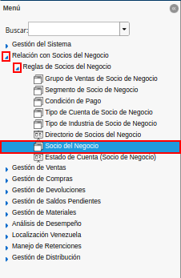
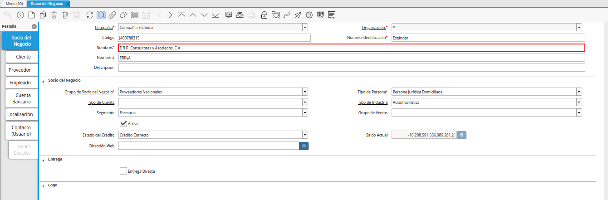
.. |campo tipo de persona| image:: resources/person-type-field.png
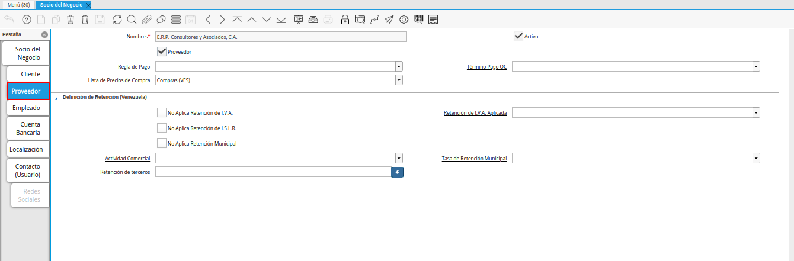
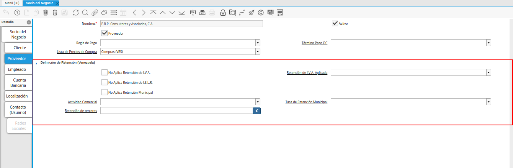
.. |check retenciones| image:: resources/check-withholdings.png
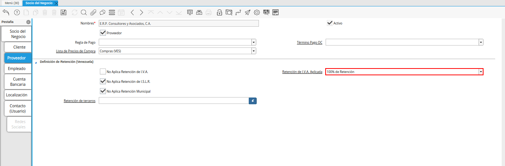
.. |factura aplicada al socio del negocio| image:: resources/invoice-applied-to-the-business-partner.png
.. |icono visualiza detalle| image:: resources/icon-displays-detail.png
.. |menú del icono visualiza detalle| image:: resources/icon-menu-displays-detail.png
.. |opción socio del negocio| image:: resources/business-partner-option.png
.. |opción retención generada| image:: resources/withholding-option-generated.png
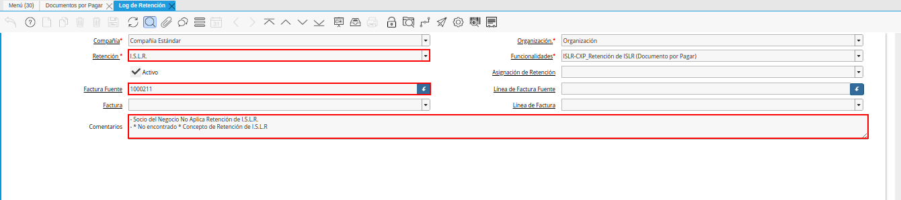
.. |menú de generar retenciones| image:: resources/generate-withholdings-menu.png
.. |ventana de búsqueda inteligente| image:: resources/smart-search-window.png
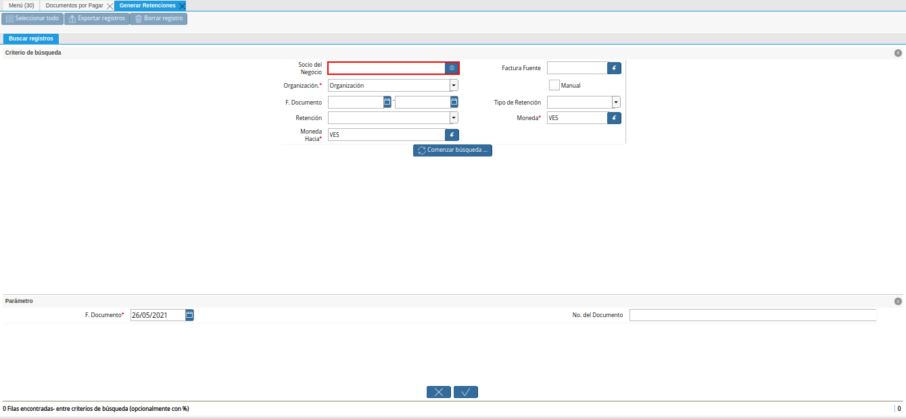
.. |filtrar por organización| image:: resources/filter-by-organization.png
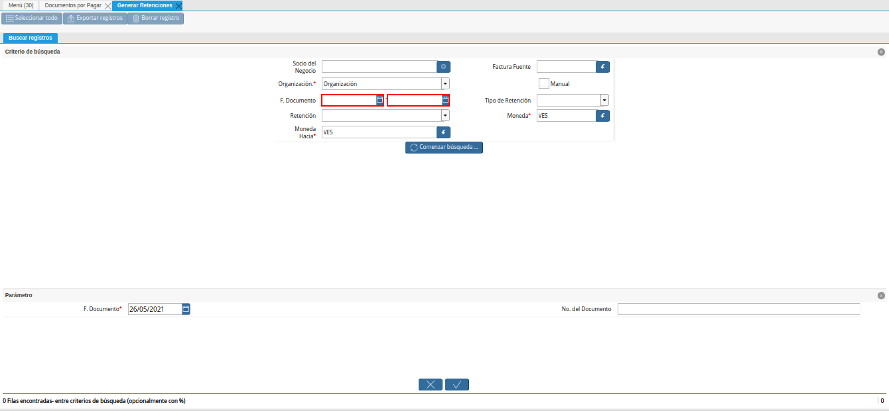
.. |filtrar por retención| image:: resources/filter-by-retention.png
.. |campo moneda hacia| image:: resources/field-currency-to.png
.. |filtrar por factura fuente| image:: resources/filter-by-source-invoice.png
.. |filtrar por tipo de retención| image:: resources/filter-by-retention-type.png
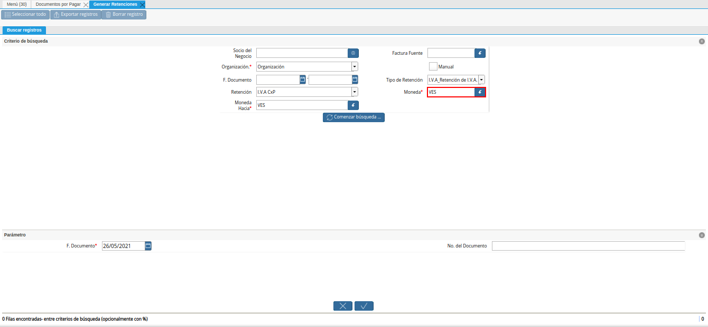
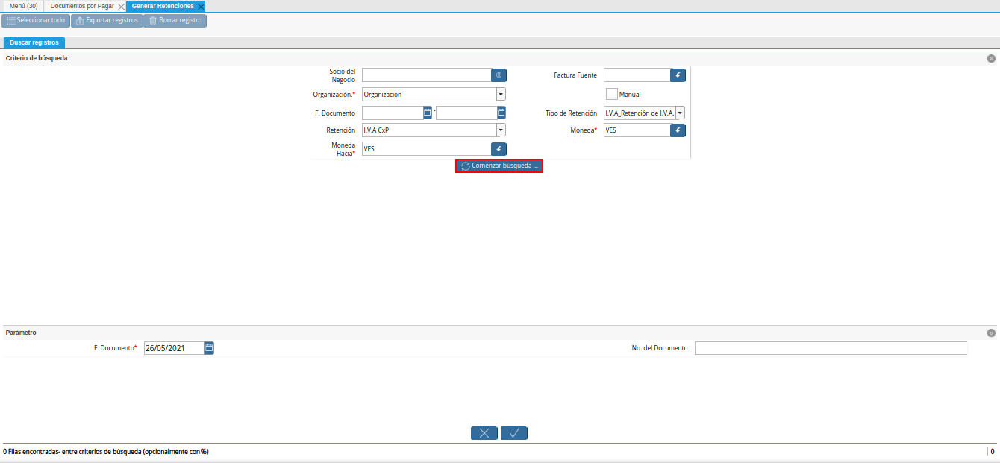
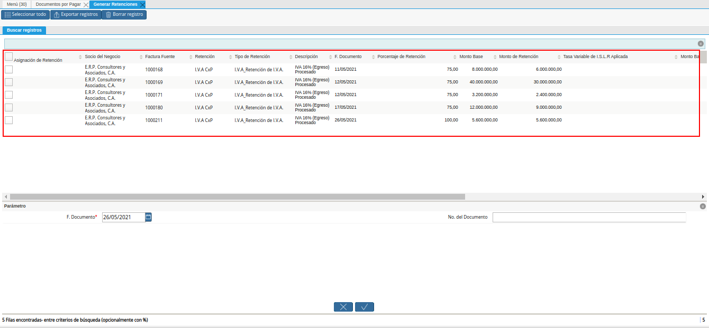
.. |selección de retención y opción ok| image:: resources/retention-selection-and-ok-option.png
.. |mensaje ok| image:: resources/message-ok.png
.. |menú de documentos por pagar| image:: resources/payable-documents-menu.png
.. |ventana documentos por pagar| image:: resources/payable-documents-window.png
.. |icono encontrar registro| image:: resources/find-record-icon.png
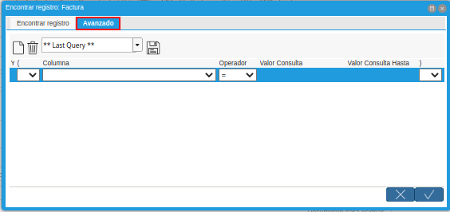
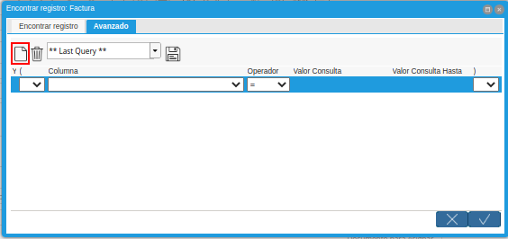
.. |selección socio del negocio| image:: resources/selection-of-business-partner.png
.. |selección tipo de Documento destino| image:: resources/selection-of-destination-document-type.png
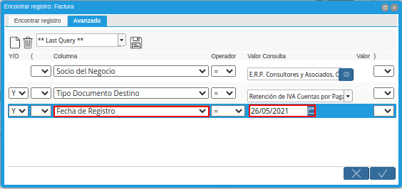
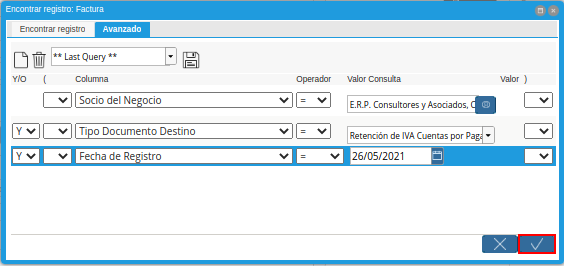
.. |opción imprimir| image:: resources/print-option.png
.. |documento de retención| image:: resources/retention-document.png

.. _documento/retención-iva:

**Configuración del Socio de Negocio**
======================================

ADempiere permite seleccionar por socio del negocio el porcentaje de IVA a aplicar en los documentos de compra/venta del mismo, a continuación se explica el procedimiento para seleccionar el IVA en un socio del negocio determinado.

Ubique en el menú de ADempiere la carpeta "**Relación con Socios del Negocio**", luego seleccione la carpeta "**Reglas de Socios del Negocio**", por último seleccione la ventana "**Socio del Negocio**".

    |menú de socio del negocio| 

    Imagen 1. Menú de ADempiere

Ubique el registro del socio del negocio proveedor al cual se le va a configurar la retención de IVA, para este ejemplo el socio del negocio proveedor es "**E.R.P. Consultores y Asociados, C.A.**".

    |registro de socio del negocio| 

    Imagen 2. Socio del Negocio

En la ventana principal "**Socio del Negocio**", verifique que en el campo "**Tipo de Persona**" se encuentre seleccionado el tipo de socio del negocio al que se le aplicará la retención de IVA, en este campo debe indicar si el socio es persona jurídica domiciliada, persona jurídica no constituída domiciliada, persona jurídica no domiciliada, persona natural no residente, o persona natural residente. 

    |campo tipo de persona| 

    Imagen 3. Campo Tipo de Persona

Seleccione la pestaña "**Proveedor**" para configurar la retención de IVA a aplicar al socio del negocio.

    |pestaña proveedor| 

    Imagen 4. Pestaña Proveedor

Ubique en la parte inferior del documento los checklist para definir las retenciones a aplicar a un socio del negocio proveedor.

    |retenciones a aplicar| 

    Imagen 5. Retenciones a Aplicar

    .. note::

        Al tildar el check "**No Aplica Retención de I.V.A.**" en el registro del socio del negocio, se indica a ADempiere que a ese socio no se le deben aplicar retenciones del IVA. Lo que significa que cuando sea seleccionado dicho socio en cualquier documento por pagar cargado en ADempiere que maneje valor de impuesto, no le calculará ningún monto de retención.

        Al destildar el check "**No Aplica Retención de I.V.A.**" en el registro del socio del negocio, se habilita el campo "**Retención de I.V.A. Aplicada**", con el cual se indica a ADempiere cual es el porcentaje de retención a aplicar a ese socio cada vez que se le genere un documento por pagar con valor de impuesto.

Para realizar este ejemplo de la retención de IVA y observar el comportamiento de los check en ADempiere, se tildan los check referentes a retención de ISLR y municipal.

    |check retenciones| 
    
    Imagen 6. Check de Retenciones

Seleccione en el campo "**Retención de IVA Aplicada**", el porcentaje de IVA a retener al socio del negocio proveedor, para este ejemplo el porcentaje a retener es cien por ciento (100%).

    |campo retención de iva aplicada| 
    
    Imagen 7. Campo Retención de IVA Aplicada

.. warning::

    Solo debe tildar la retención que no se aplicará al socio del negocio proveedor que esta configurando y guarde los cambios realizados en el socio del negocio con ayuda del icono "**Guardar Cambios**" ubicadi en la barra de herramientas de ADempiere.

**Ejecución de la Estimación de Retenciones**
=============================================

Al completar el registro del documento por pagar generado al socio del negocio proveedor previamente configurado con el tipo de retención, se genera de manera automática el pre-cálculo de retención del IVA, el mismo se puede visualizar de la siguiente manera.

    .. note::

        El documento por pagar debe estar en estado "**Completo**", para este ejemplo se utiliza la factura número "**1000154**" del socio del negocio proveedor "**E.R.P. Consultores y Asociados, C.A.**".

    |factura aplicada al socio del negocio| 

    Imagen 8. Factura Aplicada al Socio del Negocio

Seleccione el icono "**Visualiza Detalle**" para apreciar donde es usado el documento, el mismo se encuentre ubicado en la barra de herramientas de ADempiere.

    |icono visualiza detalle| 

    Imagen 9. Icono Visualiza Detalle

    .. warning:: 

        ADempiere le genera al usuario por medio del icono "**Visualiza Detalle**", las alertas donde indica cuales fueron las retenciones aplicadas (**Retención Generada**) y cuales retenciones no fueron aplicadas (**Log**) según la configuración que tiene un socio del negocio determinado.

Podrá apreciar el menú desplegado por el icono "**Visualiza Detalle**", el mismo muestra los documentos donde es utilizado el documento por pagar.

    |menú del icono visualiza detalle| 
    
    Imagen 10. Menú del Icono Visualiza Detalle

    La opción "**Socio del Negocio**", muestra el registro del socio del negocio utilizado en el documento por pagar donde es seleccionado el icono "**Visualiza Detalle**", puede ser utilizada para corroborar que las retenciones aplicadas al documento por pagar sean las mismas configuradas para el socio del negocio.

        |opción socio del negocio| 

        Imagen 11. Opción Socio del Negocio

    La opción "**Retención Generada**", muestra el documento de retención aplicado al documento por pagar donde es seleccionado el icono "**Visualiza Detalle**".

        |opción retención generada| 
        
        Imagen 12. Opción Retención Generada

    La opción "**Log de Retención**" muestra el log de la retención no aplicada al documento por pagar donde es seleccionado el icono "**Visualiza Detalle**".

        |opción log de retención|

        Imagen 13. Opción Log de Retención

.. warning:: 

    Adicionalmente, se puede consultar el impuesto de un documento por pagar al seleccionar la pestaña "**Impuesto de Factura**", de la ventana "**Documentos por Pagar**".

**Generar Retención de IVA Fiscal**
===================================

Ubique y seleccione en el menú de ADempiere, la carpeta "**Manejo de Retenciones**", luego seleccione la ventana de busqueda inteligente "**Generar Retenciones**".

    |menú de generar retenciones| 

    Imagen 14. Menú de ADempiere

Podrá apreciar la ventana de búsqueda inteligente con diferentes campos para filtrar la busqueda.

    |ventana de búsqueda inteligente| 

    Imagen 15. Ventana de Búsqueda Inteligente

Seleccione en el campo "**Socio del Negocio**",  el socio del negocio relacionado a la retención que requiere generar. Para este ejemplo utilizaremos el socio del negocio "**E.R.P. Consultores y Asociados, C.A.**".

    |filtrar por socio del negocio| 

    Imagen 16. Filtrar por Socio del Negocio

En el campo "**Organización**", la organización relacionada a la retención que requiere generar.

    |filtrar por organización|

    Imagen 17. Campo Organización de la Retención

Seleccione en el campo "**F. Documento**", el rango de fecha en la cual fue generado el documento por pagar relacionado a la retención que requiere generar.

    |filtrar por fecha del documento|

    Imagen 18. Campo Fecha del Documento de la Retención

Seleccione en el campo "**Retención**", la retención por la cual requiere filtrar la información.

    |filtrar por retención|

    Imagen 19. Campo Retención

Seleccione en el campo "**Moneda Hacia**", la moneda a la cual requiere convertir el monto de la retención.

    |campo moneda hacia|

    Imagen 20. Campo Moneda Hacia

Seleccione en el campo "**Factura Fuente**", la factura por la cual requiere filtrar la información para generar la retención.

    |filtrar por factura fuente|

    Imagen 21. Campo Factura Fuente

Seleccione en el campo "**Tipo de Retención**", el tipo de retención por el cual requiere filtrar la búsqueda.

    |filtrar por tipo de retención|

    Imagen 22. Campo Tipo de Retención

    .. note::

        El campo cuenta con tres opciones que son "**IM_Retencion de Impuesto Municipal**, "**ISLR_Retención de I.S.L.R.**" y "**I.V.A_Retención de I.V.A.**". Recuerde que la selección de este campo va a depender de la retención que se va a aplicar al documento de cuentas por pagar.

Seleccione en el campo "**Moneda**", la moneda del documento y desde la cual se requiere convertir el monto de la retención.

    |campo moneda|

    Imagen 23. Campo Moneda

Seleccione la opción "**Comenzar Búsqueda**", para filtrar la información en base a los valores seleccionados en los campos indicados anteriormente.

    |opción comenzar búsqueda| 

    Imagen 24. Opción Comenzar Búsqueda

    .. note::

        Al utilizar los criterios de búsqueda se tilda el botón "**Comenzar Búsqueda**", luego se mostrará los pre-cálculos de retención de IVA, dependiendo de los criterios utilizados.

Podrá apreciar las retenciones que el socio del negocio seleccionado tiene en los diferentes documentos.

    |retenciones del socio del negocio|  

    Imagen 25. Retenciones del Socio del Negocio

Seleccione el pre-cálculo de la retención a generar y verifique que el campo "**F. Documento**", tenga la misma fecha del campo "**Fecha Contable**" del documento por pagar al cual se le aplicará la retención. Finalmente se procede a seleccionar la opción "**OK**" para generar la retención al socio del negocio seleccionado.

    |selección de retención y opción ok| 

    Imagen 26. Selección de Retención y Opción OK

Podrá apreciar que el proceso se realizó correctamente con el mensaje "**OK**" mostrado por ADempiere al final de la ventana de busqueda inteligente.

    |mensaje ok| 

    Imagen 27. Mensaje OK

**Imprimir Documento de la Retención Aplicada al Socio del Negocio**
====================================================================

Ubique y seleccione en el menú de ADempiere, la carpeta "**Gestión de Compras**" y luego seleccione la ventana "**Documentos por Pagar**".

    |menú de documentos por pagar| 

    Imagen 28. Menú de ADempiere

Podrá apreciar la ventana "**Documentos por Pagar**" donde se encuentran todos los registros que posee la misma.

    |ventana documentos por pagar|

    Imagen 29. Ventana Documentos por Pagar

Seleccione el icono "**Encontrar Registro**" ubicado en la barra de herramientas de ADempiere, para realizar una busqueda avanzada del documento de retención generado.

    |icono encontrar registro| 

    Imagen 30. Icono Encontrar Registro

    Seleccione la pestaña "**Avanzado**" para filtrar la busqueda por "**Socio del Negocio**", "**Tipo de Documento de Retención de Cuentas por Pagar**" y "**Fecha de Registro**".

        |buscador avanzado| 

        Imagen 31. Buscador Avanzado

    Seleccione el icono "**Nuevo**" para generar el número de filas de busqueda que se necesitan, para este ejemplo se necesitan tres (3) filas.

        |icono nuevo| 

        Imagen 32. Icono Nuevo

        Seleccione en la primera fila la opción "**Socio del Negocio**" e introduzca el nombre del socio del negocio en la columna "**Valor Consulta**", para este ejemplo el socio del negocio es "**E.R.P. Consultores y Asociados, C.A.**".

            |selección socio del negocio| 

            Imagen 33. Selección Socio del Negocio

        Seleccione en la segunda fila la opción "**Tipo de Documento Destino**" y seleccione en la columna "**Valor Consulta**" el tipo de documento destino, para este ejemplo el tipo de documento destino es "**Retención de IVA Cuentas por Pagar**".

            |selección tipo de documento destino| 

            Imagen 34. Selección Tipo de Documento Destino

        Seleccione en la tercera fila la opción "**Fecha de Registro**" y seleccione en la columna "**Valor Consulta**" la fecha en la que se realizo la retención, para este ejemplo la fecha es "**26/05/2021**".

            |selección fecha de registro| 

            Imagen 35. Selección Fecha de Registro

        Seleccione la opción "**OK**" para realizar la busqueda filtrada por los campos seleccionados.

            |opción ok| 

            Imagen 36. Opción OK

.. note::

    El registro de retención de IVA generado, también se puede ubicar de manera rápida, al posicionarse en el registro del documento por pagar (Factura Principal), al cual se esta aplicando la retención, luego seleccionar el icono de la barra de herramientas "**Visualiza Detalle (Donde es Usado)**", y seleccionar la opción "**Documentos por Pagar (Asignados)**". Al tildar esta opción se abrirá otra ventana de "**Documentos por Pagar**" pero con el registro del documento "**Retención de IVA Cuentas por Pagar**" y el monto total de la retención.

Luego de ubicar el registro de la retención, seleccione el icono "**Imprimir**" ubicado en la barra de herramientas de ADempiere para visualizar el reporte del documento de retención.

    |opción imprimir|  

    Imagen 37. Opción Imprimir

Podrá apreciar de la siguiente manera, el reporte del documento "**Retención de IVA Cuentas por Pagar**".

    |documento de retención| 

    Imagen 38. Documento de Retención
