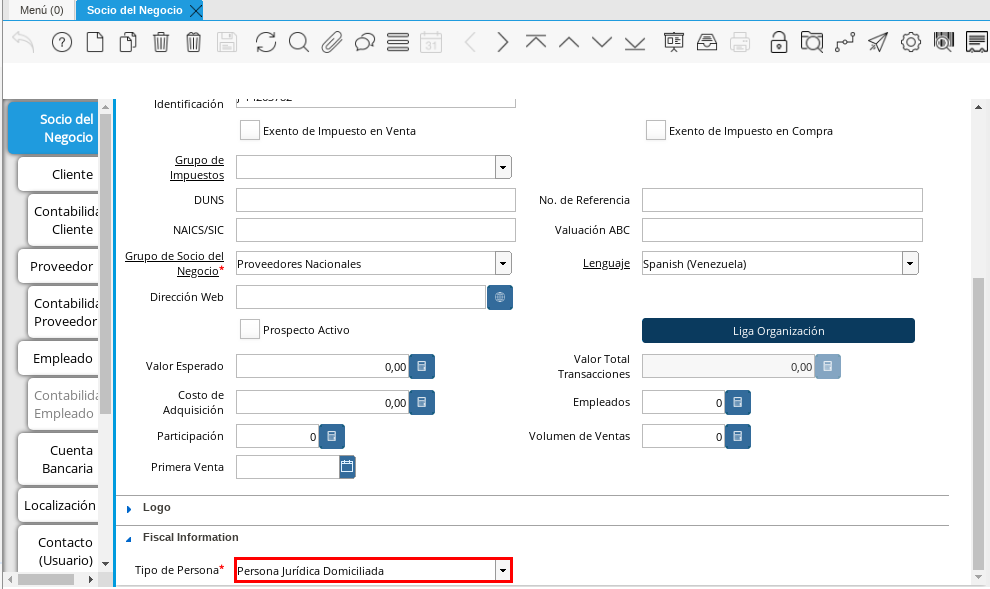
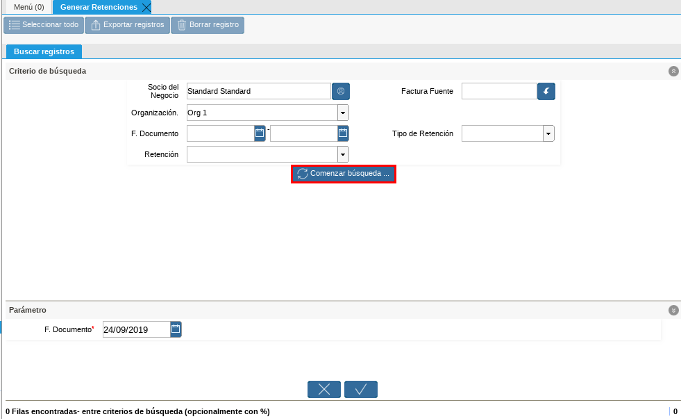
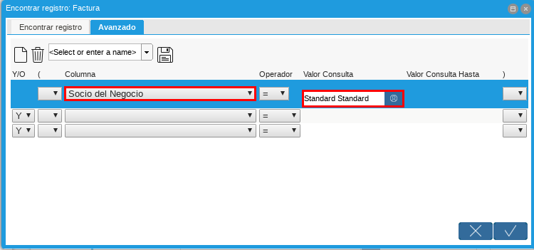

.. |Menú de ADempiere 1| image:: resources/menu.png 
.. |Socio del Negocio| image:: resources/socio.png 

.. |Retenciones| image:: resources/retenciones.png 

.. |Campo Actividad| image:: resources/actividad.png 

.. |Menú de ADempiere 2| image:: resources/menugenerar.png 

.. |Filtrar por Socio del Negocio| image:: resources/selecsocio.png 

.. |Menú de ADempiere 3| image:: resources/menudoc.png 

.. |Icono Encontrar Registro| image:: resources/iconobuscar.png 

.. |Icono Nuevo| image:: resources/nuevo.png 

.. |Selección Tipo de Documento Destino| image:: resources/selectipodoc.png 

.. |Opción OK| image:: resources/selecok.png 

.. _documento/retención-municipal:

**Configuración Esencial de la Retención Municipal**
====================================================

ADempiere permite seleccionar por socio del negocio la retención municipal a aplicar en los documentos de compra/venta del mismo, a continuación se explica el procedimiento para seleccionar la retención municipal en un socio del negocio determinado.

#. Ubique en el menú de ADempiere la carpeta "**Relación con Socios del Negocio**", luego seleccione la carpeta "**Reglas de Socios del Negocio**", por último seleccione la ventana "**Socio del Negocio**".

      |Menú de ADempiere 1|

      Imagen 1. Menú de ADempiere

#. Ubique el socio del negocio proveedor al cual se le va a configurar la retención municipal, para este ejemplo el socio del negocio proveedor es "**Standard Standard**".

      |Socio del Negocio|

      Imagen 2. Socio del Negocio

#. En la ventana principal "**Socio del Negocio**" verifique que en el campo "**Tipo de Persona**" se encuentre seleccionado el tipo de socio del negocio al que se le aplicará la retención municipal, en este campo debe indicar si el socio es persona jurídica domiciliada, persona jurídica no constituída domiciliada, persona jurídica no domiciliada, persona natural no residente, persona natural residente. 

      |Campo Tipo de Persona|

      Imagen 3. Campo Tipo de Persona

#. Seleccione la pestaña "**Proveedor**" para configurar la retención municipal a aplicar al socio del negocio.

      |Pestaña Proveedor|

      Imagen 4. Pestaña Proveedor

#. Ubique en la parte inferior del documento los checklist para definir las retenciones a aplicar a un socio del negocio proveedor.

      |Retenciones|

      Imagen 5. Retenciones

      .. note::

            Al tildar el checklist en los campos de retenciones ubicados en la parte inferior del documento, significa para ADempiere que no se aplicará dicha retención seleccionada al socio del negocio.

#. Para realizar este ejemplo de la retención municipal y observar el comportamiento de los checklist en ADempiere, se tildan los checklist referentes a retención de IVA y ISLR.

      |Checklist Retenciones|

      Imagen 6. Checklist Retenciones

.. warning::

      Solo debe tildar la retención que no se aplicará al socio del negocio proveedor que esta configurando.

#. Seleccione la actividad comercial en el campo "**Actividad Comercial**", esta va a depender de la actividad que realice el proveedor y para este ejemplo la actividad es "**Las Compras, Servicios y Suministros Prestados**".

      |Campo Actividad|

      Imagen 7. Campo Actividad

#. Seleccione la tasa de retención municipal en el campo "**Tasa de Retención Municipal**", esta tasa va a depender del municipio donde se encuentre el cliente y para este ejemplo la tasa es "**1.5**".

      |Campo Tasa de Retención Municipal|

      Imagen 8. Campo Tasa de Retención Municipal

.. warning::

      Guardar los cambios realizados en el socio del negocio con ayuda del icono "**Guardar Cambios**" de la barra de herramientas de ADempiere.

**Ejecución de la Estimación de Retenciones**
=============================================

#. Ubique la factura ya realizada al socio del negocio, la misma debe estar en estado "**Completo**", para este ejemplo se utiliza la factura número "**1000037**" del socio del negocio proveedor "**Standard Standard**".

      |Factura Aplicada al Socio del Negocio|

      Imagen 9. Factura Aplicada al Socio del Negocio

#. Seleccione el icono "**Visualiza Detalle**" en la barra de herramientas para apreciar donde es usado el documento, en este caso la factura.

      |Icono Visualiza Detalle| 

      Imagen 10. Icono Visualiza Detalle

#. Podrá apreciar el menú desplegado por el icono "**Visualiza Detalle**", el mismo muestra los documentos donde es utilizada la factura.

      |Menú del Icono Visualiza Detalle|

      Imagen 11. Menú del Icono Visualiza Detalle

      #. La opción "**Socio del Negocio**" muestra el documento del socio del negocio utilizado en la factura número "**1000037**" seleccionada para el ejemplo, puede ser utilizada para corroborar que las retenciones aplicadas a la factura sean las mismas configuradas para el socio del negocio.

            |Opción Socio del Negocio|

            Imagen 12. Opción Socio del Negocio
    
      #. La opción "**Retención Generada**" muestra el documento de retención aplicado a la factura número "**1000037**" seleccionada para el ejemplo.

            |Opción Retención Generada| 

            Imagen 13. Opción Retención Generada

      #. La opción "**Log de Retención**" muestra el log de la retención no aplicada a la factura número "**1000037**" seleccionada para el ejemplo.

            |Opción Log de Retención|

            Imagen 14. Opción Log de Retención

.. warning::

      ADempiere le genera al usuario por medio del icono "**Visualiza Detalle**", las alertas donde indica cuales fueron las retenciones aplicadas (**Retención Generada**) y cuales retenciones no fueron aplicadas (**Log**) según la configuración que tiene un socio del negocio determinado.

**Generación de la Retención Municipal Fiscal**
===============================================

#. Ubique en el menú de ADempiere la carpeta "**Manejo de Retenciones**" y seleccione la ventana de busqueda inteligente "**Generar Retenciones**".

      |Menú de ADempiere 2| 
    
      Imagen 15. Menú de ADempiere

#. Podrá apreciar la ventana de busqueda inteligente con diferentes campos para filtrar la busqueda.

      |Ventana de Busqueda Inteligente| 
    
      Imagen 16. Ventana de Busqueda Inteligente

#. Seleccione el socio del negocio en el campo "**Socio del Negocio**", para este ejemplo el socio del negocio es "**Standard Standard**".

      |Filtrar por Socio del Negocio| 

      Imagen 17. Filtrar por Socio del Negocio

#. Seleccione la opción "**Comenzar Busqueda**" para buscar por los campos introducidos.

      |Opción Comenzar Busqueda| 

      Imagen 18. Opción Comenzar Busqueda

#. Podrá apreciar las retenciones que el socio del negocio tiene seleccionado en los diferentes documentos.

      |Retenciones del Socio del Negocio| 

      Imagen 19. Retenciones del Socio del Negocio

#. Seleccione la retención a generar y la opción "**OK**" para generar la retención al socio del negocio seleccionado.

      |Selección de Retención y Opción OK| 

      Imagen 20. Selección de Retención y Opción OK

#. Podrá apreciar que el proceso se realizó correctamente con el mensaje "OK" mostrado por ADempiere al final de la ventana de busqueda inteligente.

      |Mensaje OK|

      Imagen 21. Mensaje OK

**Imprimir Documento de la Retención Aplicada al Socio del Negocio**
====================================================================

#. Ubique en el menú de ADempiere la carpeta "**Gestión de Compras**" y seleccione la ventana "**Documentos por Pagar**".

      |Menú de ADempiere 3| 

      Imagen 22. Menú de ADempiere

#. Podrá apreciar la ventana "**Documentos por Pagar**" donde se encuentran todos los registros que posee la misma.

      |Ventana Documentos por Pagar|

      Imagen 23. Ventana Documentos por Pagar

#. Seleccione el icono "**Encontrar Registro**" en la barra de herramientas de ADempiere, para realizar una busqueda avanzada del documento de retención generado.

      |Icono Encontrar Registro| 

      Imagen 24. Icono Encontrar Registro

#. Seleccione la pestaña "**Avanzado**" para filtrar la busqueda por "**Socio del Negocio**", "**Tipo de Documento de Retención de Cuentas por Pagar**" y "**Fecha de la Retención**".

      |Buscador Avanzado|

      Imagen 25. Buscador Avanzado

#. Seleccione el icono "**Nuevo**" para generar el número de filas de busqueda que se necesitan, para este ejemplo se necesitan tres (3) filas.

      |Icono Nuevo|

      Imagen 26. Icono Nuevo

      #. Seleccione en la primera fila la opción "**Socio del Negocio**" y introduzca el nombre del socio del negocio en la columna "**Valor Consulta**", para este ejemplo el socio del negocio es "**Standard Standard**".

            |Selección Socio del Negocio|
        
            Imagen 27. Selección Socio del Negocio

      #. Seleccione en la segunda fila la opción "**Tipo de Documento Destino**" y seleccione en la columna "**Valor Consulta**" el tipo de documento destino, para este ejemplo el tipo de documento destino es "**Retención de IVA para Factura de Cuentas por Pagar**".

            |Selección Tipo de Documento Destino| 
        
            Imagen 28. Selección Tipo de Documento Destino

      #. Seleccione en la tercera fila la opción "**Fecha Contable**" y seleccione en la columna "**Valor Consulta**" la fecha en la que se realizo la retención, para este ejemplo la fecha es "**25/09/2019**".
    
            |Selección Fecha Contable| 
        
            Imagen 29. Selección Fecha Contable

      #. Seleccione la opción "**OK**" para realizar la busqueda filtrada por los campos seleccionados.

            |Opción OK|
        
            Imagen 30. Opción OK

#. Seleccione en la barra de herramientas de ADempiere el icono "**Imprimir**", para imprimir el documento de retención buscado.

      |Opción Imprimir|
    
      Imagen 31. Opción Imprimir

#. Podrá apreciar el documento de retención de la siguiente manera.

      |Documento de Retención| 
      
      Imagen 32. Documento de Retención
