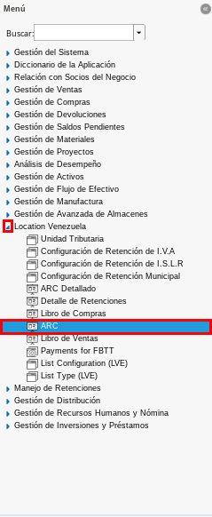
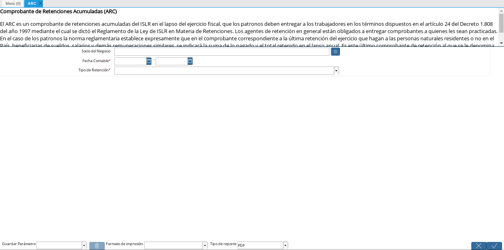
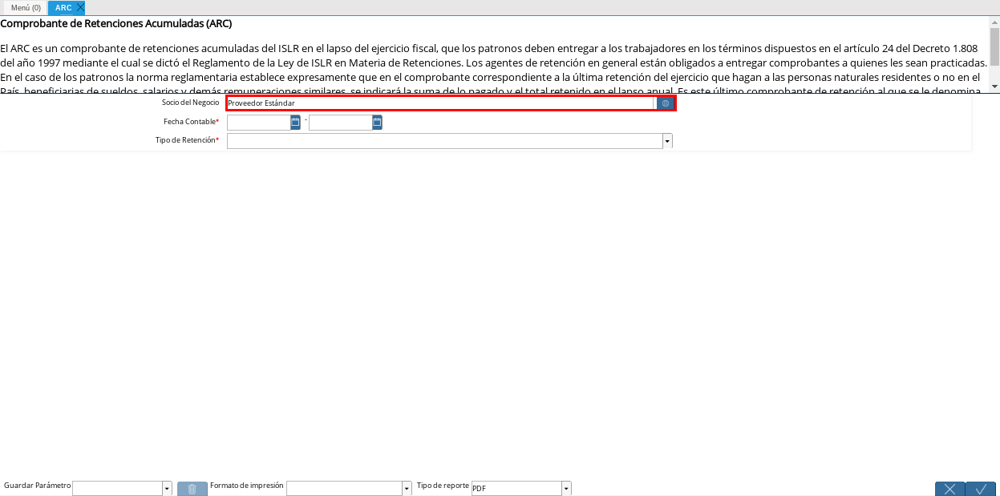
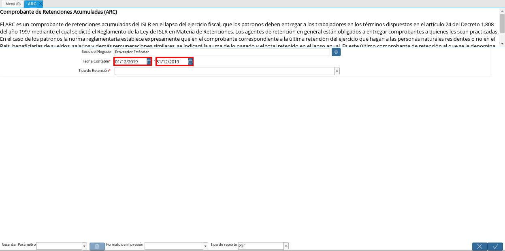
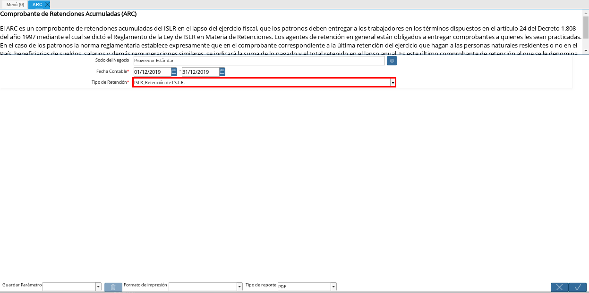
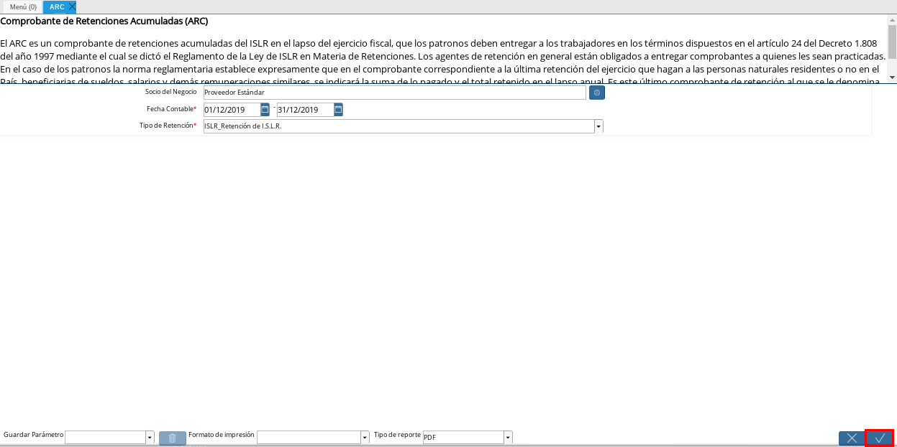
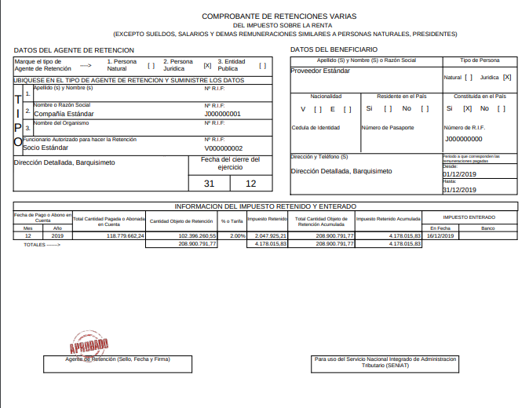

.. _documento/reporte-arc:

**Generar Reporte ARC**
=======================

#. Ubique y seleccione en el menú de ADempiere, la carpeta "**Localización Venezuela**", luego seleccione el proceso "**ARC**".

    |Menú de ADempiere 1|

    Imagen 1. Menú de ADempiere

#. Podrá visualizar la ventana "**ARC**", donde debe seleccionar los campos por los cuales filtrará la búsqueda.

    |Ventana ARC 1|

    Imagen 2. Ventana ARC

    #. Seleccione en el campo "**Socio del Negocio**", el socio del negocio involucrado en las retenciones.

        |Campo Socio del Negocio 1|

        Imagen 3. Campo Socio del Negocio

    #. Introduzca en el campo "**Fecha Contable**", el rango de fecha de inicio y culminación que indica el período por el cual se filtrará la búsqueda de las retenciones.

        |Campo Fecha Contable 1|

        Imagen 4. Campo Fecha Contable

    #. Seleccione e el campo "**Tipo de Retención**", la retención por la cual ADempiere filtrará la búsqueda de la información.

        |Campo Tipo de Retención 1|

        Imagen 5. Campo Tipo de Retención

    #. Seleccione la opción "**OK**", para generar el reporte ARC.

        |Opción OK 1|

        Imagen 6. Opción OK

#. Podrá visualizar el reporte de ARC de la siguiente manera, según los campos indicados anteriormente. 

    |Reporte ARC 1|

    Imagen 7. Reporte ARC