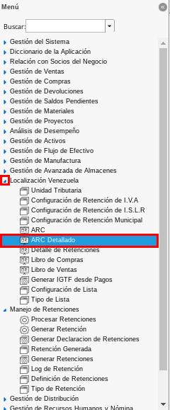
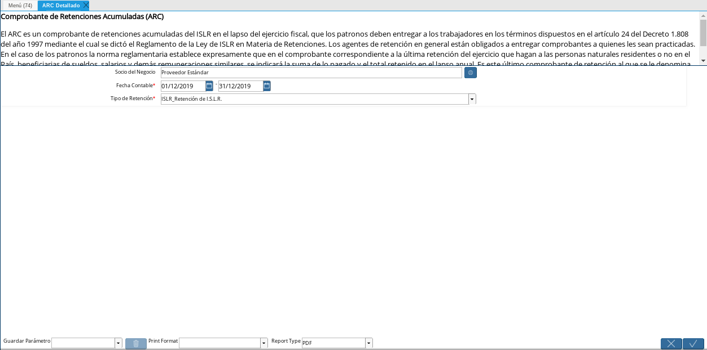
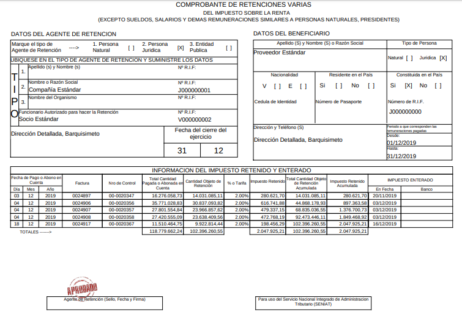

.. _documento/reporte-arc-detallado:

**Generar Reporte ARC Detallado**
=================================

 Ubique y seleccione en el menú de ADempiere, la carpeta "**Localización Venezuela**", luego seleccione el proceso "**ARC**".

    |Menú de ADempiere 1|

    Imagen 1. Menú de ADempiere

 Realice el procedimiento explicado en el documento :ref:`documento/reporte-arc` para generar el reporte detallado del mismo, quedando la ventana "**ARC Detallado**" de la siguiente manera.

    |Ventana ARC con Datos Cargados|

    Imagen 2. Ventana ARC con Datos Cargados

 Al seleccionar la opción "**OK**" en la ventana "**ARC Detallado**, podrá visualizar el reporte de ARC de la siguiente manera.

    |Reporte ARC 2| 

    Imagen 3. Reporte ARC Detallado