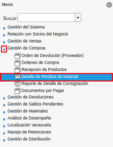
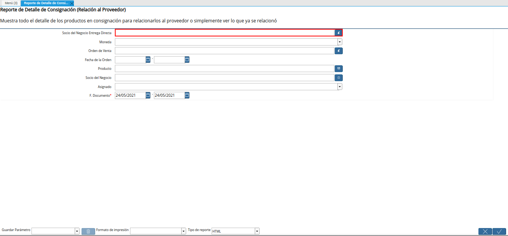
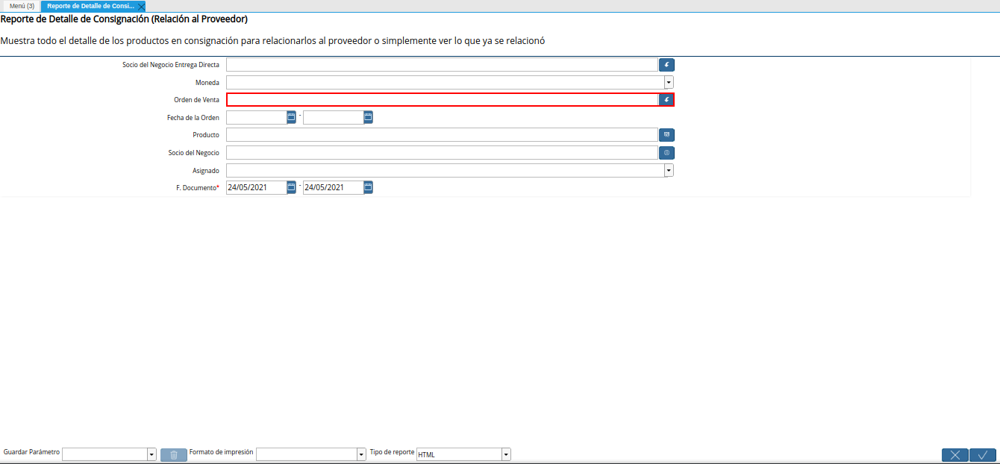
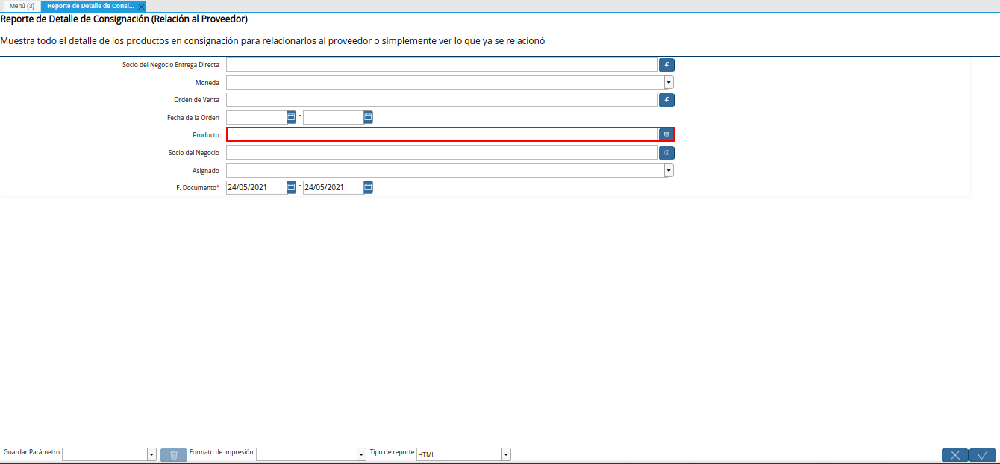
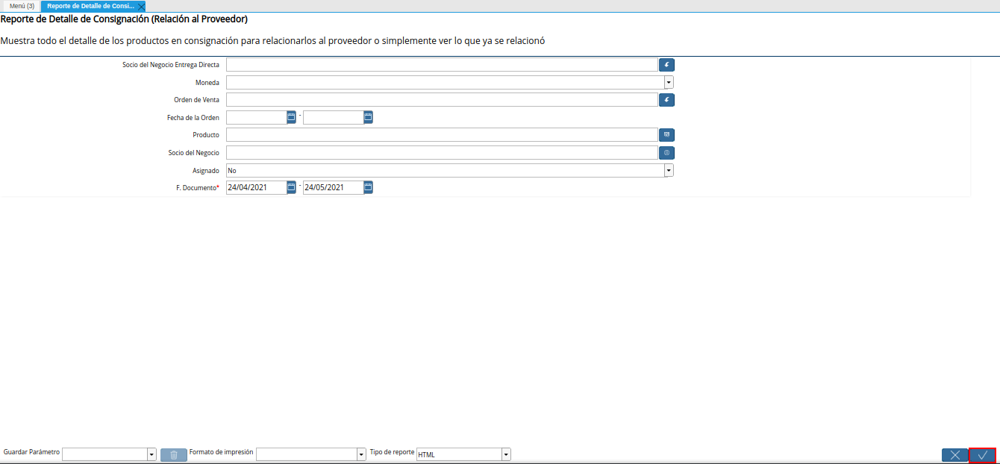
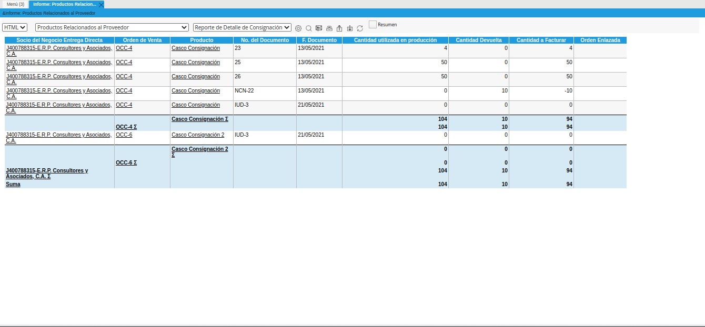
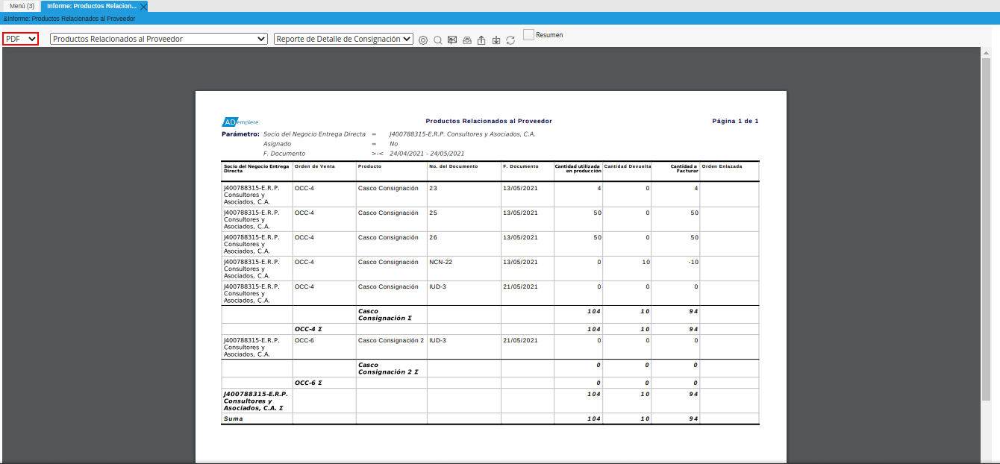
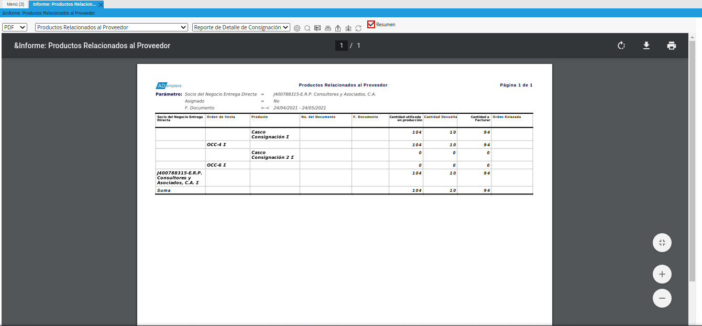

.. |ventana del reporte de detalle de consignación| image:: resources/consignment-detail-report-window.png

.. |campo moneda del reporte de detalle de consignación| image:: resources/currency-field-of-the-consignment-detail-report.png

.. |campo fecha de la orden del reporte de detalle de consignación| image:: resources/order-date-field-of-the-consignment-detail-report.png

.. |campo socio del negocio del reporte de detalle de consignación| image:: resources/business-partner-field-of-consignment-detail-report.png
.. |campo asignado del reporte de detalle de consignación| image:: resources/assigned-field-of-consignment-detail-report.png
.. |campo fecha del documento del reporte de detalle de consignación| image:: resources/document-date-field-of-the-consignment-detail-report.png

.. _documento/reporte-de-detalle-de-consignación:

**Reporte de Detalle de Consignación**
======================================

#. Ubique y seleccione en el menú de ADempiere, la carpeta "**Gestión de Compras**", luego seleccione el "**Reporte de Detalle de Consignación**".

    |menú de reporte de detalle de consignación|

    Imagen 1. Menú de ADempiere

#. Podrá visualizar la ventana del reporte de detalle de consignación con diferentes campos que le permiten al usuario, filtrar la información en base a lo requerido en su momento.

    |ventana del reporte de detalle de consignación|

    Imagen 2. Ventana del Reporte de Detalle de Consignación

#. Seleccione en el campo "**Socio del Negocio Entrega Directa**", el socio del negocio proveedor del material a consignación.

    |campo socio del negocio entrega directa del reporte de detalle de consignación|

    Imagen 3. Campo Socio del Negocio Entrega Directa

#. Seleccione en el campo "**Moneda**", la moneda por la cual requiere filtrar la información.

    |campo moneda del reporte de detalle de consignación|

    Imagen 4. Campo Moneda

#. Seleccione en el campo "**Orden de Venta**", la orden de compra o venta por la cual requiere filtrar la información.

    |campo orden de venta del reporte de detalle de consignación|

    Imagen 5. Campo Orden de Venta

#. Introduzca en el campo "**Fecha de la Orden**", el rango de fecha en el cual fue generada la orden de venta.

    |campo fecha de la orden del reporte de detalle de consignación|

    Imagen 6. Campo Fecha de la Orden

#. Seleccione en el campo "**Producto**", el producto por el cual requiere filtrar la información.

    |campo producto del reporte de detalle de consignación|

    Imagen 7. Campo Producto

#. Seleccione en el campo "**Socio del Negocio**", el socio del negocio por el cual requiere filtrar la información.

    |campo socio del negocio del reporte de detalle de consignación|

    Imagen 8. Campo Socio del Negocio

#. Indique en el campo "**Asignado**", si el pago ha sido asignado o no.

    |campo asignado del reporte de detalle de consignación|

    Imagen 9. Campo Asignado

#. Seleccione en el campo "**F. Documento**", el rango de fecha en el que fue generado el documento.

    |campo fecha del documento del reporte de detalle de consignación|

    Imagen 10. Campo F. Documento

#. Seleccione la opción "**OK**", para generar el reporte en base a la información seleccionada en los diferentes campos que contiene la ventana del reporte de detalle de consignación.

    |opción ok del reporte de detalle de consignación|

    Imagen 11. Opción OK

#. Podrá visualizar de la siguiente manera, la información del reporte de detalle de consignación.

    |resultado del reporte de detalle de consignación|

    Imagen 12. Resultado del Reporte 

#. El reporte se genera en formato "**HTML**", para cambiar dicho formato se debe seleccionar la opción del formato en el campo "**Tipo de Reporte**", el mismo se encuentra ubicado en la parte superior izquierda de la ventana.

    |tipo de reporte de la ventana del reporte de detalle de consignación|

    Imagen 13. Tipo de Reporte

#. Para visualizar un resumen del reporte donde se reflejen solamente los totales del mismo, se debe seleccionar el check "**Resumen**", ubicado de ultimo lugar de izquierda a derecha en la parte superior de la ventana.

    |check resumen del reporte de detalle de consignación|

    Imagen 14. Check Resumen