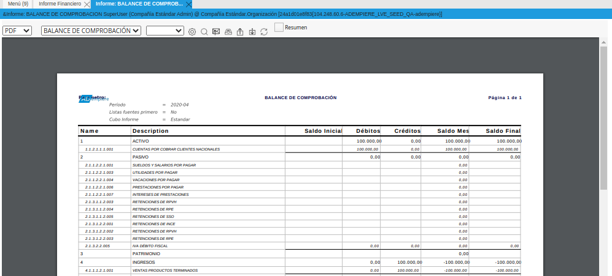
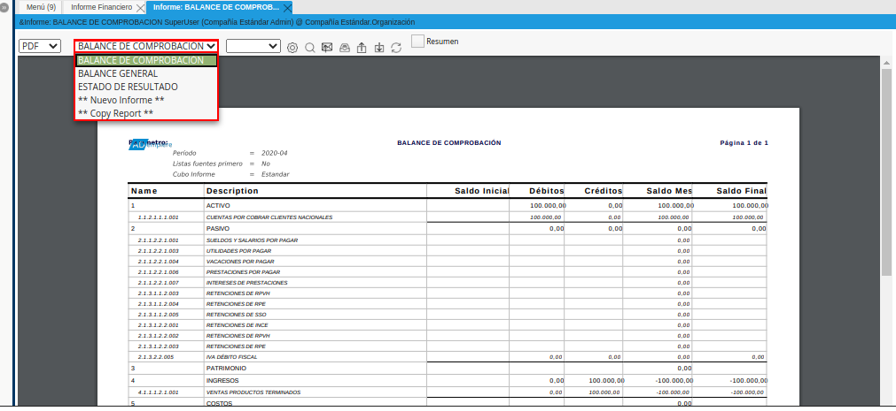
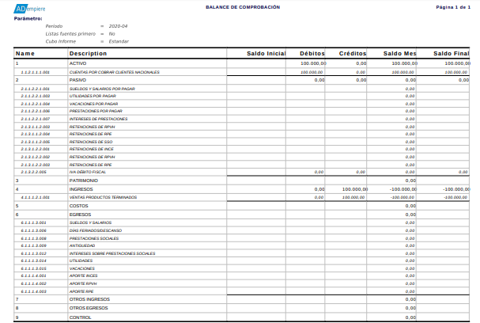
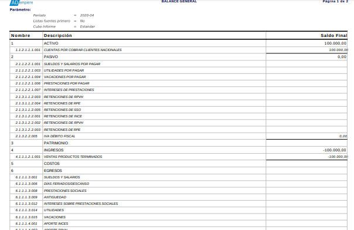

.. _ERPyA: http://erpya.com

.. |Tercer Reporte| image:: resources/estado-resultado.png

.. _documento/informe-financiero-configurado:

**Informe Financiero**
======================

En función de los requerimientos del cliente y con la finalidad de brindar apoyo en las actividades que el mismo realiza, `ERPyA`_ realizó las configuraciones necesarias en los formatos de impresión para que el usuario pueda obtener tres (3) diferentes informes financieros.

#. Para generar el reporte, debe realizar el procedimiento explicado en el documento :ref:`documento/informe-financiero`, elaborado por `ERPyA`_. 

#. Luego de que haya culminado el procedimiento, podrá visualizar la ventana "**Informe**" con el reporte financiero. 

    |Ventana Informe|

    Imagen 1. Ventana Informe

#. Podrá visualizar los tres (3) diferentes informes financieros que pueden ser generados desde la ventana "**Informe**", seleccionando en el campo "**Formato de Impresión**", el tipo de reporte que requiere.

    |Campo Formato de Impresión|

    Imagen 2. Campo Formato de Impresión

A continuación se muestran los reportes generados en la ventana "**Informe**".

**Balance de Comprobación**
***************************

Un informe financiero de balance de comprobación es un reporte que muestra los débitos, créditos y los saldos iniciales y finales de las cuentas.

    |Primer Reporte|

    Imagen 3. Balance de Comprobación

.. note::

    El reporte de balance de comprobación muestra la información en base al periodo de tiempo seleccionado en el campo "**Periodo**" de la ventana "**Crear Informe**". 

**Balance General**
*******************

Un informe financiero de balance general es un reporte que muestra la situación económica y financiera en un momento determinado. 

|Segundo Reporte|

Imagen 4. Balance General

.. note::

    El reporte de balance general muestra la información en base al periodo de tiempo seleccionado en el campo "**Periodo**" de la ventana "**Crear Informe**".

**Estado de Resultado**
***********************

Un informe financiero de estado de resultado es un reporte que muestra los movimientos de los ingresos y egresos de la empresa.

|Tercer Reporte|

Imagen 5. Estado de Resultado

.. note::

    El reporte de estado de resultado muestra la información en base al periodo de tiempo seleccionado en el campo "**Periodo**" de la ventana "**Crear Informe**".