.. |menú del reporte resumen de facturas| image:: resources/invoice-summary-report-menu.png
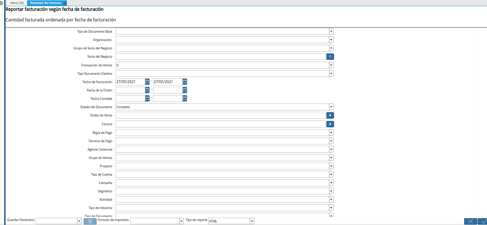
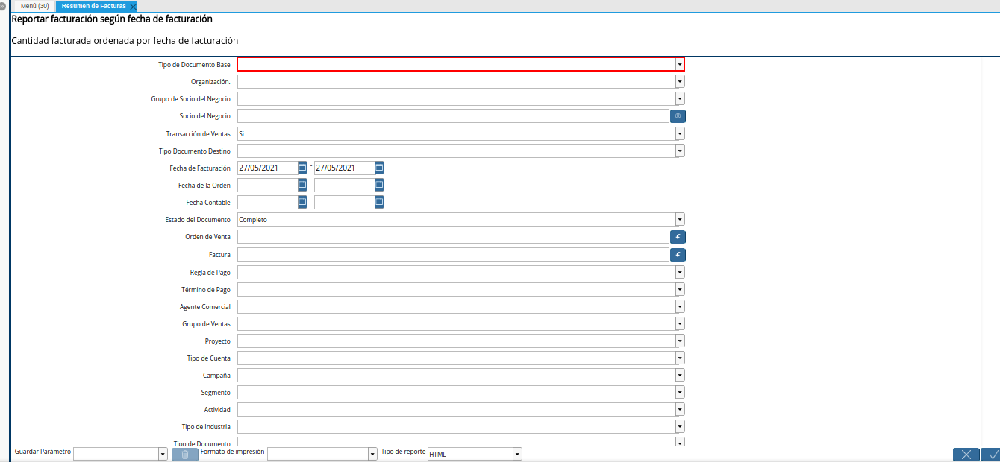
.. |campo organización del reporte resumen de facturas| image:: resources/organization-field-of-the-invoice-summary-report.png
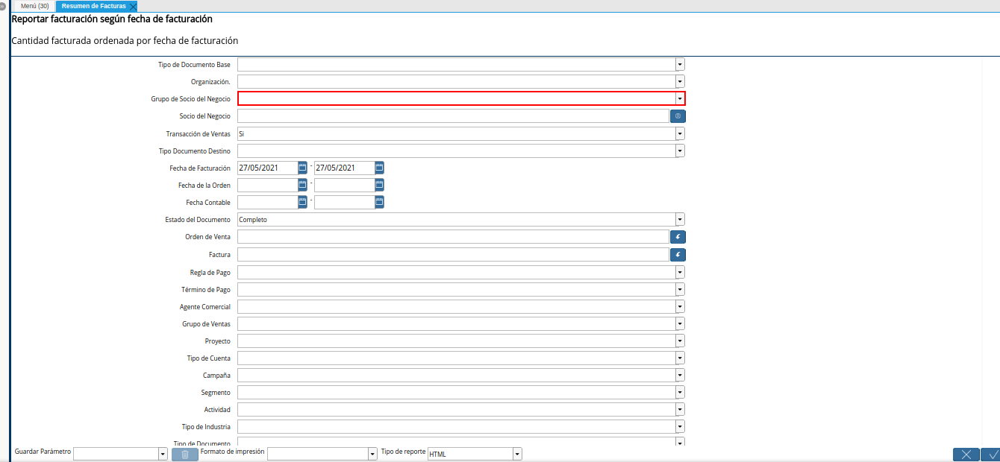
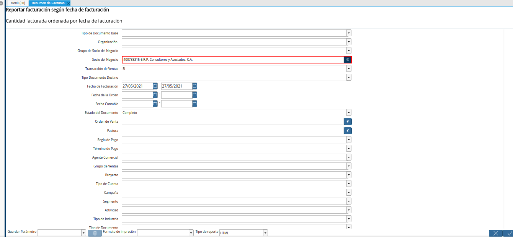
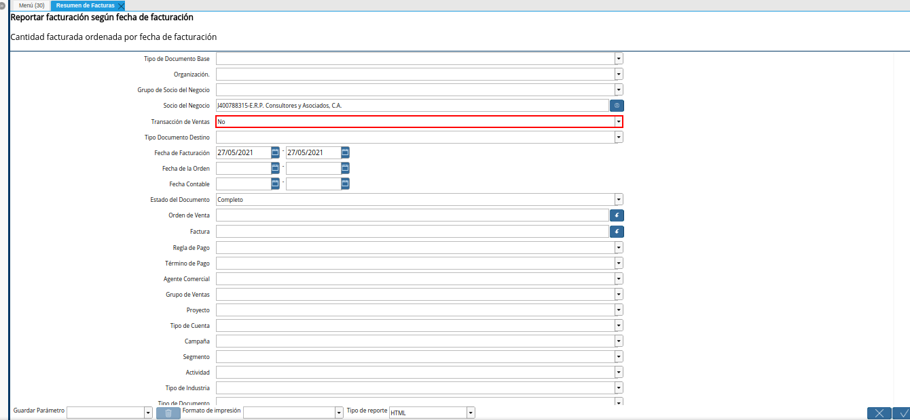
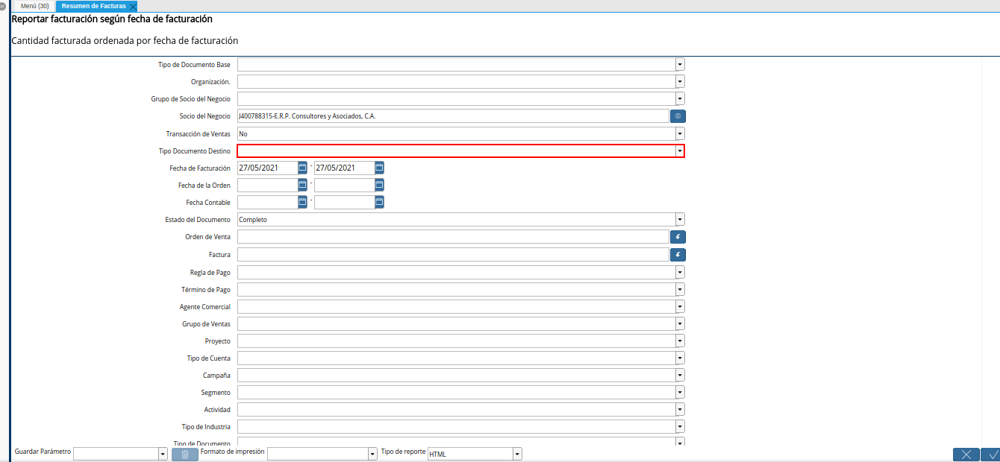
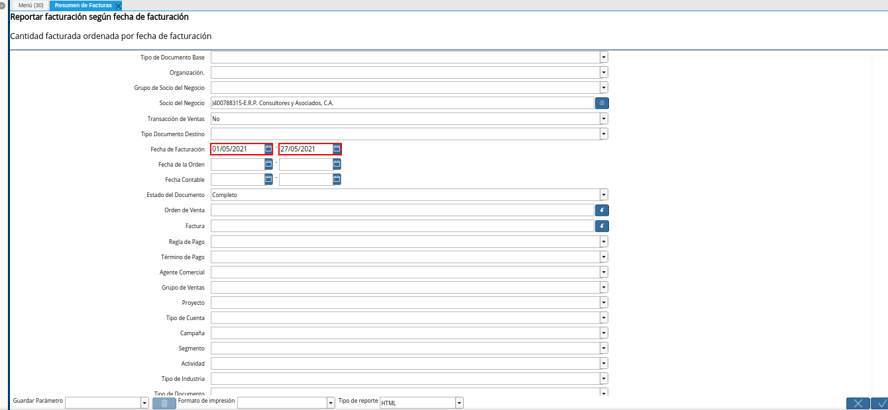
.. |campo fecha de la orden del reporte resumen de facturas| image:: resources/order-date-field-of-the-invoice-summary-report.png
.. |campo fecha contable del reporte resumen de facturas| image:: resources/accounting-date-field-of-the-invoice-summary-report.png
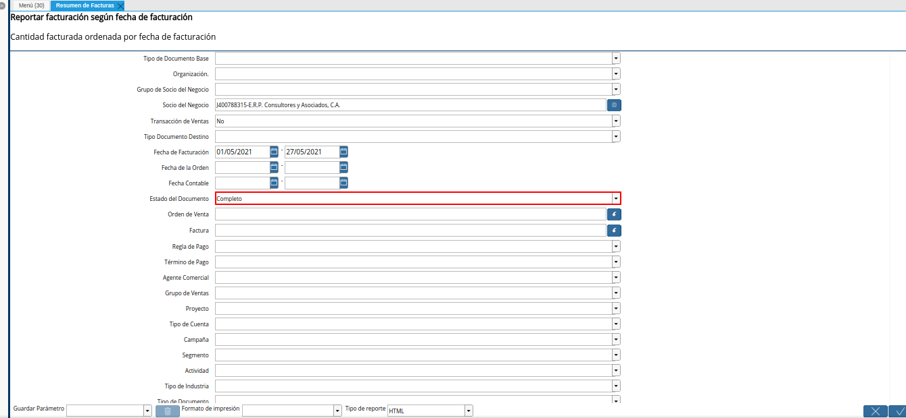
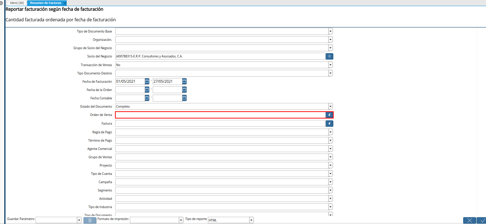
.. |campo factura del reporte resumen de facturas| image:: resources/invoice-field-of-the-invoice-summary-report.png
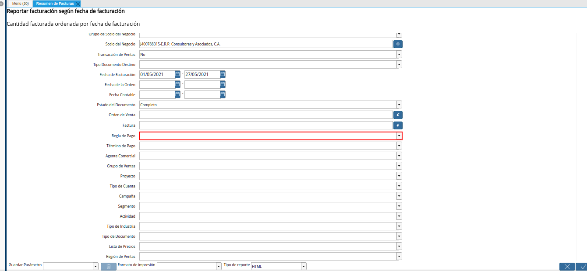
.. |campo término de pago del reporte resumen de facturas| image:: resources/payment-term-field-of-the-invoice-summary-report.png
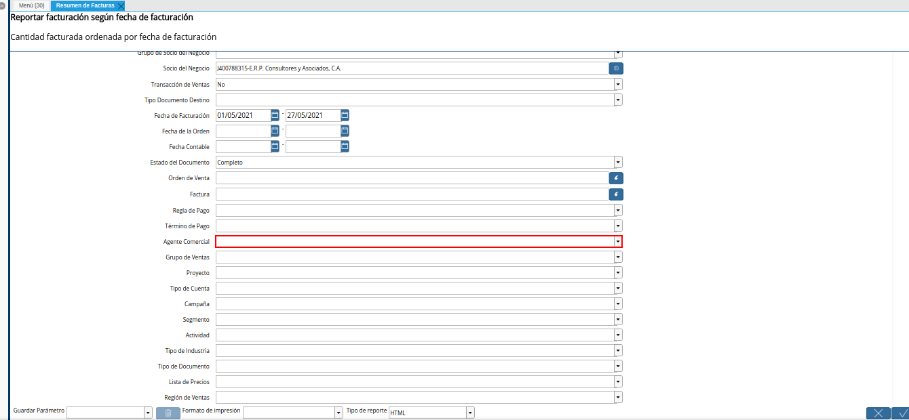
.. |campo grupo de ventas del reporte resumen de facturas| image:: resources/sales-group-field-of-the-invoice-summary-report.png
.. |campo proyecto del reporte resumen de facturas| image:: resources/project-field-of-the-invoice-summary-report.png
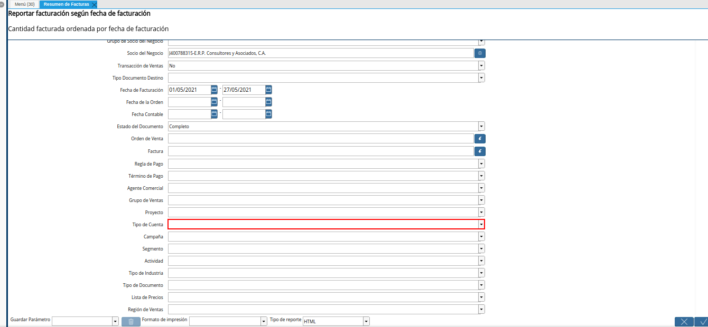
.. |campo campaña del reporte resumen de facturas| image:: resources/campaign-field-of-the-invoice-summary-report.png
.. |campo segmento del reporte resumen de facturas| image:: resources/segment-field-of-the-invoice-summary-report.png
.. |campo actividad del reporte resumen de facturas| image:: resources/activity-field-of-the-invoice-summary-report.png
.. |campo tipo de industria del reporte resumen de facturas| image:: resources/industry-type-field-of-invoice-summary-report.png
.. |campo tipo de documento del reporte resumen de facturas| image:: resources/document-type-field-of-the-invoice-summary-report.png
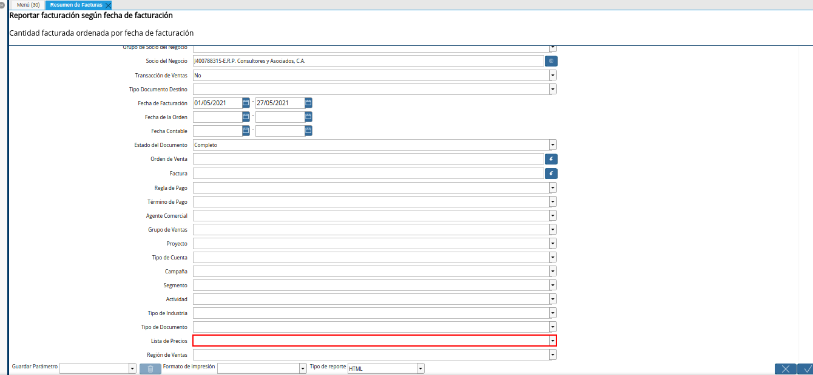
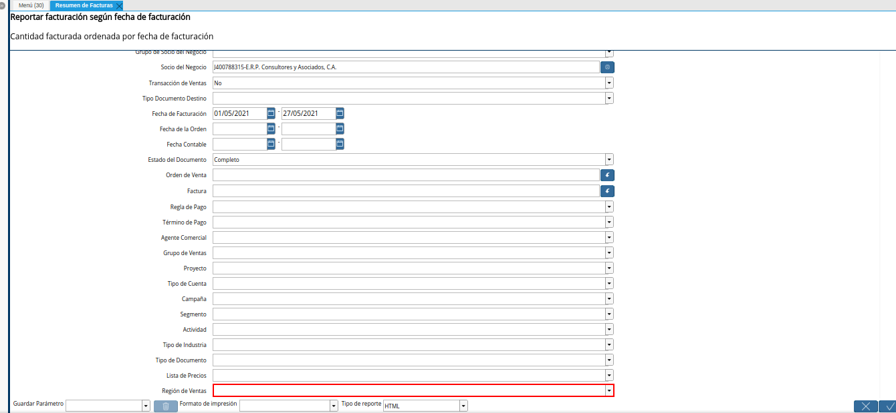
.. |opción ok del reporte resumen de facturas| image:: resources/option-ok-of-the-invoice-summary-report.png
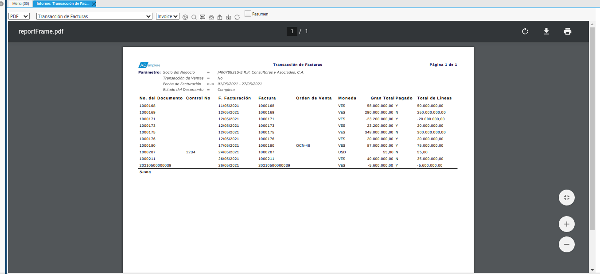

.. _documento/resumen-de-facturas:

**Resumen de Facturas**
=======================

Ubique y seleccione en el menú de ADempiere, la carpeta "**Gestión de Ventas**", luego seleccione la carpeta "**Consulta de Facturas**", por último seleccione el reporte "**Resumen de Facturas**".

    |menú del reporte resumen de facturas|

    Imagen 1. Menú de ADempiere

Podrá visualizar la ventana "**Resumen de Facturas**", que permiten filtrar la búsqueda de la información para el reporte en base a lo requerido por el usuario en su momento. 

    |ventana del reporte resumen de facturas|

    Imagen 2. Ventana del Reporte Resumen de Facturas

Seleccione en el campo "**Tipo de Documento Base**", el tipo de documento base por el cual requiere filtrar la información.

    |campo tipo de documento base del reporte resumen de facturas|

    Imagen 3. Campo Tipo de Documento

Seleccione en el campo "**Organización**", la organización a la cual pertenecen los registros por los cuales requiere filtrar la información.

    |campo organización del reporte resumen de facturas|

    Imagen 4. Campo Organización

Seleccione en el campo "**Grupo de Socio del Negocio**", el grupo de socio del negocio por el cual requiere filtrar la información.

    |campo grupo de socio del negocio del reporte resumen de facturas|

    Imagen 5. Campo Grupo de Socio del Negocio

Seleccione en el campo "**Socio del Negocio**", el socio del negocio por el cual requiere filtrar la información.

    |campo socio del negocio del reporte resumen de facturas|

    Imagen 6. Campo Socio del Negocio

Indique en el campo "**Transacción de Ventas**", si requiere que el reporte sea filtrado por transacciones de ventas o no.

    .. note::

        La opción **Si**: Muestra las facturas de ventas
        La opción **No**: Muestra las facturas de compras

    |campo transacción de ventas del reporte resumen de facturas|

    Imagen 7. Campo Transacción de Ventas

Seleccione en el campo "**Tipo de Documento Destino**", el tipo de documento destino de los reguistros por los cuales requiere filtrar la información.

    |campo tipo de documento destino del reporte resumen de facturas|

    Imagen 8. Campo Tipo de Documento Destino

Seleccione en el campo "**Fecha de Facturación**", el rango de fecha de facturación de los registros por los cuales requiere filtrar la información.

    |campo fecha de facturación del reporte resumen de facturas|

    Imagen 9. Campo Fecha de Facturación

Seleccione en el campo "**Fecha de la Orden**", el rango de fecha de la orden por la cual requiere filtrar la información.

    |campo fecha de la orden del reporte resumen de facturas|

    Imagen 10. Campo Fecha de la Orden

Seleccione en el campo "**Fecha Contable**", el rango de fecha contable por la cual requiere filtrar la información.

    |campo fecha contable del reporte resumen de facturas|

    Imagen 11. Campo Fecha Contable

Seleccione en el campo "**Estado del Documento**", el estado del documento por el cual requiere filtrar la información.

    .. note::

        Se recomienda que preferiblemente sea utilizado el estado de documento "**Completo**", porque son los documentos considerados "**Válidos**".

    |campo estado del documento del reporte resumen de facturas|

    Imagen 12. Campo Estado del Documento

Seleccione en el campo "**Orden de Venta**", la orden de venta por la cual requiere filtrar la información.

    |campo orden de venta del reporte resumen de facturas|

    Imagen 13. Campo Orden de Venta

Seleccione en el campo "**Factura**", la factura por la cual requiere filtrar la información.

    |campo factura del reporte resumen de facturas|

    Imagen 14. Campo Factura

Seleccione en el campo "**Regla de Pago**", la regla de pago por la cual requiere filtrar la información.

    |campo regla de pago del reporte resumen de facturas|

    Imagen 15. Campo Regla de Pago

Seleccione en el campo "**Término de Pago**", el término de pago por el cual requiere filtrar la información.

    |campo término de pago del reporte resumen de facturas|

    Imagen 16. Campo Término de Pago

Seleccione en el campo "**Agente Comercial**", el agente comercial por el cual requiere filtrar la información.

    |campo agente comercial del reporte resumen de facturas|

    Imagen 17. Campo Agente Comercial

Seleccione en el campo "**Grupo de Ventas**", el grupo de ventas por el cual requiere filtrar la información.

    |campo grupo de ventas del reporte resumen de facturas|

    Imagen 18. Campo Grupo de Ventas

Seleccione en el campo "**Proyecto**", el proyecto por el cual requiere filtrar la información.

    |campo proyecto del reporte resumen de facturas|

    Imagen 19. Campo Proyecto

Seleccione en el campo "**Tipo de Cuenta**", el tipo de cuenta por el cual requiere filtrar la información.

    |campo tipo de cuenta del reporte resumen de facturas|

    Imagen 20. Campo Tipo de Cuenta

Seleccione en el campo "**Campaña**", la campaña por la cual requiere filtrar la información.

    |campo campaña del reporte resumen de facturas|

    Imagen 21. Campo Campaña

Seleccione en el campo "**Segmento**", el segmento por el cual requiere filtrar la información.

    |campo segmento del reporte resumen de facturas|

    Imagen 22. Campo Segmento

Seleccione en el campo "**Actividad**", la actividad por la cual requiere filtrar la información.

    |campo actividad del reporte resumen de facturas|

    Imagen 23. Campo Actividad

Seleccione en el campo "**Tipo de Industria**", el tipo de industria por el cual requiere filtrar la información.

    |campo tipo de industria del reporte resumen de facturas|

    Imagen 24. Campo Tipo de Industria 

Seleccione en el campo "**Tipo de Documento**", el tipo de documento por el cual requiere filtrar la información.

    |campo tipo de documento del reporte resumen de facturas|

    Imagen 25. Campo Tipo de Documento

Seleccione en el campo "**Lista de Precios**", la lista de precios por la cual requiere filtrar la información.

    |campo lista de precios del reporte resumen de facturas|

    Imagen 26. Campo Lista de Precios

Seleccione en el campo "**Región de Ventas**", la región de ventas por la cual requiere filtrar la información.

    |campo región de ventas del reporte resumen de facturas|

    Imagen 27. Campo Región de Ventas

.. note::

    En el campo "**Tipo de Reporte**" se puede definir el tipo reporte que se requiere generar:

        - Html: Con este tipo de reporte el usuario se podrá acercar a la factura o socio del negocio que desee visualizar de manera inmediata.

        - PDF: Con este tipo de reporte el usuario tiene acceso inmediato al reporte en formato "**PDF**" para imprimir el mismo.

Seleccione la opción "**OK**" para generar el reporte en base a lo seleccionado en los campos nombrados anteriormente.

    |opción ok del reporte resumen de facturas|

    Imagen 28. Opción OK

Podrá visualizar de la siguiente manera, el reporte "**Resumenn de Facturas**".

    |reporte resumen de facturas|

    Imagen 29. Reporte Resumen de Facturas

.. note::

    En el reporte puede visualizar las siguientes columnas:

    - **No de Documento**: El número de documentlo que identifica el registro de la factura.

    - **Control No.**: El número de control del registro de la factura.

    - **Fecha de Facturación**: La fecha en la cual fue emitida la factura.

    - **Factura**: Refleja el documento aplicado para la venta. Ejemplo: Notas de Créditos, Facturas de Cuentas por Cobrar, entre otros.

    - **Órdenes de Ventas**: El numero de documento que identifica el registro de la orden asociada a la factura.

    - **Moneda**: La moneda con la cual se realizó la transacción.

    - **Gran Total**: El monto total del documento, icluyendo impuestos y totales de fletes en la moneda del documento.

    - **Pagado**: Indica si el documento fue pagado o no. Ejemplo: Y (Pagada), N (No pagado).

    - **Total de Lineas**: El total de todas las líneas que contiene la factura.
