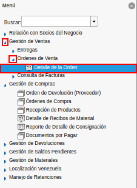
.. |ventana del reporte detalle de la orden| image:: resources/order-detail-report-window.png
.. |campo tipo de documento del reporte detalle de la orden| image:: resources/document-type-field-of-the-order-detail-report.png
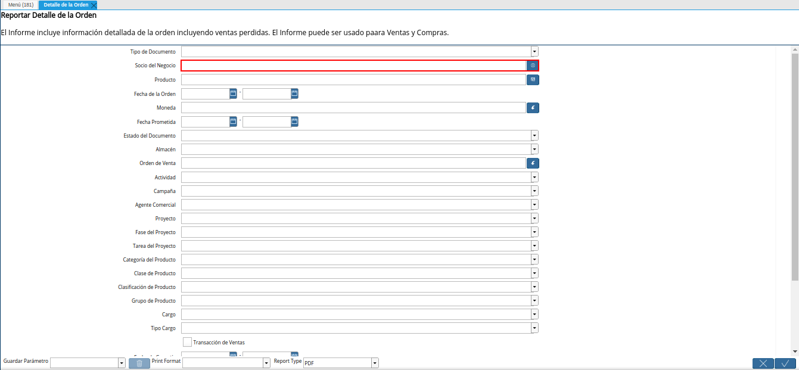
.. |campo producto del reporte detalle de la orden| image:: resources/product-field-of-the-order-detail-report.png
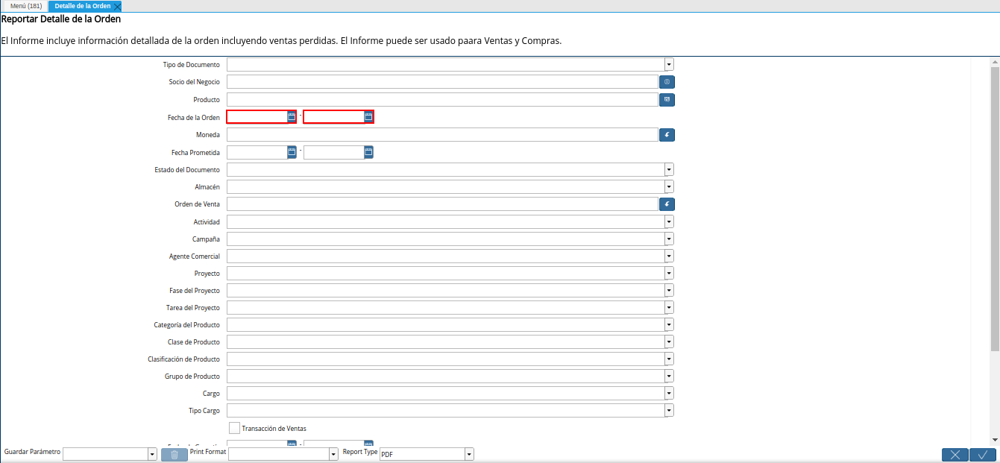
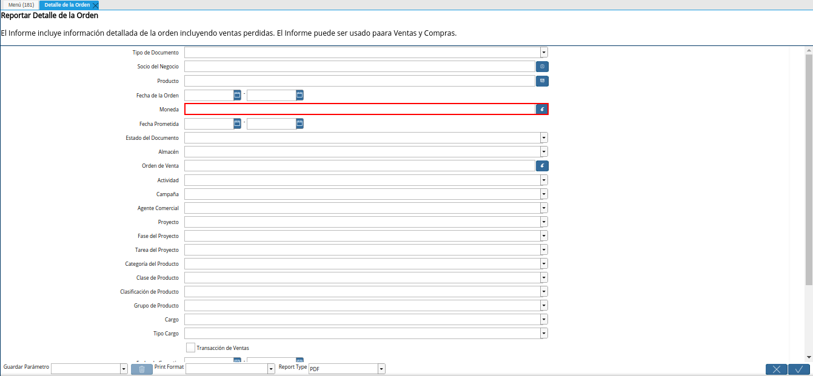
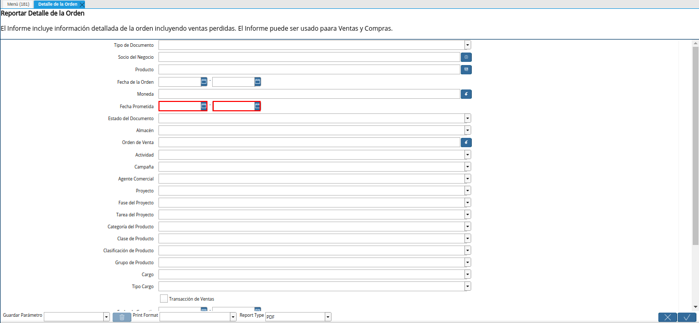
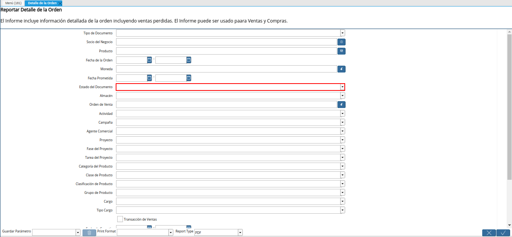
.. |campo almacén del reporte detalle de la orden| image:: resources/warehouse-field-of-the-order-detail-report.png
.. |campo orden de venta del reporte detalle de la orden| image:: resources/sales-order-field-of-the-order-detail-report.png
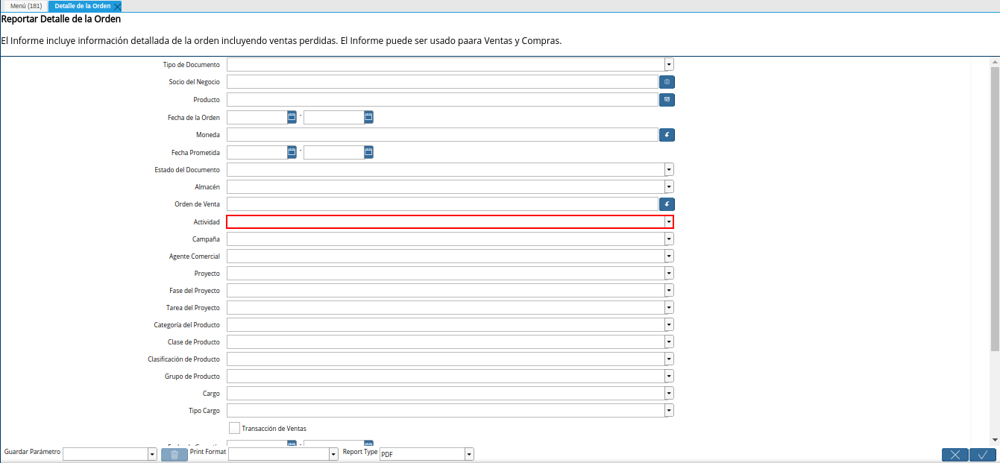
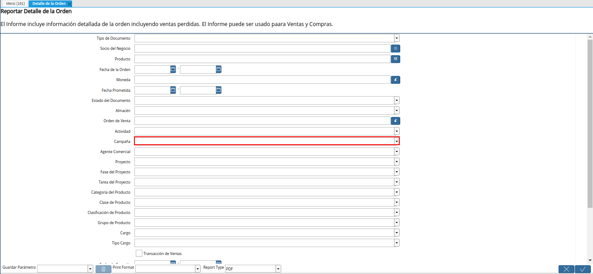
.. |campo agente comercial del reporte detalle de la orden| image:: resources/commercial-agent-field-of-the-order-detail-report.png
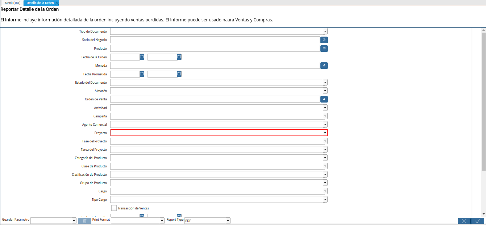
.. |campo fase del proyecto del reporte detalle de la orden| image:: resources/project-phase-field-of-the-order-detail-report.png
.. |campo tarea del proyecto del reporte detalle de la orden| image:: resources/project-task-field-of-the-order-detail-report.png
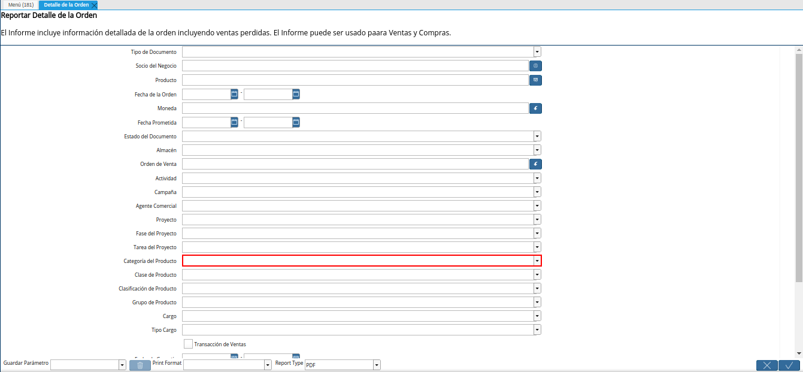
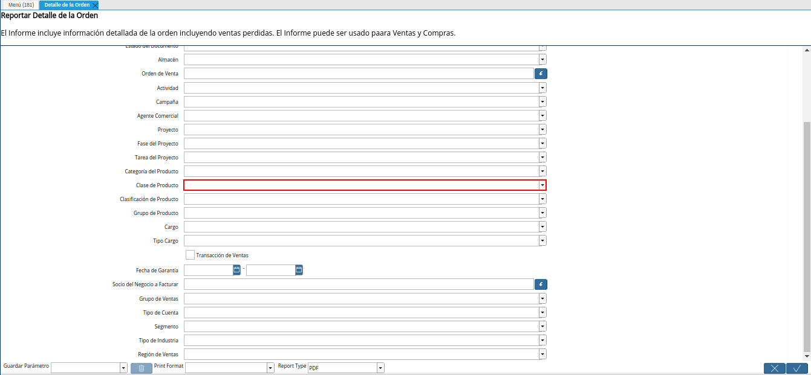
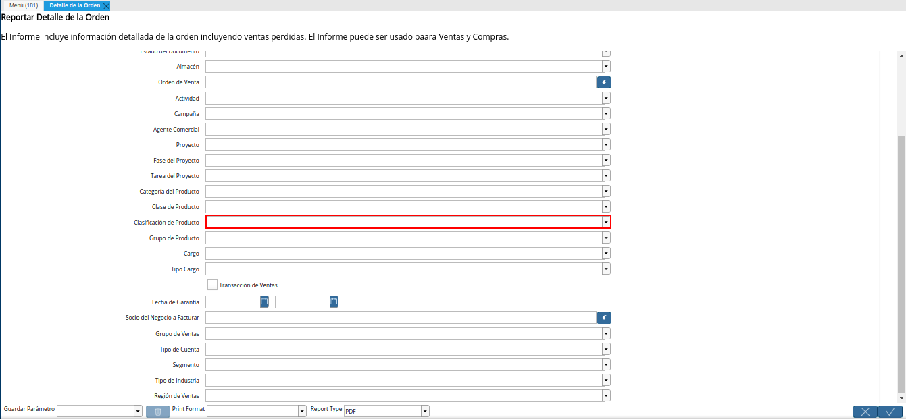
.. |campo grupo de producto del reporte detalle de la orden| image:: resources/product-group-field-of-the-order-detail-report.png
.. |campo cargo del reporte detalle de la orden| image:: resources/charge-field-of-the-order-detail-report.png
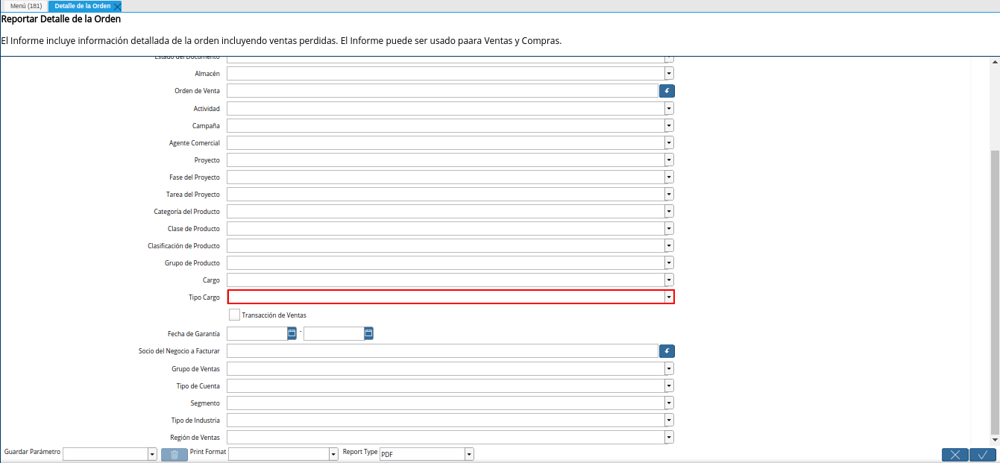
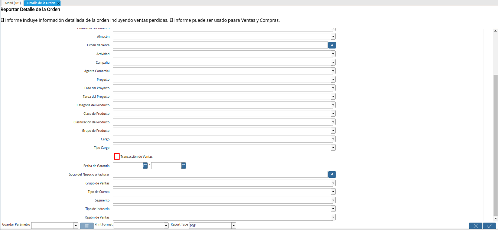
.. |campo fecha de garantía del reporte detalle de la orden| image:: resources/guarantee-date-field-of-the-order-detail-report.png
.. |campo socio del negocio a facturar del reporte detalle de la orden| image:: resources/business-partner-field-to-be-billed-from-the-order-detail-report.png
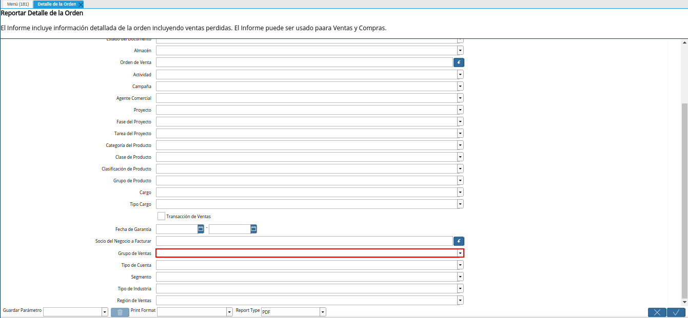
.. |campo tipo de cuenta del reporte detalle de la orden| image:: resources/account-type-field-of-the-order-detail-report.png
.. |campo segmento del reporte detalle de la orden| image:: resources/segment-field-of-the-order-detail-report.png
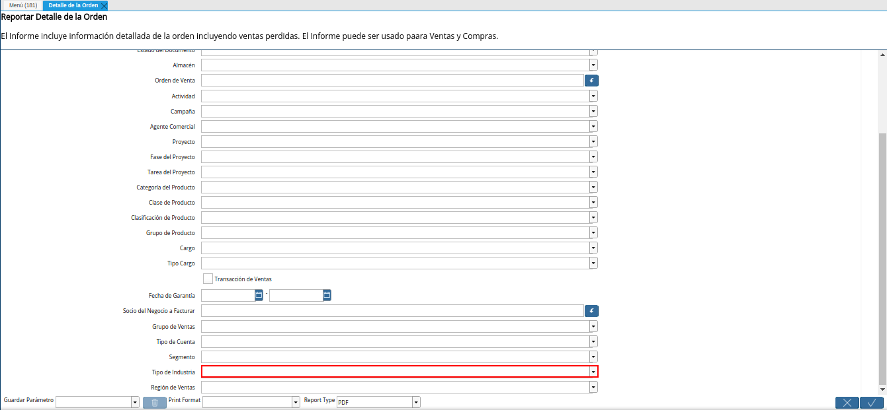
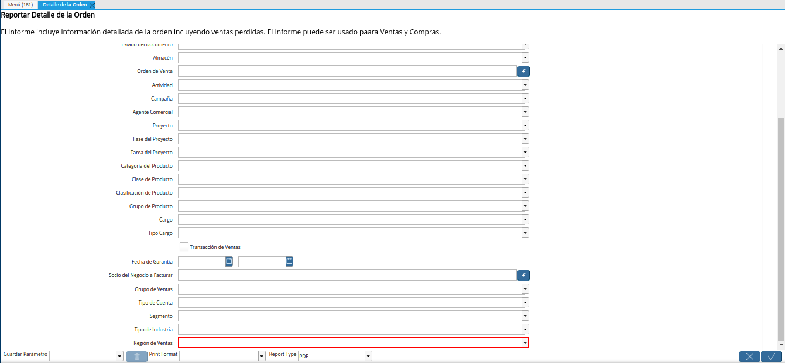
.. |opción ok del reporte detalle de la orden| image:: resources/ok-option-of-the-order-detail-report.png
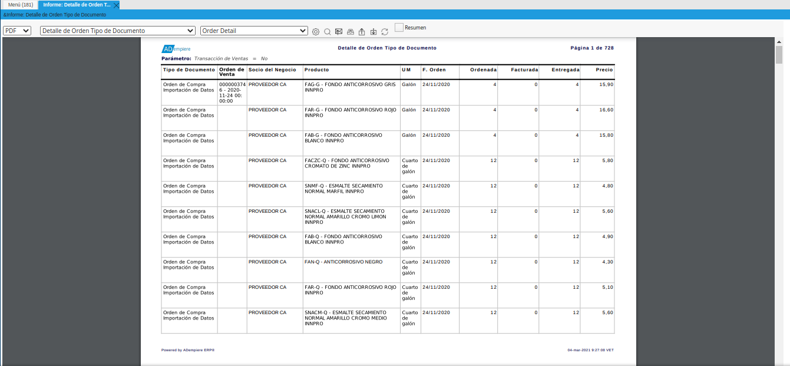

.. _documento/reporte-detalle-de-la-orden:

**Detalle de la Orden**
=======================

#. Ubique y seleccione en el menú de ADempiere, la carpeta "**Gestión de Ventas**", luego seleccione la carpeta "**Órdenes de Venta**", por último seleccione el reporte "**Detalle de la Orden**".

    |menú del reporte detalle de la orden|

    Imagen 1. Menú de ADempiere

#. Podrá visualizar la ventana del reporte "**Detalle de la Orden**", con diferentes campos que le permiten al usuario filtrar la información del reporte en base a lo requerido por el mismo.

    |ventana del reporte detalle de la orden|

    Imagen 2. Ventana del Reporte Detalle de la Orden

#. Seleccione en el campo "**Tipo de Documento**", el tipo de documento por el cual requiere filtrar la información.

    |campo tipo de documento del reporte detalle de la orden|

    Imagen 3. Campo Tipo de Documento

#. Seleccione en el campo "**Socio del Negocio**", el socio del negocio por el cual requiere filtrar la información.

    |campo socio del negocio del reporte detalle de la orden|

    Imagen 4. Campo Socio del Negocio

#. Seleccione en el campo "**Producto**", el producto por el cual requiere filtrar la información.

    |campo producto del reporte detalle de la orden|

    Imagen 5. Campo Producto

#. Seleccione en el campo "**Fecha de la Orden**", el rango de fecha de la orden por el cual requiere filtrar la información.

    |campo fecha de la orden del reporte detalle de la orden|

    Imagen 6. Campo Fecha de la Orden

#. Seleccione en el campo "**Moneda**", la moneda por la cual requiere filtrar la información.

    |campo moneda del reporte detalle de la orden|

    Imagen 7. Campo Moneda

#. Seleccione en el campo "**Fecha Prometida**", el rango de fecha prometida de la orden por el cual requiere filtrar la información.

    |campo fecha prometida del reporte detalle de la orden|

    Imagen 8. Campo Fecha Prometida

#. Seleccione en el campo "**Estado del Documento**", el estado del documento por el cual requiere filtrar la información.

    |campo estado del documento del reporte detalle de la orden|

    Imagen 9. Campo Estado del Documento

#. Seleccione en el campo "**Almacén**", el almacén por el cual requiere filtrar la información.

    |campo almacén del reporte detalle de la orden|

    Imagen 10. Campo Almacén

#. Seleccione en el campo "**Orden de Venta**", la orden de compra o venta por la cual requiere filtrar la información.

    |campo orden de venta del reporte detalle de la orden|

    Imagen 11. Campo Orden de Venta

#. Seleccione en el campo "**Actividad**", la actividad por la cual requiere filtrar la información.

    |campo actividad del reporte detalle de la orden|

    Imagen 12. Campo Actividad

#. Seleccione en el campo "**Campaña**", la campaña por la cual requiere filtrar la información.

    |campo campaña del reporte detalle de la orden|

    Imagen 13. Campo Campaña

#. Seleccione en el campo "**Agente Comercial**", el agente comercial por el cual requiere filtrar la información.

    |campo agente comercial del reporte detalle de la orden|

    Imagen 14. Campo Agente Comercial

#. Seleccione en el campo "**Proyecto**", el proyecto por el cual requiere filtrar la información.

    |campo proyecto del reporte detalle de la orden|

    Imagen 15. Campo Proyecto

#. Seleccione en el campo "**Fase del Proyecto**", la fase del proyecto por la cual requiere filtrar la información.

    |campo fase del proyecto del reporte detalle de la orden|

    Imagen 16. Campo Fase del Proyecto

#. Seleccione en el campo "**Tarea del Proyecto**", la tarea del proyecto por la cual requiere filtrar la información.

    |campo tarea del proyecto del reporte detalle de la orden|

    Imagen 17. Campo Tarea del Proyecto

#. Seleccione en el campo "**Categoría del Producto**", la cateoría del producto por la cual requiere filtrar la información.

    |campo categoría del producto del reporte detalle de la orden|

    Imagen 18. Campo Categoría del Producto

#. Seleccione en el campo "**Clase de Producto**", la clase de producto por la cual requiere filtrar la información.

    |campo clase de producto del reporte detalle de la orden|

    Imagen 19. Campo Clase de Producto

#. Seleccione en el campo "**Clasificación de Producto**", la clasificación de producto por la cual requiere filtrar la información.

    |campo clasificación de producto del reporte detalle de la orden|

    Imagen 20. Campo Clasificación de Producto

#. Seleccione en el campo "**Grupo de Producto**", el grupo de producto por el cual requiere filtrar la información.

    |campo grupo de producto del reporte detalle de la orden|

    Imagen 21. Campo Grupo de Producto

#. Seleccione en el campo "**Cargo**", el cargo por el cual requiere filtrar la información.

    |campo cargo del reporte detalle de la orden|

    Imagen 22. Campo Cargo

#. Seleccione en el campo "**Tipo de Cargo**", el tipo de cargo por el cual requiere filtrar la información.

    |campo tipo de cargo del reporte detalle de la orden|

    Imagen 23. Campo Tipo de Cargo

#. Tilde el check "**Transacción de Ventas**", para filtrar la información por transacciones de ventas.

    |check transacción de ventas del reporte detalle de la orden|

    Imagen 24. Check Transacción de Ventas

#. Seleccione en el campo "**Fecha de Garantía**", la fecha de garantía por la cual requiere filtrar la información.

    |campo fecha de garantía del reporte detalle de la orden|

    Imagen 25. Campo Fecha de Garantía

#. Seleccione en el campo "**Socio del Negocio a Facturar**", el socio del negocio a facturar por el cual requiere filtrar la información.

    |campo socio del negocio a facturar del reporte detalle de la orden|

    Imagen 26. Campo Socio del Negocio a Facturar

#. Seleccione en el campo "**Grupo de Ventas**", el grupo de ventas por el cual requiere filtrar la información.

    |campo grupo de ventas del reporte detalle de la orden|

    Imagen 27. Campo Grupo de Ventas

#. Seleccione en el campo "**Tipo de Cuenta**", el tipo de cuenta por el cual requiere filtrar la información.

    |campo tipo de cuenta del reporte detalle de la orden|

    Imagen 28. Campo Tipo de Cuenta

#. Seleccione en el campo "**Segmento**", el segmento por el cual requiere filtrar la información.

    |campo segmento del reporte detalle de la orden|

    Imagen 29. Campo Segmento

#. Seleccione en el campo "**Tipo de Industria**", el tipo de industria por el cual requiere filtrar la información.

    |campo tipo de industria del reporte detalle de la orden|

    Imagen 30. Campo Tipo de Industria

#. Seleccione en el campo "**Región de Ventas**", la región de ventas por la cual requiere filtrar la información.

    |campo región de ventas del reporte detalle de la orden|

    Imagen 31. Campo Región de Ventas

#. Seleccione la opción "**OK**", para generar el reporte "**Detalle de la Orden**", en base a los campos seleccionados anteriormente.

    |opción ok del reporte detalle de la orden|

    Imagen 32. Opción OK

#. Podrá visualizar el reporte de la siguiente manera. La información del mismo puede variar dependiendo de los campos o filtros de búsqueda seleccionados.

    |reporte detalle de la orden|

    Imagen 32. Reporte Detalle de la Orden