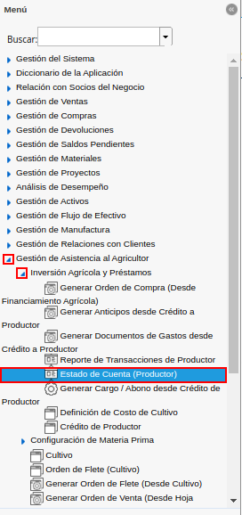
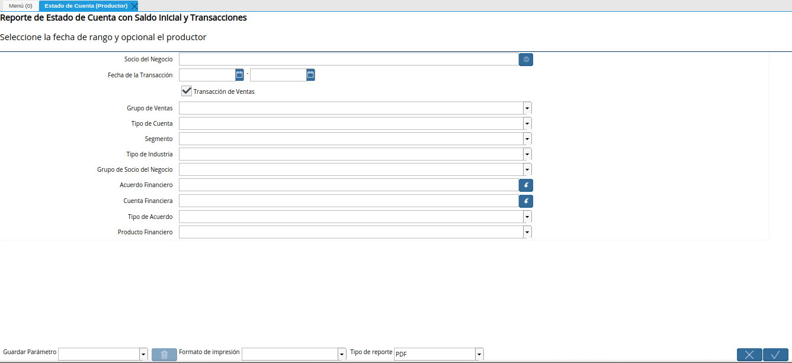
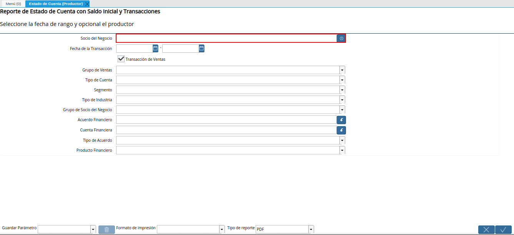
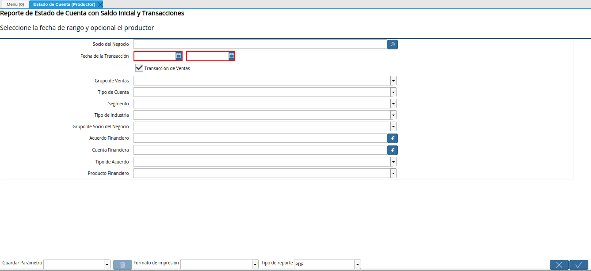
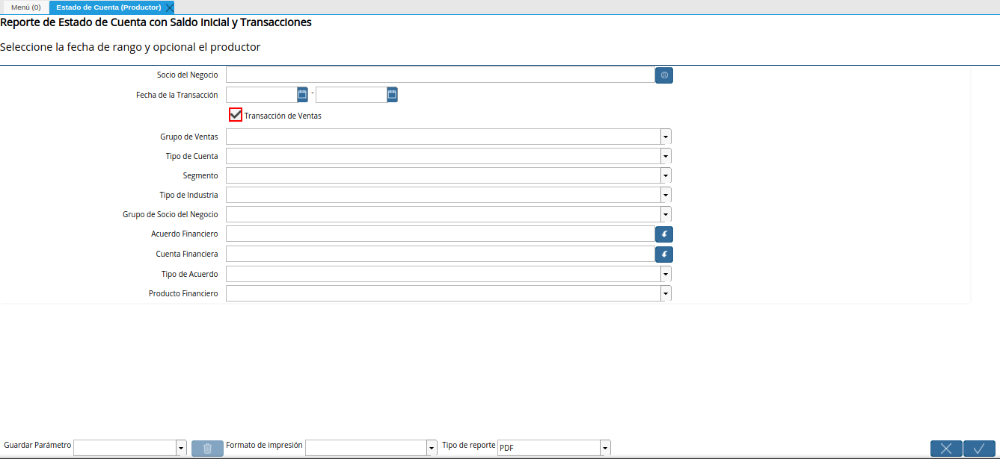
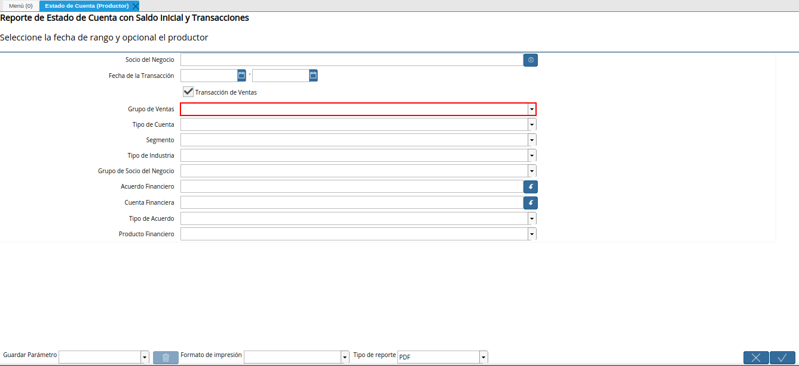
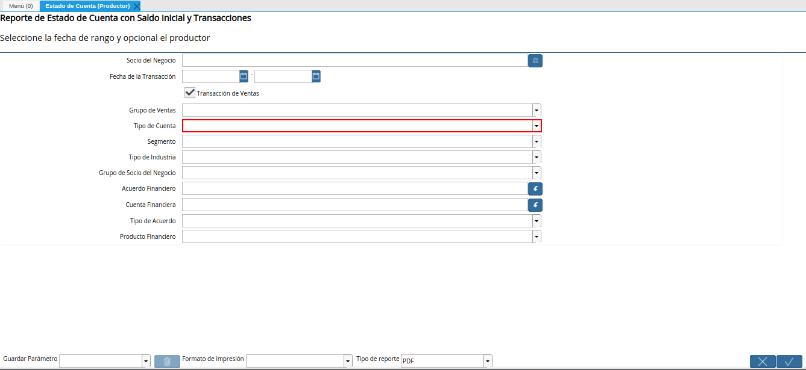
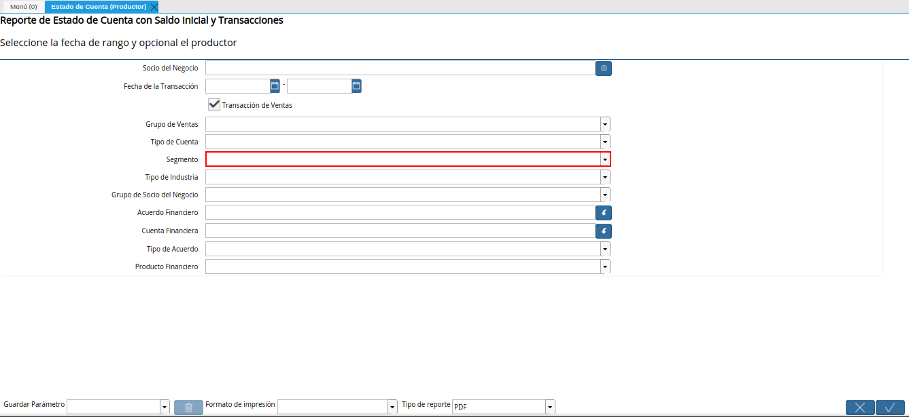
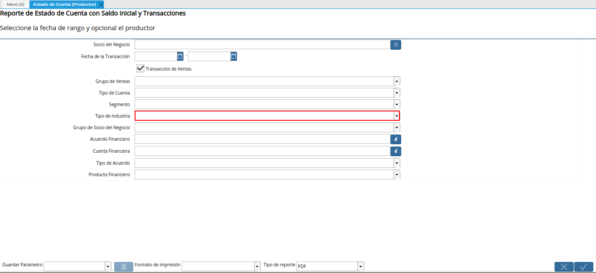
.. |campo grupo de socio del negocio del reporte estado de cuenta productor| image:: resources/business-partner-group-field-of-the-producer-account-statement-report.png
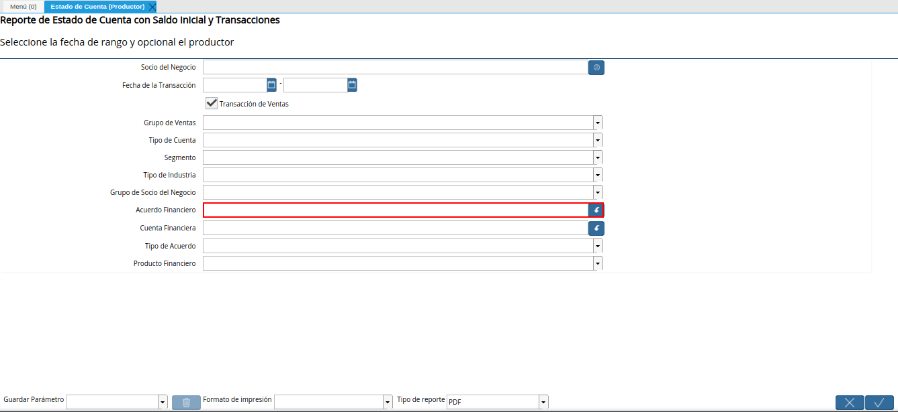
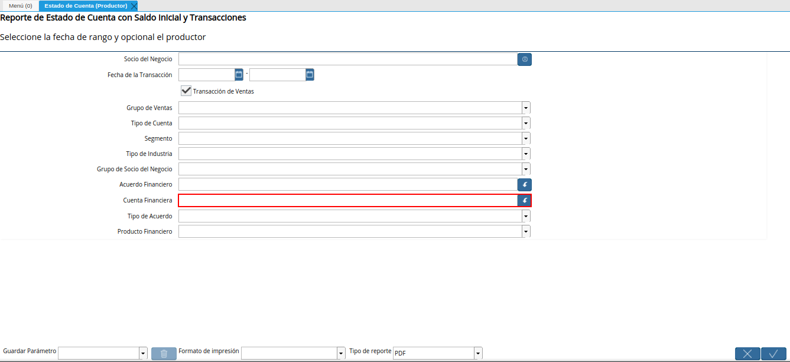
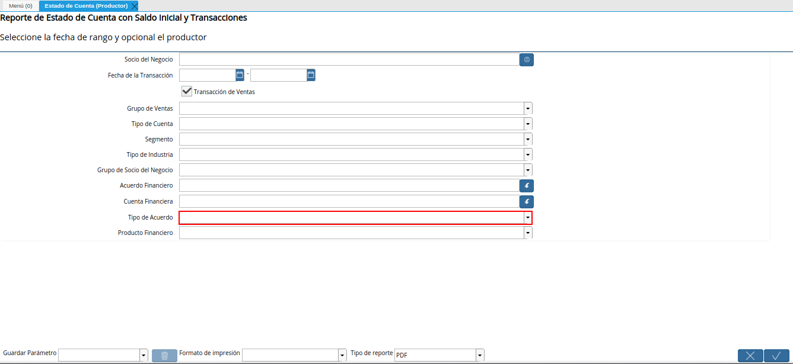
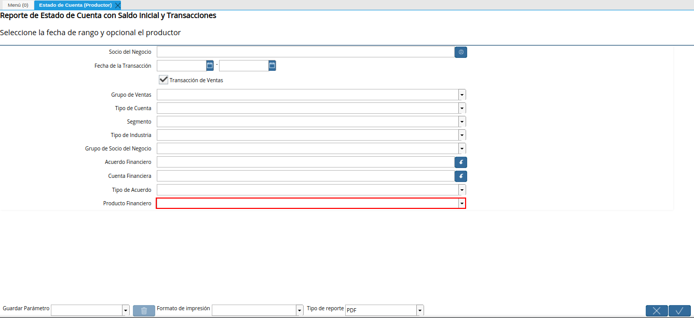
.. |opción ok del reporte estado de cuenta productor| image:: resources/ok-option-of-the-producer-account-statement-report.png
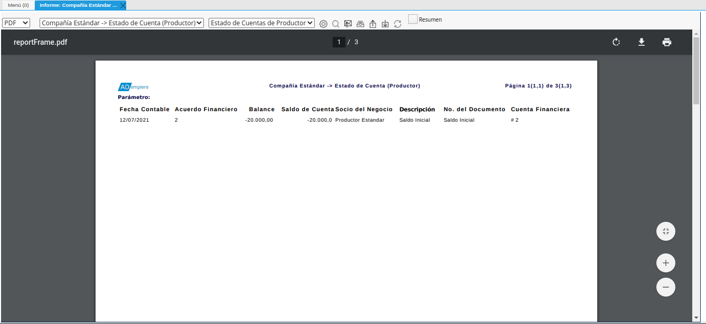

.. _documento/estado-de-cuenta-productor:

**Estado de Cuenta (Productor)**
================================

Ubique y seleccione en el menú de ADempiere, la carpeta "**Gestión de Asistencia al Agricultor**", luego seleccione la carpeta "**Inversión Agrícola y Préstamos**", por último seleccione el reporte "**Estado de Cuenta (Productor)**".

    |menú de reporte estado de cuenta productor|

    Imagen 1. Menú de ADempiere

Podrá visualizar la ventana del reporte "**Estado de Cuenta (Productor)**", con diferentes campos que le permiten al usuario generar el reporte en base a lo requerido por el mismo.

    |ventana del reporte estado de cuenta productor|

    Imagen 2. Ventana del Reporte Estado de Cuenta (Productor)

Seleccione en el campo "**Socio del Negocio**", el socio del negocio por el cual requiere filtrar la información.

    |campo socio del negocio del reporte estado de cuenta productor|

    Imagen 3. Campo Socio del Negocio

Seleccione en el campo "**Fecha de la Transacción**", la fecha de la transacción por la cual requiere filtrar la información.

    |campo fecha de la transacción del reporte estado de cuenta productor|

    Imagen 4. Campo Fecha de la Transacción

El check "**Transacción de Ventas**", indica que se requiere generar el reporte de "**Estado de Cuenta (Productor)**", con las transacciones de ventas asociadas al productor. En caso contrario, se debe desactivar dicho check.

    |check transacción de ventas del reporte estado de cuenta productor|

    Imagen 5. Check Transacción de Ventas

Seleccione en el campo "**Grupo de Ventas**", el grupo de ventas por el cual requiere filtrar la información.

    |campo grupo de ventas del reporte estado de cuenta productor|

    Imagen 6. Campo Grupo de Ventas

Seleccione en el campo "**Tipo de Cuenta**", el tipo de cuenta por el cual requiere filtrar la información.

    |campo tipo de cuenta del reporte estado de cuenta productor|

    Imagen 7. Campo Tipo de Cuenta

Seleccione en el campo "**Segmento**", el segmento por el cual requiere filtrar la información.

    |campo segmento del reporte estado de cuenta productor|

    Imagen 8. Campo Segmento 

Seleccione en el campo "**Tipo de Industria**", el tipo de industria por el cual requiere filtrar la información.

    |campo tipo de industria del reporte estado de cuenta productor|

    Imagen 9. Campo Tipo de Industria

Seleccione en el campo "**Grupo de Socio del Negocio**", el grupo de socio del negocio por el cual requiere filtrar la información.

    |campo grupo de socio del negocio del reporte estado de cuenta productor|

    Imagen 10. Campo Grupo de Socio del Negocio

Seleccione en el campo "**Acuerdo Financiero**", el acuerdo financiero por el cual requiere filtrar la información.

    |campo acuerdo financiero del reporte estado de cuenta productor|

    Imagen 11. Campo Acuerdo Financiero

Seleccione en el campo "**Cuenta Financiera**", la cuenta financiera por la cual requiere filtrar la información.

    |campo cuenta financiera del reporte estado de cuenta productor|

    Imagen 12. Campo Cuenta Financiera

Seleccione en el campo "**Tipo de Acuerdo**", el tipo de acuerdo por el cual requiere filtrar la información.

    |campo tipo de acuerdo del reporte estado de cuenta productor|

    Imagen 13. Campo Tipo de Acuerdo

Seleccione en el campo "**Producto Financiero**", el producto financiero por el cual requiere filtrar la información.

    |campo producto financiero del reporte estado de cuenta productor|

    Imagen 14. Campo Producto Financiero

Seleccione la opción "**OK**", para generar el reporte en base a lo seleccionado en los campos indicados anteriormente.

    |opción ok del reporte estado de cuenta productor|

    Imagen 15. Opción OK

Podrá visualizar el reporte "**Estado de Cuenta (Productor)**". 

    |reporte estado de cuenta productor|

    Imagen 16. Reporte Estado de Cuenta (Productor)