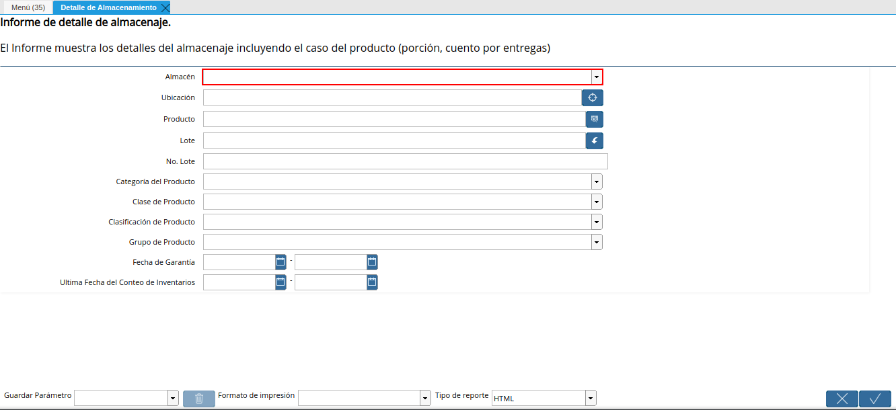
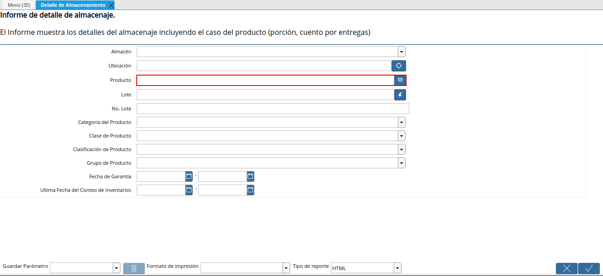
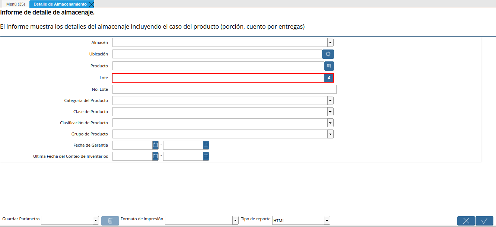
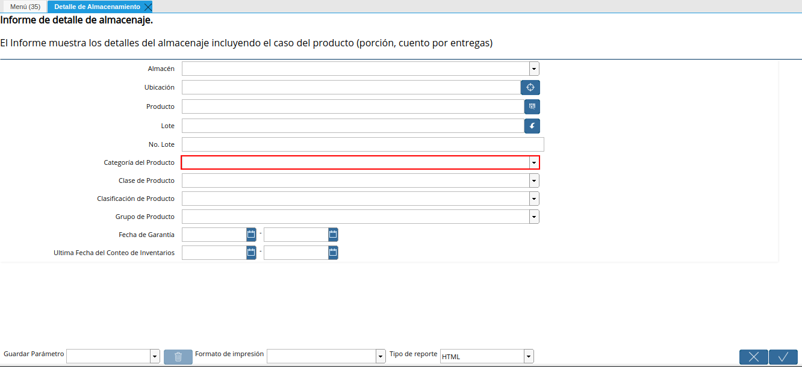
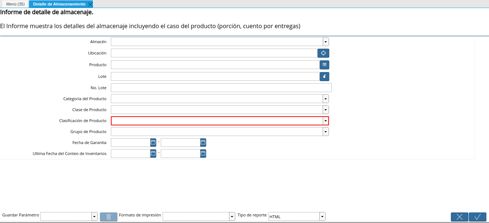
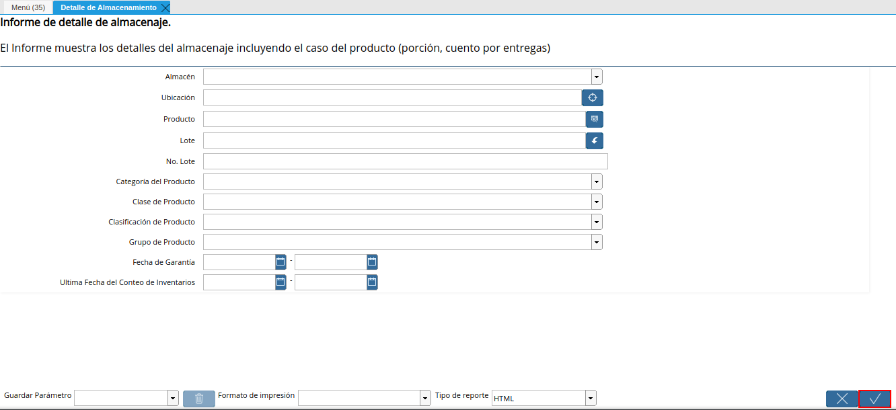
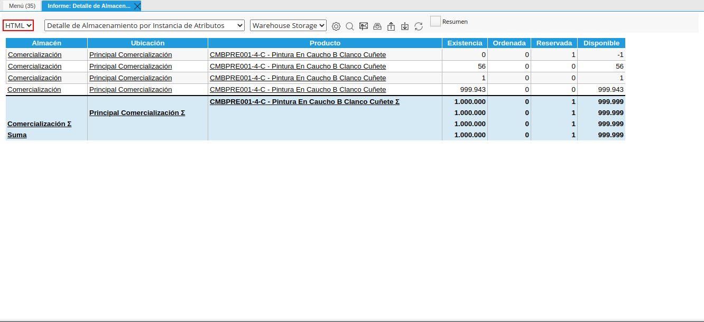

.. |menú del reporte detalle de almacenamiento| image:: resources/storage-detail-report-menu.png
.. |ventana del reporte detalle de almacenamiento| image:: resources/storage-detail-report-window.png

.. |campo número de lote del reporte detalle de almacenamiento| image:: resources/batch-number-field-of-the-storage-detail-report.png

.. |campo clase de producto del reporte detalle de almacenamiento| image:: resources/product-class-field-of-the-storage-detail-report.png

.. |campo grupo de producto del reporte detalle de almacenamiento| image:: resources/product-group-field-of-the-storage-detail-report.png
.. |campo fecha de garantía del reporte detalle de almacenamiento| image:: resources/warranty-date-field-of-the-storage-detail-report.png
.. |campo última fecha de conteo de inventario del reporte detalle de almacenamiento| image:: resources/last-inventory-count-date-field-of-the-storage-detail-report.png

.. |reporte detalle de almacenamiento con formato seleccionado| image:: resources/storage-detail-report-with-selected-format.png

.. _documento/reporte-detalle-de-almacenamiento:

**Detalle de Almacenamiento**
=============================

Este reporte da información sobre la cantidad de productos que han sido Ordenados, Reservados en  Existencia y  Disponible, a demás auditar en que "Almacén" y "Ubicación" se encuentra cada uno. Por otra parte, por cada transacción del producto se visualiza su movimiento.

Ubique y seleccione en el menú de ADempiere, la carpeta "**Gestión de Materiales**", luego seleccione el reporte "**Detalle de Almacenamiento**". 

    |menú del reporte detalle de almacenamiento|

    Imagen 1. Menú de ADempiere

Podrá visualizar la ventana del reporte con diferentes campos que le permiten al usuario, filtrar la información en base lo requerido por el mismo.

    |ventana del reporte detalle de almacenamiento|

    Imagen 2. Ventana del Reporte Detalle de Almacenamiento

Seleccione en el campo "**Almacén**", el almacén por el cual requiere filtrar la información.

    |campo almacén del reporte detalle de almacenamiento|

    Imagen 3. Campo Almacén

Seleccione en el campo "**Ubicación**", la ubicación exacta por la cual requiere filtrar la información.

    |campo ubicación del reporte detalle de almacenamiento|

    Imagen 4. Campo Ubicación

Seleccione en el campo "**Producto**", el producto por el cual requiere filtrar la información.

    |campo producto del reporte detalle de almacenamiento|

    Imagen 5. Campo Producto

Seleccione en el campo "**Lote**", el lote por el cual requiere filtrar la información.

    |campo lote del reporte detalle de almacenamiento|

    Imagen 6. Campo Lote

Introduzca en el campo "**No. Lote**", el número de lote específico del producto por el cual requiere filtrar la información.

    |campo número de lote del reporte detalle de almacenamiento|

    Imagen 7. Campo No. Lote

Seleccione en el campo "**Categoría del Producto**", la categoría del producto por la cual requiere filtrar la información.

    |campo categoría del producto del reporte detalle de almacenamiento|

    Imagen 8. Campo Categoría del Producto

Seleccione en el campo "**Clase de Producto**", la clase del producto por el cual requiere filtrar la información.

    |campo clase de producto del reporte detalle de almacenamiento|

    Imagen 9. Campo Clase de Producto

Seleccione en el campo "**Clasificación de Producto**", la clasificación de producto por la cual requiere filtrar la información.

    |campo clasificación de producto del reporte detalle de almacenamiento|

    Imagen 10. Campo Clasificación de Producto

Seleccione en el campo "**Grupo de Producto**", el grupo de producto por el cual requiere filtrar la información.

    |campo grupo de producto del reporte detalle de almacenamiento|

    Imagen 11. Campo Grupo de Producto

Indique en el campo "**Fecha de Garantía**", la fecha de garantía por la cual requiere filtrar la información.

    |campo fecha de garantía del reporte detalle de almacenamiento|

    Imagen 12. Campo Fecha de Garantía

Indique en el campo "**Última Fecha de Conteo de Inventarios**", la última fecha de conteo de inventario por el cual requiere filtrar la información.

    |campo última fecha de conteo de inventario del reporte detalle de almacenamiento|

    Imagen 13. Campo Última Fecha de Conteo de Inventarios

Seleccione la opción "**OK**", para generar el reporte en base a lo seleccionado en los campos indicados anteriormente.

    |opción ok del reporte detalle de almacenamiento|

    Imagen 14. Opción OK 

Podrá visualizar de la siguiente manera, el reporte de detalle de almacenamiento generado.

    |reporte detalle de almacenamiento|

    Imagen 15. Reporte Detalle de Almacenamiento

Para cambiar el formato del reporte generado, se debe seleccionar el formato requerido en el campo "**Tipo de Reporte**".

    |campo tipo de reporte para detalle de almacenamiento|

    Imagen 16. Campo Tipo de Reporte

Al seleccionar un tipo de reporte, ADempiere actualiza de manera automática el reporte generado con el formato seleccionado. Para ejemplificar el caso, es utilizado el formato "**PDF**".

    |reporte detalle de almacenamiento con formato seleccionado|

    Imagen 17. Reporte Detalle de Almacenamiento con Formato PDF