.. |ventana de inicio de telegram| image:: resources/star-window.png
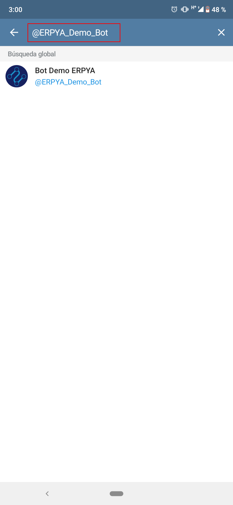
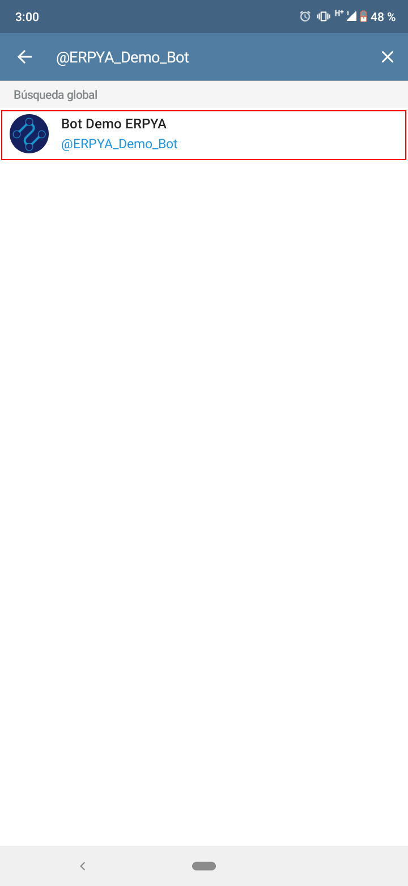
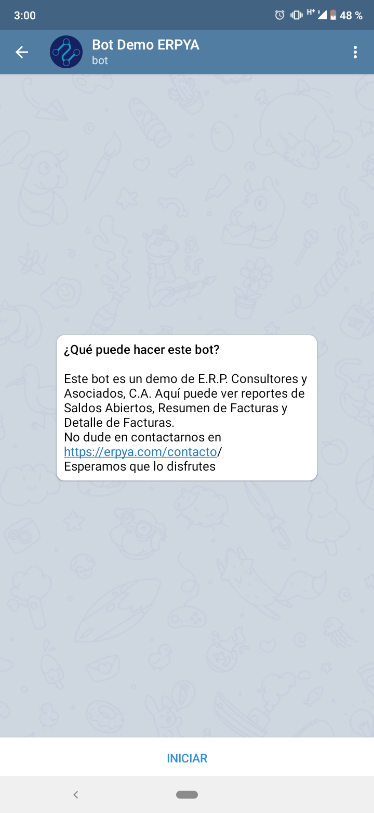
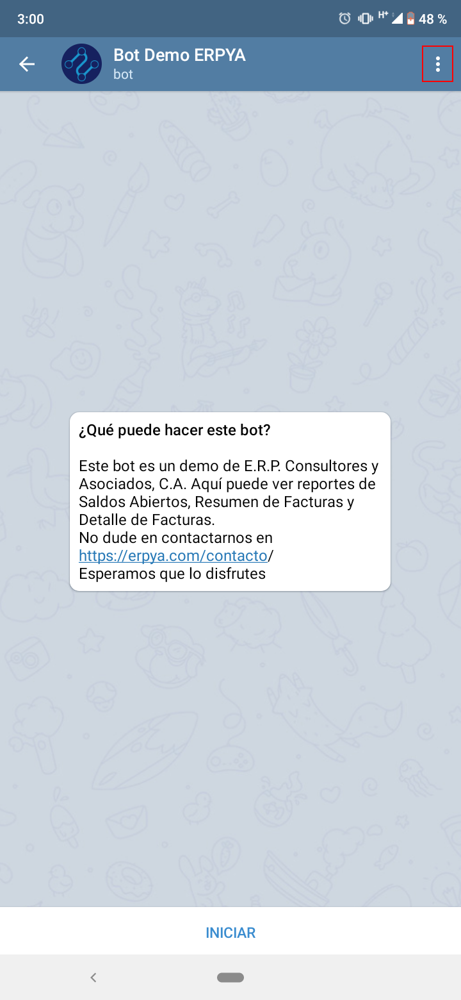
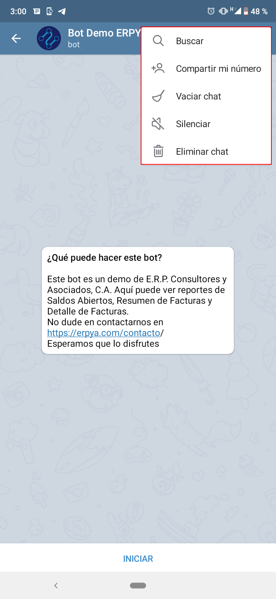
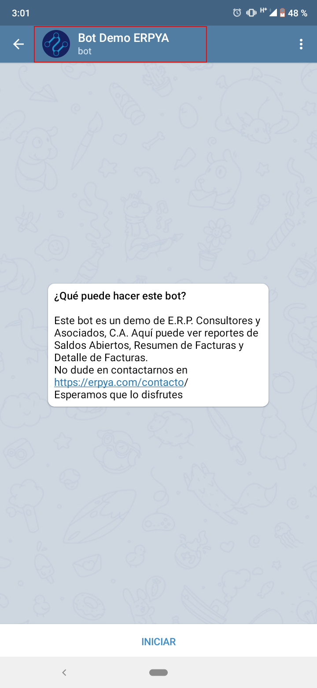
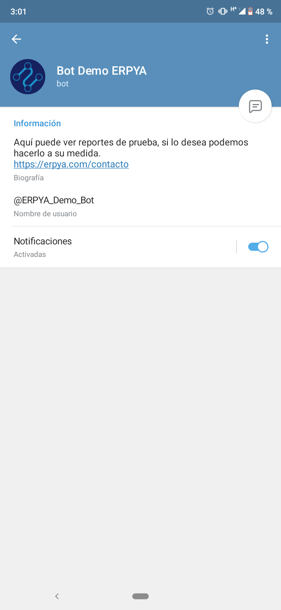
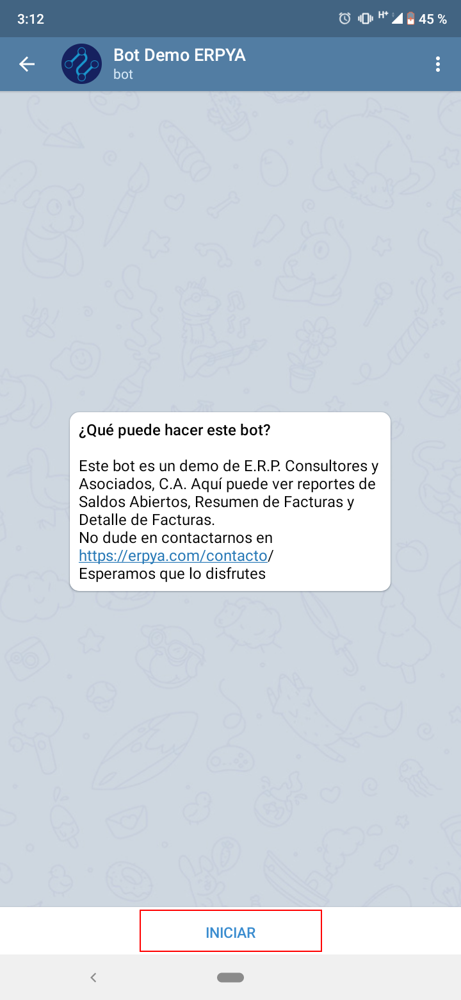
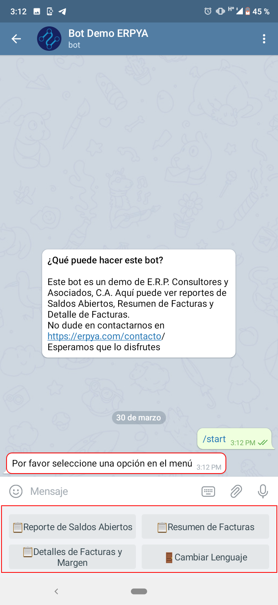
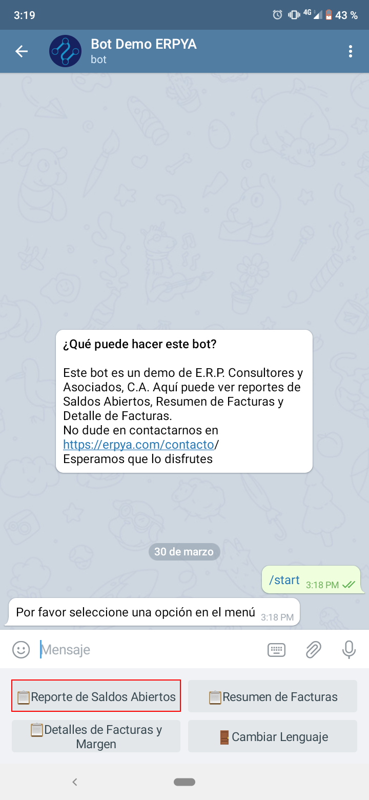

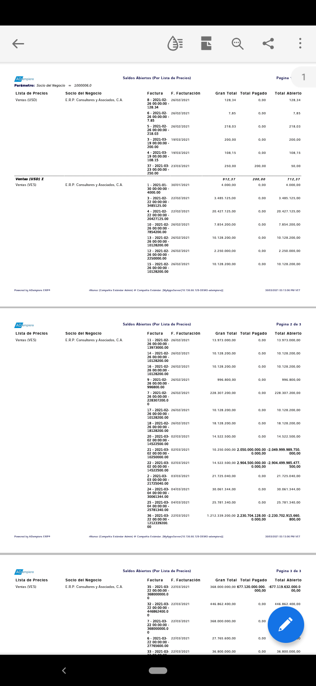
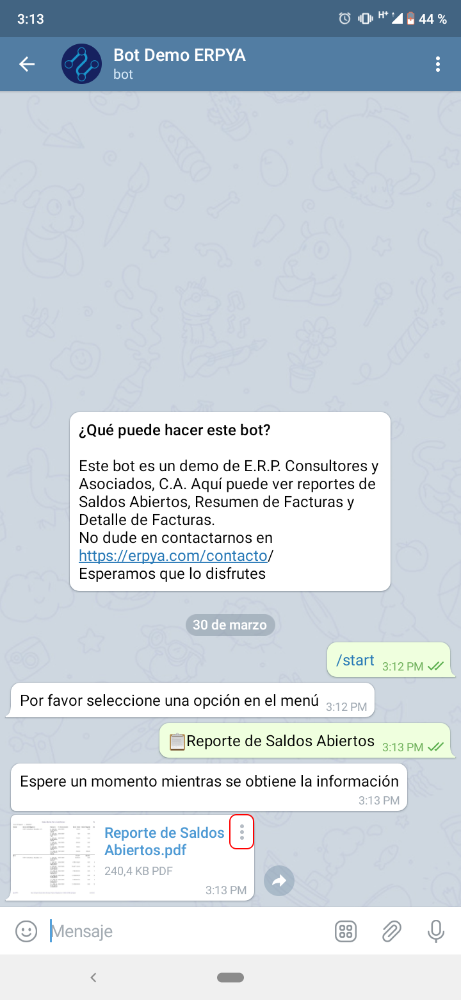
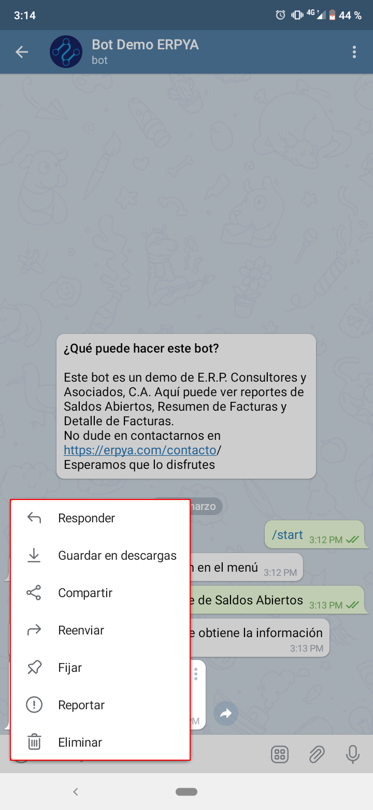
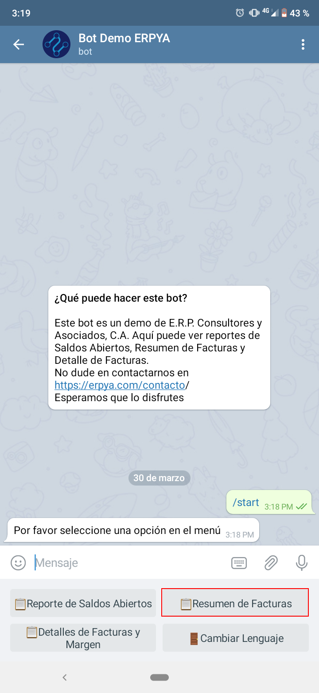
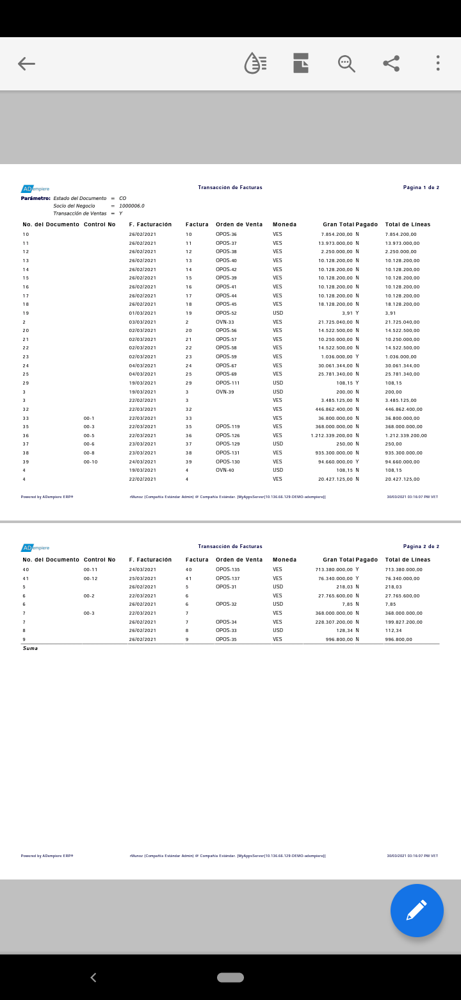
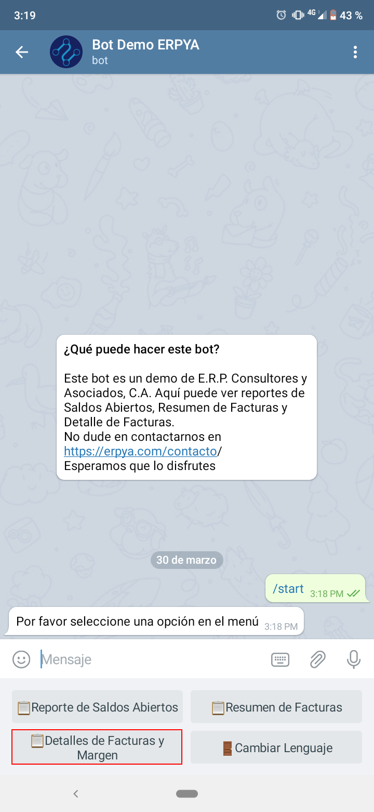
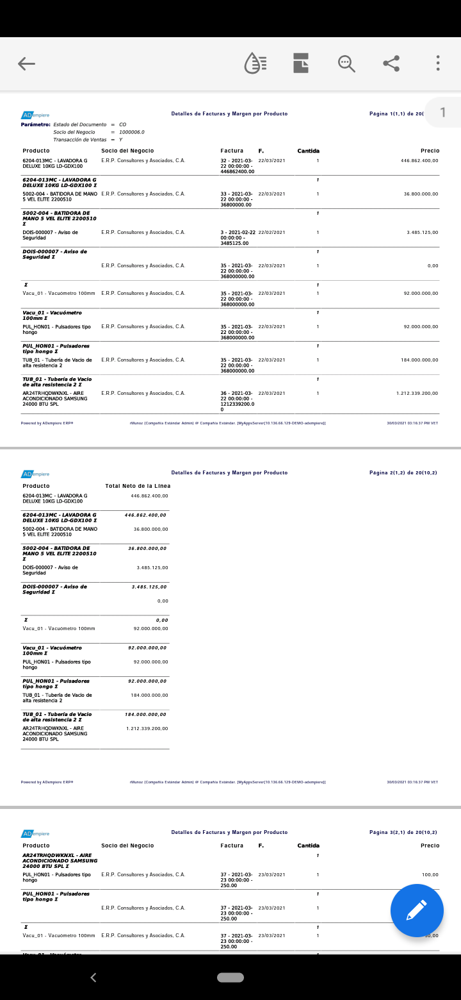
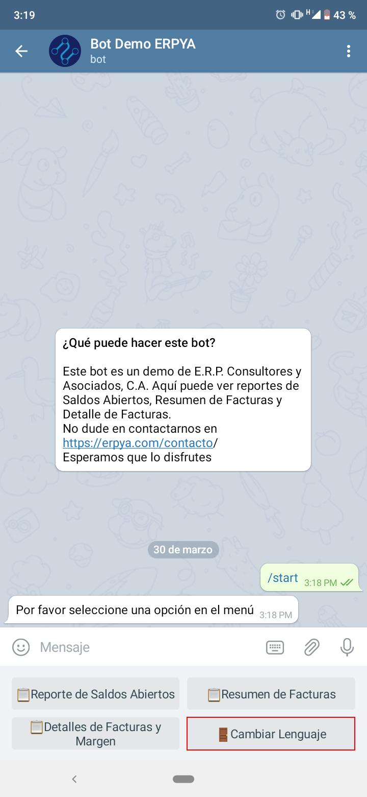
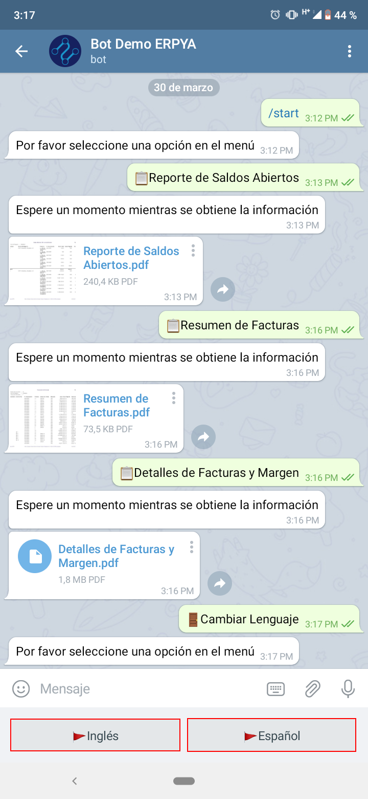

.. _documento/interfaz-del-bot:

**Interfaz del Bot**
====================

Al iniciar sesión en telegram, seleccione el icono "**Buscar**", ubicado en la parte superior derecha de la ventana.

    |ventana de inicio de telegram|

    Imagen 1. Ventana de inicio

Busque el bot ingresando el nombre del mismo en la barra desplegada por el icono "**Buscar**". Para el presente ejemplo se ingresa lo siguiente "**@Bot_Demo_ERPYA**".

    |buscar bot de erpya|

    Imagen 2. Buscar Bot

Al culminar la búsqueda debe seleccionar el bot para iniciar la conversación.

    |seleccionar bot de erpya|

    Imagen 3. Seleccionar Bot

A continuación podrá visualizar la conversación inicial de la siguiente manera.

    |conversación inicial|

    Imagen 4. Conversación Inicial

Del lado superior derecho de la conversación podrá acceder al menú de la misma donde se desplegan direfentes opciones que le permiten al usuario realizar ejecutar las mismas según su conveniencia.

    |menú superior de la conversación|

    Imagen 5. Menú Superior de la Conversación

    Dicho menú puede ser visualizado de la siguiente manera.

        |opciones del menú superior de la conversación|

        Imagen 6. Opciones del Menú Superior de la Conversación

    - La opción "**Buscar**", permite realizar una búsqueda detallada dentro de la conversación.
    - La opción "**Compartir mi número**", permite compartir el número de teléfono en la conversación.
    - La opción "**Vaciar Chat**", permite borrar todos los mensajes de la conversación.
    - La opción "**Silenciar**", permite silenciar las notificaciones de la conversación.
    - La opción "**Eliminar Chat**", permite eliminar la conversación completamente.

Para acceder a la información de perfil del bot, seleccionando el nombre del mismo.

    |selección de nombre de perfil|

    Imagen 7. Selección del Nombre de Perfil 

    La misma puede ser visualizada de la siguiente manera.

        |información de perfil del bot|

        Imagen 8. Información de Perfil del Bot

.. _documento/uso-del-bot:

**Uso del Bot**
===============

El bot puede ser utilizado para obtener de manera inmediata información requerida como reportes de facturas y margen, saldos abiertos, entre otros. Así como también para obtener una comunicación efectiva e inmediata entre el usuario de la empresa y el usuario cliente o proveedor. A continuación se ecplican ambos casos.

Para obtener reportes de manera inmediata, al ingresar a la conversación debe seleccionar la opción "**INICIAR**".

    |opción iniciar conversación|

    Imagen 9. Opción Iniciar Conversación

De manera automática recibirá el mensaje "**Por favor seleccione una opción en el menú**" y visualizara en la parte inferior de dicho mensaje, las diferentes opciones que le permitiran generar los reportes requeridos.

    |respuesta de inicio|

    Imagen 10. Respuesta de Inicio 

    -  Al seleccionar la opción "**Reporte de Saldos Abiertos**", se envia un mensaje con dicha solicitud.

        |opción reporte de saldos abiertos|

        Imagen 11. Opción Reporte de Saldos Abiertos 

        De manera automática recibirá el mensaje "**Espere un momento mientras se obtiene la información**" y comenzará a descargarse en formato "**.pdf**" dicho reporte seleccionado.

            |descarga de reporte de saldos abiertos|

            Imagen 12. Descarga de Reporte de Saldos Abiertos

            Al seleccionar el mismo, puede visualizarlo de la siguiente manera.

                |reporte de saldos abiertos|

                Imagen 13. Reporte de Saldos Abiertos

        Adicional a ello, los reportes que se descargan pueden desplegar un menú al seleccionar el icono en la parte superior derecha del mensaje.

            |icono menú del mensaje de reporte|

            Imagen 14. Icono Menú del Mensaje de Reporte

            Dicho menú puede ser visualizado de la siguiente manera y permite ejecutar diferentes acciones.

                |menú desplegado del mensaje de reporte|

                Imagen 15. Menú Desplegado del Mensaje de Reporte

            - La opción "**Responder**", permite responder como comentario el mensaje recibido en el cual se selecciona dicha opción.
            - La opción "**Guardar en Descargas**", permite guardar el archivo "**.pdf**" en la carpeta "**Descargas**" del teléfono o equipo en el que se encuentra utilizando telegram.
            - La opción "**Compartir**", permite compartir el archivo "**.pdf**" por medio de las aplicaciones configuradas en el teléfono o equipo en el que se encuentra utilizado telegram.
            - La opción "**Reenviar**", permite reenviar el archivo "**.pdf**" a los diferentes contactos de telegram.
            - La opción "**Fijar**", permite fijar el mensaje en la parte superior de la conversación.
            - La opción "**Reportar**", permite reportar el mensaje como contenido no deseado y especificar el motivo.
            - La opción "**Eliminar**", permite eliminar el mensaje.

    - Al seleccionar la opción "**Resumen de Facturas**", se envia un mensaje con dicha solicitud.

        |opción resumen de facturas|

        Imagen 16. Opción Resumen de Facturas

        El comportamiento de esta opción es igual a la explicada anteriormente, con la diferencia de que se genera el archivo "**.pdf**" con el reporte de resumen de facturas.

            |reporte resumen de facturas|

            Imagen 17. Reporte Resumen de Facturas

    - De igual manera, al seleccionar la opción "**Detalles de Facturas y Margen**", se envia un mensaje con dicha solicitud.

        |opción detalles de facturas y margen|

        Imagen 18. Opción Detalles de Facturas y Margen

        El comportamiento de esta opción es igual a las anteriores, con la diferencia de que se genera el archivo "**.pdf**" con el reporte de resumen de facturas.

            |reporte detalles de facturas y margen|

            Imagen 19. Reporte Detalles de Facturas y Margen

    - El bot también tiene la opción de cambiar el idioma de la conversación, al seleccionar la opción "**Cambiar Lenguaje**".

        |opción cambiar lenguaje|

        Imagen 20. Opción Cambiar Lenguaje

        Dicha opción permite seleccionar entre "**Ingles**" y "**Español**", para mejor comodidad del usuario.

            |opciones de lenguaje|

            Imagen 21. Opciones de Lenguaje

